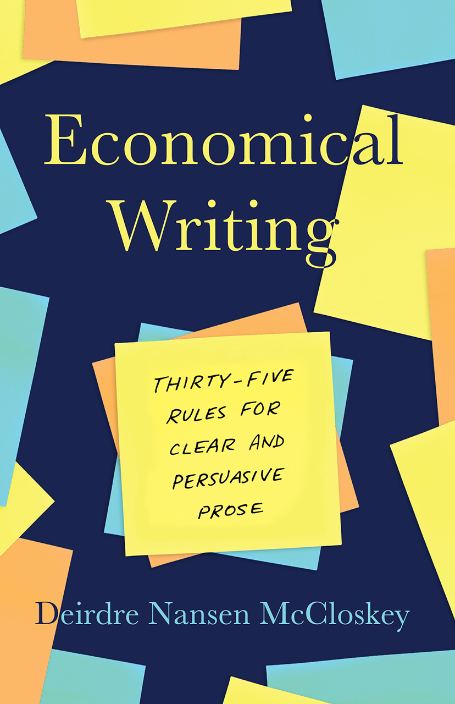

```{r setup, include=FALSE}
options(htmltools.dir.version = FALSE)
library(knitr)
opts_chunk$set(
  fig.align="center", ##fig.width=6, fig.height=4.5, 
  ## out.width="748px", ##out.length="520.75px",
  dpi=300, ##fig.path='Figs/',
  cache=T##, echo=F, warning=F, message=F
  )
```


class: top, left
### Structure of the essay matters (a lot)! ##

* What is the main message of your essay?

 * Say it clearly in the introduction
 
 * Repeat the main message in the main body and in the conclusion
 
* Structure your essay around the main message

 * Analyze the different aspects of your message
 
 * Support each and every argument you make
 
 

* Cite your references appropriately
---
class: top, left

### I will fill my essay with references to newspapers and non-academic sources. ##

--
<center>
<iframe src="https://giphy.com/embed/3oz8xt6aO8l4UjcnXa" width="600" height="400" frameBorder="0" class="giphy-embed" allowFullScreen></iframe><p><a href="https://giphy.com/gifs/trust-me-dont-do-it-youll-regret-3oz8xt6aO8l4UjcnXa"></a></p>
</center>


---
class: top, left
### I have written ~1500 words, but I don't have any more meaningful arguments to make. I will blah blah 500 words. ###

--

<center>

</center>


---
class: top, left
### What is the minimum number of papers I need to cite? ###

--

<center>

</center>

--
- I don't have a minimum number of citations requirement. Cite as many as you need!

---
### What do I need to ensure to get a First? ##

--
### Be like Mike! ###

<center>
<iframe width="560" height="315" src="https://www.youtube.com/embed/zJu0iCZGunw" frameborder="0" allow="accelerometer; autoplay; encrypted-media; gyroscope; picture-in-picture" allowfullscreen></iframe>
</center>

---


### Be like Mike to get a First? ###

--
<center>

</center>


---
### Getting a first on essay ###

* Gather your resources
 * your notes on lectures and seminar exercises, relevant textbook chapters and papers from reading list and the Module’s Moodle page.
 
 * **Other academic readings**
 
 * Don't just repeat back to me what I have discussed in the lectures.

* Structure your essay well
 * think about the line of argument that constantly links back to the essay topic

* Reference properly

* Relate your essay to economic concepts:

 - E.g.: Market failures, externalities, ...

---
### Getting a first on essay, cont'd ###

* Use empirical evidence in favour / against the theoretical arguments 

 * Refer to many empirical evidence
 
 * One piece of evidence is never enough

* Do not just summarize journal articles

 - relate the articles you cite to your essay topic

* Do not digress

---
### Some rules for clear and persuasive prose ###

.pull-left[


Read Economical Writing by Deirdre McCloskey:

The book is available at the library [shelves.](https://librarysearch.kent.ac.uk/client/en_GB/kent/search/detailnonmodal/ent:$002f$002fSD_ILS$002f0$002fSD_ILS:1574505/ada?qu=economical+writing&if=el%09edsSelectFacet%09FT1&ir=Both)

Some quotes from the book:

- "The one genuine rule, a golden one, is Be Clear."

 - "If the reader thinks what you write is unclear, then it is, by definition."
 
- "So What?"
 
 - "Answer that question in every sentence, and you will become a great scholar, or a millionaire; answer it once or twice in a ten-page paper, and you'll write a good one"

]

.pull-right[
<center>

</center>
]

---
### Economical Writing by Deirdre McCloskey:

- "Paragraphs should have points"

 - "The paragraph should be a more or less complete discussion of one point."

- "Make your writing cohere"

 - "The reader can understand writing that hangs together, from phrases up to entire books. She cannot understand writing filled with irrelevancies."
 
- "Be concrete" and "be plain"

- "Speak to an audience of human beings"

 - "Choose a reader and stick with her. Changing your implied reader is in an economic sense inefficient."

- "Avoid boilerplate" 
 
 - "Get to the point that some skeptical but serious reader cares about and stick to it." 


---
class: inverse, center, middle
name: advice
## Some advice from academics

<html><div style='float:left'></div><hr color='#EB811B' size=1px width=796px></html>

---
### Writing tips

.pull-left[
<center>
<iframe width="460" height="540" src="./img/tweet1.html" frameborder="0" allow="accelerometer; autoplay; encrypted-media; gyroscope; picture-in-picture" allowfullscreen></iframe>
</center>
]

.pull-right[
<center>
<iframe width="460" height="540" src="./img/tweet2.html" frameborder="0" allow="accelerometer; autoplay; encrypted-media; gyroscope; picture-in-picture" allowfullscreen></iframe>
</center>
]

---
### Writing tips, cont'd

.pull-left[
<center>
<iframe width="460" height="540" src="./img/tweet3.html" frameborder="0" allow="accelerometer; autoplay; encrypted-media; gyroscope; picture-in-picture" allowfullscreen></iframe>
</center>
]

.pull-right[
<center>
<iframe width="460" height="540" src="./img/tweet4.html" frameborder="0" allow="accelerometer; autoplay; encrypted-media; gyroscope; picture-in-picture" allowfullscreen></iframe>
</center>
]