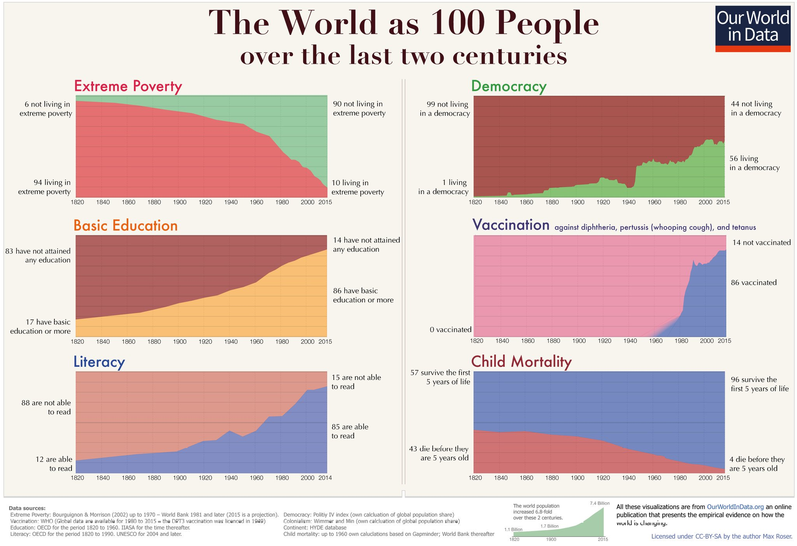
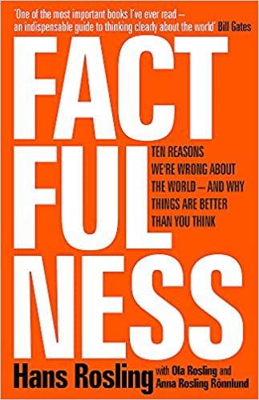
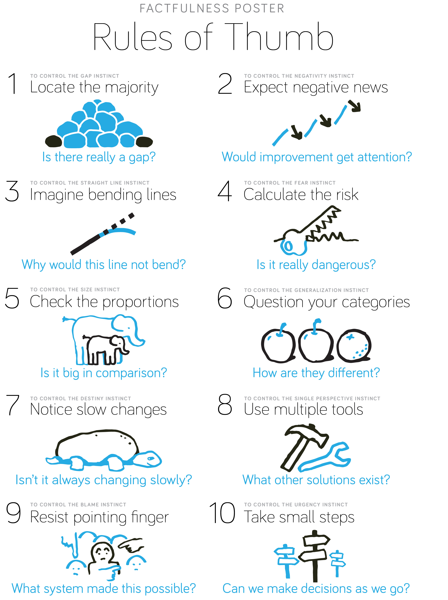
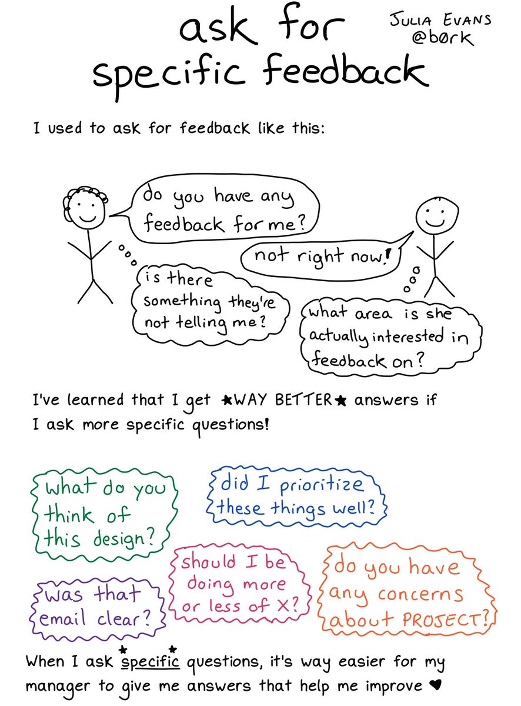
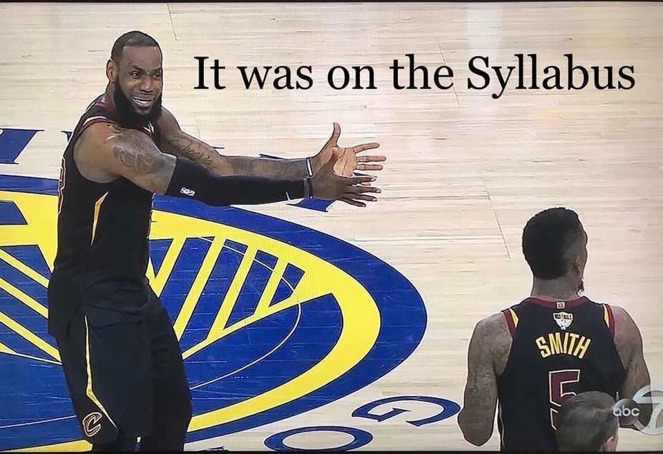
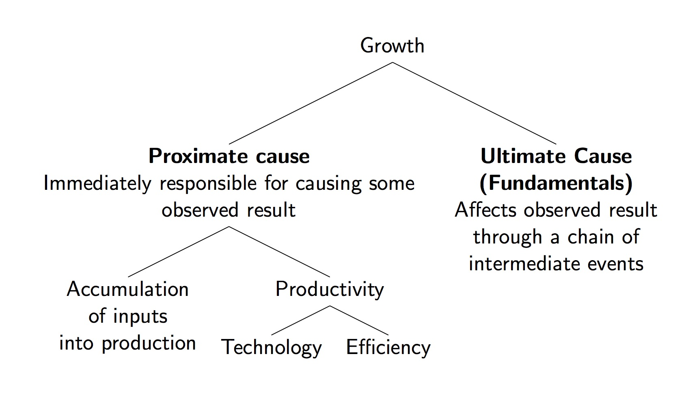

```{r setup, include=FALSE}
options(htmltools.dir.version = FALSE)
library(knitr)
opts_chunk$set(
  fig.align="center", ##fig.width=6, fig.height=4.5, 
  ## out.width="748px", ##out.length="520.75px",
  dpi=300, ##fig.path='Figs/',
  cache=T##, echo=F, warning=F, message=F
  )
```
```{r xaringan-themer, include=FALSE, warning=FALSE}
library(xaringanthemer)
style_mono_accent(
  base_color = '#000000',
  title_slide_text_color = '#000000',
  title_slide_background_color = '#FFFFFF',
  header_font_google = google_font("Josefin Sans"),
  text_font_google   = google_font("Montserrat", "300", "300i"),
  code_font_google   = google_font("Fira Mono")
)
```
class: center, middle
name: welcome

# Welcome back (virtually)!

<html><div style='float:left'></div><hr color='#EB811B' size=1px width=796px></html>


---

### EC569: Economic Growth 

<br>


- Convenor: &#x130;lhan G&#252;ner

- Office: Kennedy Building 119 (No in-person meetings)

- Lectures: recordings will be released on Fridays

- Drop-in sessions: during lecture times (Mondays 9-10am) via MS Teams

- Office hours: Wednesdays 10-11am on MS Teams

 - If you have questions to ask, please don't hesitate to shoot an email or send a message on MS Teams.

- Email: i.guner@kent.ac.uk


---

### Timetable

<br>

<br>

- Lectures: Weeks 13-24 

 - Drop-in sessions: Mondays 09:00 - 10:00 on MS Teams
 
 - Recordings will be posted the Friday prior to the drop-in session 

- Seminars: Weeks 16-18, 20-22

 - Check your SDS timetables for your seminar time
 
 - Will be conducted on, tentatively, MS Teams

---

### Seminars 

- Questions will be available on Moodle before seminars

 - Data analysis
 
 - Questions from required readings
 
 - Problems/exercises

- Everyone is responsible for reading the material and answering the questions.

- I may ask you to share your answers during the seminars.

 - Prior to seminars, take a picture of your answers and upload it your computer to share with the class if asked.

- Mandatory papers/articles are marked with (<font color="red">*</font>) on the Module outline.

- There will be exam questions on them.


---
### Assessment

Coursework: 20%
 - Essay (10%): Due Friday of Week 24

 - 3 Problem Sets (10% total)
  - Problem sets will be assessed through Moodle quizzes
  - Quiz question will be on the problem set questions
  - The average of your highest marked 2 quizzes will be your problem set mark
  - You must take at least 2 quizzes
  - Dates of problem sets:


 | | Assignment Date | Moodle Quiz Date |
 | --- | --- | --- |
 | Problem Set #1 | Monday of Week 15 |Week 16 Monday 12pm – Wednesday 12pm|
 | Problem Set #2 | Monday of Week 18 | Week 19 Monday 12pm – Wednesday 12pm |
 |Problem Set #3 |Monday of Week 21 | Week 22 Monday 12pm – Wednesday 12pm |

Exam: 80%


---

### Assessment of the problem sets

- Problem sets will be assessed using Moodle quizzes. 

- On the due weeks of problem sets, quizzes will appear on Moodle for _48 hours from Monday 12pm to Wednesday 12pm_.

- To take a quiz, first, _you must submit your work on  the problem set in digital form_ (typed or scanned copy of your hand-written solution). 

- Each problem set quiz will be _on the questions of the problem set._ 

- You will have _2 hours to complete the quiz once started_.

- You will have _1 attempt_.

- A mock problem set #0 will up on Moodle on Monday. Quiz will appear on Moodle next week.


---


### Aim of the problem sets

<br>


- My intention is _not_ assessing you

- Incentivizing you to learn module material on time

- Opportunity to check your understanding

- Opportunity to practice examinable material


---
### Essay

<br>


- Essay questions will be posted by the Monday of Week 14

- Essay is due the Friday of Week 24

- Approximately 2 thousand words

 - Word limit is not strict at all
 
 - A 1000 word essay which is clear, is concise, and conveys your arguments in a robust way would earn you at least a first.


---
### Textbooks 

- Weil, D., 2013, [<u>Economic Growth</u>](https://librarysearch-digital.kent.ac.uk/client/en_GB/kent-e/search/detailnonmodal/ent:$002f$002fSD_ILS$002f0$002fSD_ILS:641863/ada?qu=economic+growth&if=el%09edsSelectFacet%09FT1&d=ent%3A%2F%2FSD_ILS%2F0%2FSD_ILS%3A641863%7EILS%7E1&ir=Both&h=8), 3rd ed., **must read**

- Jones, C. and D. Vollrath, 2013, [<u>Introduction to Economic Growth</u>](https://librarysearch.kent.ac.uk/client/en_GB/kent/search/detailnonmodal/ent:$002f$002fSD_ILS$002f0$002fSD_ILS:511436/ada?qu=Introduction+to+Economic+Growth&if=el%09edsSelectFacet%09FT1&d=ent%3A%2F%2FSD_ILS%2F0%2FSD_ILS%3A511436%7EILS%7E1&ir=Both&h=8), 3rd ed.,  **must read**

.pull-left[


<center>

</center>

]

.pull-right[

<center>

</center>

]


---

### Other Resources

- [CORE The Economy: Economics for a Changing World](https://core-econ.org/the-economy/?lang=en). Oxford University Press, First Edition, 2017, ISBN 9780198810247.

- https://ourworldindata.org : A thoughtful collection of essays on changing living conditions around the world, supplemented with striking visualization of recent data.

- Rosling, H., Rosling, O., & Rönnlund, A. R. (2018). Factfulness: Ten Reasons We're Wrong about the World--and why Things are Better Than You Think. St Martin's Press.

- Economical Writing by Deirdre N. McCloskey


- https://voxeu.org : VOX-CEPR Policy Portal, “Research-based policy analysis and commentary from leading economists”. Here, economists write about their research in an accessible style. 

- https://growthecon.com/blog/ : Blog of Dietrich Vollrath. 

- https://gunerilhan.github.io/teaching/ : My personal webpage where I post module related material. 

---
### [ourworldindata.org](https://ourworldindata.org/)

<center>

</center>

---
.pull-left[
- Rosling, H., Rosling, O., & Rönnlund, A. R. (2018). [<u>Factfulness</u>](https://librarysearch.kent.ac.uk/client/en_GB/kent/search/detailnonmodal/ent:$002f$002fSD_ILS$002f0$002fSD_ILS:1523524/ada?qu=factfulness&if=el%09edsSelectFacet%09FT1&d=ent%3A%2F%2FSD_ILS%2F0%2FSD_ILS%3A1523524%7EILS%7E0&ir=Both&h=8): Ten Reasons We're Wrong about the World--and why Things are Better Than You Think. St Martin's Press.

<center>

</center>
]

.pull-right[
<br>
<center>

</center>

]

---
### How do I get a first?

<br>


- Work hard!

- Read relevant textbook chapters

- Keep pace with lectures

- Take problem sets seriously, make sure you can solve the question in an exam environment

- Don't postpone studying for the module till a few days before the exam

- Ask help! (from me)

- Help each other to learn the class material


---
<br>
<center>

</center>
---
### Please, read the module outline

<center>

</center>

---
### For those who didn't get the joke in the previous slide


<br>

Visit https://www.youtube.com/embed/1inxvYwAvnY

<!-- <center> -->
<!-- <iframe width="660" height="415" src="https://www.youtube.com/embed/1inxvYwAvnY" frameborder="0" allow="accelerometer; autoplay; encrypted-media; gyroscope; picture-in-picture" allowfullscreen></iframe> -->
<!-- </center> -->


---
### Next Lecture

- Introduction to Economic Growth


 <center>

</center>

---
### Do well on this module!
<br>
<br>

<center>
<iframe src="https://giphy.com/embed/1iTX9tGRTTTVZb7q" width="480" height="267" frameBorder="0" class="giphy-embed" allowFullScreen></iframe><p><a href="https://giphy.com/gifs/americasgottalent-agt-americas-got-talent-1iTX9tGRTTTVZb7q"></a></p>
</center>