```{r setup, include=FALSE}
options(htmltools.dir.version = FALSE)
library(knitr)
opts_chunk$set(
  fig.align="center", ##fig.width=6, fig.height=4.5, 
  ## out.width="748px", ##out.length="520.75px",
  dpi=300, ##fig.path='Figs/',
  cache=T##, echo=F, warning=F, message=F
  )
```


## EC569: Economic Growth

<br>

- Convenor: &#x130;lhan G&#252;ner

- Office: Kennedy Building 119

- Office hours: Mondays and Wednesdays 10-11am

 - If you have questions to ask, please don't hesitate to stop by.

- Email: i.guner@kent.ac.uk


---

## Questions 

- Why do countries differ in their standards of living?

- Why do countries grow richer or fail to grow richer over time?

- What are the roles of physical capital, population, human capital, ideas, basic science, and public policy for growth?

## Topics


- Facts and modern theories of economic growth

- The role of productivity on growth

- The relationship between government policies, income inequality and economic growth


---

## Timetable

<br>

<br>

- Lectures: Weeks 13-24, Mondays 14:00 - 15:00

- Seminars: Weeks 16-18, 20-22

---
## Assessment

Coursework: 20%
 - Essay (10%): Due Friday of Week 24

 - 3 Problem Sets (10% total)
  - Problem sets will be assessed through Moodle quizzes
  - Quiz question will be on the problem set questions
  - The average of your highest marked 2 quizzes will be your problem set mark
  - You must take at least 2 quizzes
  - Dates of problem sets:


 | | Assignment Date | Moodle Quiz Date |
 | --- | --- | --- |
 | Problem Set #1 | Monday of Week 15 |Week 16 Monday 4pm – Wednesday 4pm|
 | Problem Set #2 | Monday of Week 18 | Week 19 Monday 4pm – Wednesday 4pm |
 |Problem Set #3 |Monday of Week 21 | Week 22 Monday 4pm – Wednesday 4pm |

Exam: 80%


---
## Assessment of problem sets

- Problem sets will be assessed using Moodle quizzes. 

- On the due weeks of problem sets, quizzes will appear on Moodle for _48 hours from Monday 4pm to Wednesday 4pm_.

- To take a quiz, first, _you must submit your work on  the problem set in digital form_ (typed or scanned copy of your hand-written solution). 

- Each problem set quiz will be _on the questions of the problem set._ 

- You will have _2 hours to complete the quiz once started_.

- You will have _1 attempt_.

- A mock problem set #0 is up on Moodle today. Quiz will appear on Moodle next week.

---
## Aim of the problem sets

.pull-left[

<br>

- My intention is _not_ assessing you

- Incentivizing you to learn module material on time

- Practice examinable material

- Opportunity to check your understanding

]

.pull-right[

<br>

<iframe width="560" height="650" src="./files/ps.html" frameborder="0" allowfullscreen></iframe>

]


---
### Essay

- Essay questions will be posted by Monday of Week 14

- Essay is due Friday of Week 24

- Approximately 2 thousand words

 - Word limit is not strict at all
 
 - A 1000 word essay which is clear, is concise, and conveys your arguments in a robust way would earn you at least a first.


---
## Textbooks ##

<br>

<br>


- Weil, D., 2013, Economic Growth, 3rd ed., **must read**

- Jones, C. and D. Vollrath, 2013, Introduction to Economic Growth, 3rd ed.,  **must read**

---

## Seminars 

- Questions will be available on Moodle before seminars

 - Data analysis
 
 - Questions from required readings
 
 - Problems

- Everyone is responsible for reading the material and answering the questions.

- Mandatory papers/articles are marked with (<font color="red">*</font>) on the Module outline.

- There will be exam questions on them.


---

## Other Resources

- CORE The Economy: Economics for a Changing World. Oxford University Press, First Edition, 2017, ISBN 9780198810247.

- https://ourworldindata.org : A thoughtful collection of essays on changing living conditions around the world, supplemented with striking visualization of recent data.

- Rosling, H., Rosling, O., & Rönnlund, A. R. (2018). Factfulness: Ten Reasons We're Wrong about the World--and why Things are Better Than You Think. St Martin's Press.

- Economical Writing by Deirdre N. McCloskey

- The Book of Why: The New Science of Cause and Effect by Judea Pearl and Dana Mackenzie 

- https://voxeu.org : VOX-CEPR Policy Portal, “Research-based policy analysis and commentary from leading economists”. Here, economists write about their research in an accessible style. 

- https://growthecon.com/blog/ : Blog of Dietrich Vollrath. 

- https://gunerilhan.github.io/teaching/ : My personal webpage where I post module related material. 

---
### [ourworldindata.org](https://ourworldindata.org/)

<center>
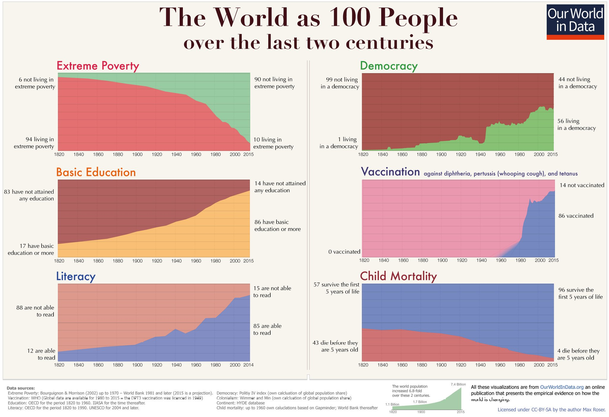
</center>

---
### Factfulness
.pull-left[
<center>
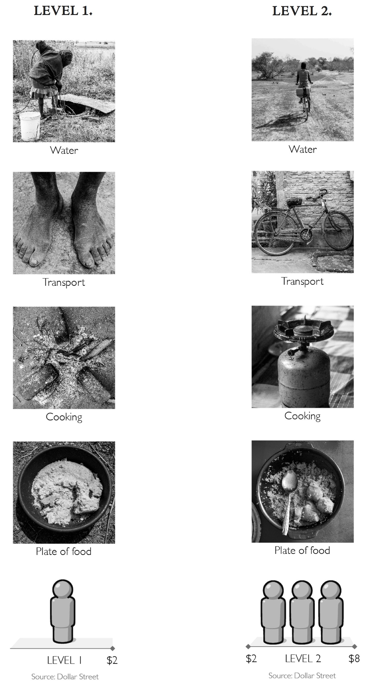
</center>
]

.pull-right[
<center>
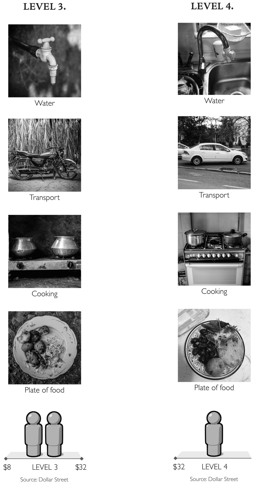
</center>

]

---
## How do I get a first?


- Work hard!

- Read relevant textbook chapters

- Keep pace with lectures

- Take problem sets seriously, make sure you can solve the question in an exam environment

- Don't postpone studying for the module till a few days before the exam


---
<br>
<center>

</center>
---
## Read the Module Outline
<center>

</center>


---
## Overview of the module

<center>
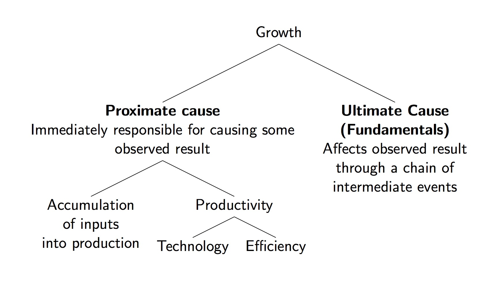
</center>


---
## Gross Domestic Product (GDP) ##

**GDP:** Market value of all the goods and services produced in a country within a period. 

- GDP = output = income

- GDP is a rough-and-ready measure of standard of living. 

- How to compare GDP of countries with different currencies and of a single country in different years?

 -  Purchasing Power Parity (PPP) exchange rates: artificial exchange rates based on the prices of a standardized basket of goods and services (both traded and non-traded).

---

## GDP per capita##
GDP per capita = average income

$$ y_t = \frac{\text{total GDP}}{\text{population}} $$

- Total GDP could be large because of high average income and/or large population

- US has high GDP per capita but China and India do not

---
### Cycles vs trends

<center>
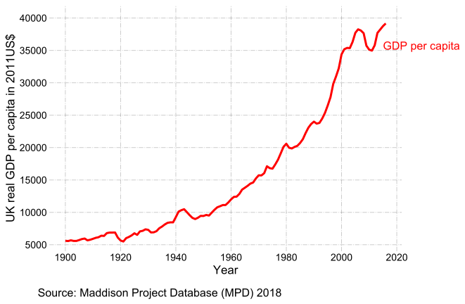
</center>

---
### Cycles vs trends

<center>
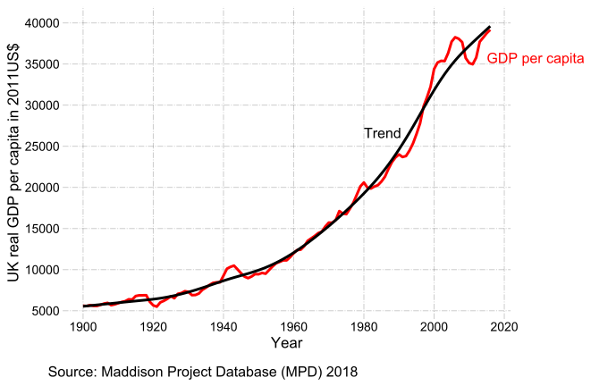
</center>

- **Our primary focus is the long-run (or trend) component of GDP per capita over time.**
---

class: inverse, center, middle
name: data

# Facts to be explained

<html><div style='float:left'></div><hr color='#EB811B' size=1px width=796px></html>

---

### Fact 1: There is a high variation in per capita income across countries.

.pull-left[
Histogram of real GDP per capita in 2016 in 2011US$

<center>
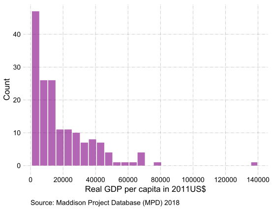
</center>
]

.pull-right[

<br>

| Statistic   |   GDP per capita |
|:------------|:-----------------:|
| # of Countries      |           166    |
| Mean        |         18591.7  |
| Std. deviation         |         19393.2  |
| Minimum         |           619    |
| 25%         |          3892.25 |
| 50%         |         12134.5  |
| 75%         |         26450.5  |
| Max         |        139783    |

]
---
### Fact 1


- Per capita income in the poorest countries are less than 5% of per capita income in the richest countries.

- GDP per capita in 2016 (in 2011 US dollars)

$$ \frac{\text{US (\$53015)}}{\text{Iran (\$15529)}} \approx \frac{\text{Iran (\$15529)}}{\text{Moldova (\$5851)}} \approx \frac{\text{Moldova (\$5851)}}{\text{Ethiopia (\$1659)}} \approx 3 $$


- The 20% of world population that lives in the richest countries receive 60% of world income.


---
### Rich countries

<br>


| Country        |   Year |   GDP per capita |   GDP per worker |   E/pop |   Avg. Growth (1960-2016) |   Years to double |
|:---------------|:-------:|:-----------------:|:-----------------:|:--------:|:--------------------------:|:------------------:|
| Spain          |   2016 |            31556 |          79356.5 |    39.8 |                       2.9 |              24.9 |
| France         |   2016 |            38758 |          93949.6 |    41.3 |                       2   |              36.2 |
| United Kingdom |   2016 |            39162 |          81439.1 |    48.1 |                       1.8 |              39.7 |
| Japan          |   2016 |            36452 |          68097   |    53.5 |                       3.2 |              22.6 |
| United States  |   2016 |            53015 |         112765   |    47   |                       1.9 |              37.4 |


Data source: Maddison Project Database (2018) 

The GDP data are in 2011 dollars.


#### Rule of 72:
- x% economic growth rate
- It takes 72/x years to double the income

---
### Poor Countries

<br>

| Country   |   Year |   GDP per capita |   GDP per worker |   E/pop |   Avg. Growth (1960-2016) |   Years to double |
|:----------|:-------:|:-----------------:|:-----------------:|:--------:|:--------------------------:|:------------------:|
| India     |   2016 |             5961 |          14248.7 |    41.8 |                       3.2 |              22.3 |
| Nigeria   |   2016 |             5323 |          15641.8 |    34   |                       1.6 |              43.8 |
| Uganda    |   2016 |             1909 |           5036   |    37.9 |                       1   |              69.3 |


Data source: Maddison Project Database (2018) 

The GDP data are in 2011 dollars.

---
### Fact 2: There is substantial variation in the rates of economic growth across countries.

.pull-left[
Histogram of average GDP per capita growth from 1960 to 2016

<center>
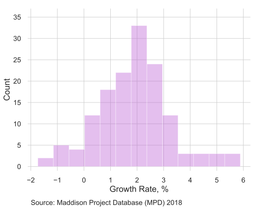
</center>
]
.pull-right[
<br>

| Statistic   |   Avg. Growth (1960-2016) |
|:------------|--------------------------:|
| # of countries       |                 144       |
| Mean        |                   1.9 |
| Std. deviation         |                   1.34 |
| Minimum         |                  -1.73 |
| 25%         |                   1.12 |
| 50%         |                   1.89 |
| 75%         |                   2.66 |
| Maximum         |                   5.89 |

]


---
### Growth Miracles

<br>


| Country/Province                   |   Year |   GDP per capita |   GDP per worker |   E/pop |   Avg. Growth (1960-2016) |   Years to double |
|:--------------------------|-------:|:-----------------:|:-----------------:|:--------:|:--------------------------:|:------------------:|
| Hong Kong      |   2016 |            47043 |          89121   |    52.8 |                       4.3 |              16.7 |
| Republic of Korea         |   2016 |            36151 |          71246.1 |    50.7 |                       5.5 |              13.2 |
| Singapore                 |   2016 |            67180 |         108866   |    61.7 |                       4.8 |              14.9 |
| Taiwan |   2016 |            42304 |          84298.5 |    50.2 |                       5.4 |              13.2 |

Data source: Maddison Project Database (2018) 

The GDP data are in 2011 dollars.


---

### Growth Disasters


<br>


| Country                            |   Year |   GDP per capita |   GDP per worker |   E/pop |   Avg. Growth (1960-2016) |   Years to double |
|:-----------------------------------|:-------:|:-----------------:|:-----------------:|:--------:|:--------------------------:|:------------------:|
| Haiti                              |   2016 |             1636 |           4066.2 |    40.2 |                      -0.7 |            -107.8 |
| Madagascar                         |   2016 |             1307 |           2528.6 |    51.7 |                      -0.9 |             -80.8 |
| Venezuela|   2016 |            13159 |          28878.4 |    45.6 |                       0.2 |             375.1 |
| Zimbabwe                           |   2016 |             1729 |           2845.4 |    60.8 |                      -0   |           -6205.2 |

Data source: Maddison Project Database (2018) 

The GDP data are in 2011 dollars.


---
### Fact 3: Growth rates are not usually constant over time

- The pace of growth worldwide has accelerated

 - 1500 - 1700: .04%
 - 1700 - 1970: .2%
 - 1870 - 1950: 1.1%
 - 1950 - 2008: 2.26%
 
- Changes in growth rates of invididual countries

| Country | Period | Average growth rate|
| :---    | :---: | :---: |
| India | 1960-1980 | 2% |
| India | 1980-2008 | 3.7% |
| China | 1960-1978 | 2.1% |
| China | 1978-2008 | 7.7% |
 
---
### Fact 4: A country's relative position in the relative income rank may change over time

<br>


- "Poor" countries can move to be "rich"


- "Rich" countries can move to be "poor"

---
### GDP over time
.pull-left[
<br>
<center>
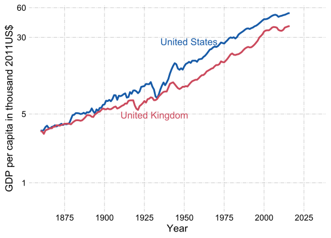
</center>
]
.pull-right[
#### Importance of small difference in the rate of economic growth

<br>


- US GDP per capita in 2016 was 14 times as large as GDP capita in 1870
 
 - 1.8% average growth rate per year (US)

 - 1.3% average growth rate per year (UK)

- In 1870, UK was 30% richer than the US

- In 2016, UK was 30% poorer than the US


]

---
### GDP over time

.pull-left[
<br>
<center>
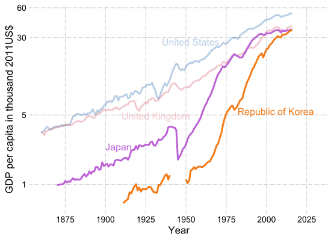
</center>
]
.pull-right[

<br>

- Japan and Korea are examples of countries which managed to reach high income levels

]


---
### GDP over time

.pull-left[
<br>
<center>
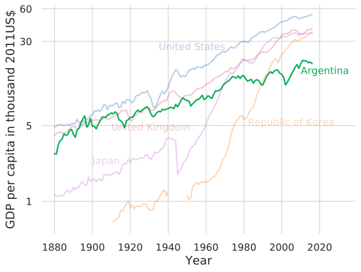
</center>
]
.pull-right[

<br>

- Argentina was as rich as the US and UK in late 19th century.

- GDP per capita of Argentina in 2016 is about 35% of the US.

]

---
### GDP over time
.pull-left[
<br>
<center>
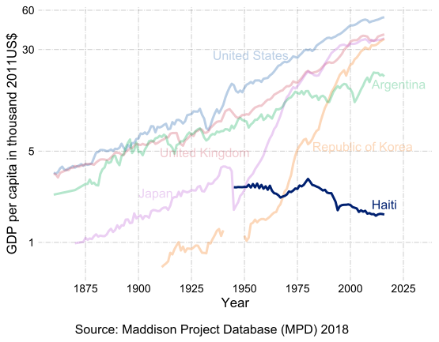
</center>
]
.pull-right[

<br>

- Haiti is an example of countries with negative average growth since mid-20th century.

- In 2016, Haiti's GDP per capita was about 3% of the US.
]


---
### Persistence of income rankings
.pull-left[
<center>
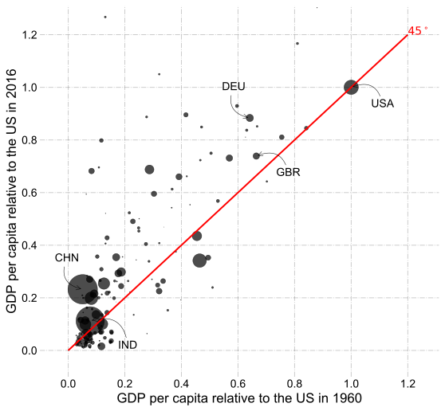
</center>
]

.pull-right[

- Income rankings of the countries may change 

 - Not all of them are on the 45-degree line 
 
- Income rankings are highly persistent

 - Strong positive correlation of the 1960 and 2016 income levels

- Countries with larger populations are usally poorer than the US

 - Size of the circles is proportional to the population of the countries
]


---
## Next Week

- Learn about the Solow Growth Model

 - A model to explain the role of factor accumulation in economic growth
 
<center>

</center>


