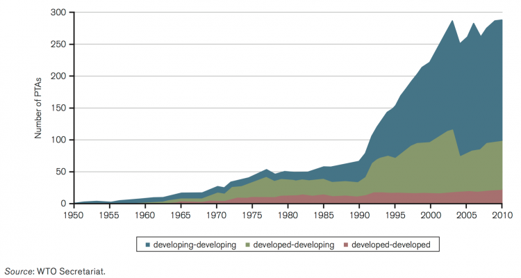
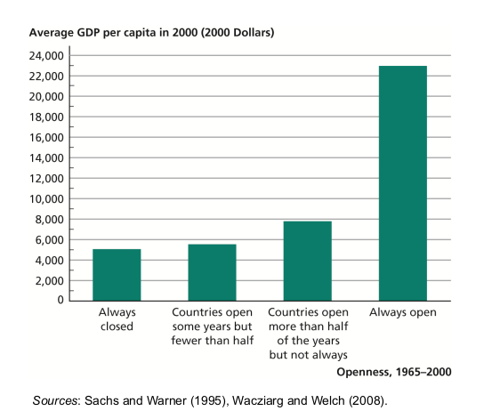
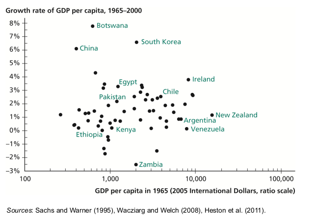
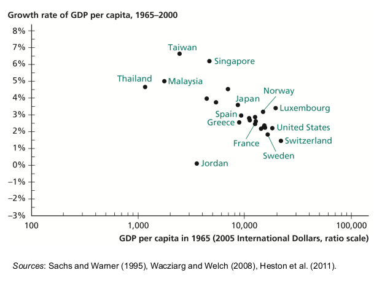
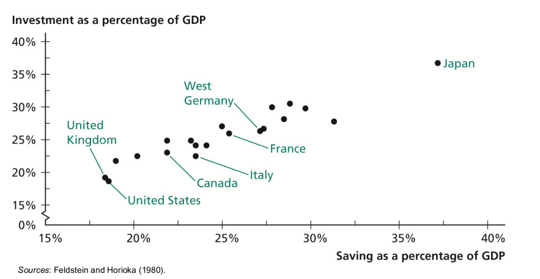
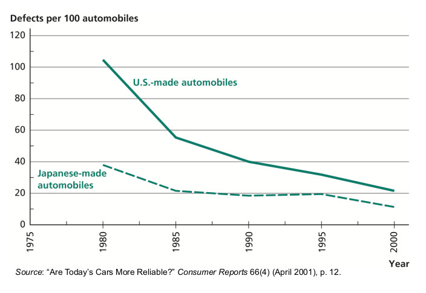

```{r setup, include=FALSE}
options(htmltools.dir.version = FALSE)
library(knitr)
opts_chunk$set(
  fig.align="center", ##fig.width=6, fig.height=4.5, 
  ## out.width="748px", ##out.length="520.75px",
  dpi=300, ##fig.path='Figs/',
  cache=T##, echo=F, warning=F, message=F
  )
```


### Overview


<br>

1. What are the causes of rising economic integration in the 20th century?

2. How does being open to world economy affect a country's economic growth?

3. What are the particular channels through which openness affect growth?

4. Why are some people opposed to openness?


---

### Autarky versus openness

<br>


- **Autarky:** a country does not interact economically at all with the rest of the world

- Openness

 - the exchange of final goods and services

 - flow of factors of production across borders

- Measuring openness

 - Quantities of goods and factors flowing across borders

 - **Law of one price:** if two countries trade freely with each other, the same good will sell for the same price in both markets

---
### Growth of the World trade

<iframe src="https://ourworldindata.org/grapher/merchandise-exports-gdp-cepii?time=1827..2014&country=OWID_WRL" style="width: 100%; height: 500px; border: 0px none;"></iframe>

---
### Growth of world trade
.pull-left[

<br>


- Globalization

 - 1st wave of globalization: mid 1800s - 1914 

 - retreat from global integration: 1914 - 1950 

 - 2nd wave of globalization: 1950 -

- Capital mobility

 - golden age of international capital flows: late 1800s-WWI <br>
  &ndash; British were the "bankers for the world" <br>
  &ndash; Britain financed half of the total sum invested across country borders
 

 - retreat from global integration: WWI - 1990

 - emerging market investment boom: 1990 -


]
.pull-right[
 
- Labor mobility

 - peak of labor market integration: 1914 <br>
 &ndash;Between 1870 and 1925 100M people changed countries (1/10 of the world's population in 1870)

 - Reduced importance of immigration after WWII <br>
 &ndash; end of colonization <br>
 &ndash; the rise of nationalism: 

- In 1910, 14.7% of the U.S. population was foreign born
- In 2010, 12.4% of the U.S. population was foreign born
]

---

### Globalization: the causes

<br>

<br>


- Decline in transport costs

- Increase in the ease of transmission of information (decline in the cost as well)

 - simplied the coordination of economic activity
 
 - enabled new types of trade (e.g. internet service providers)

- Trade policy


---

<iframe src="https://ourworldindata.org/grapher/real-transport-and-communication-costs?time=1930..2005" style="width: 100%; height: 600px; border: 0px none;"></iframe>


---
### Trade policy

.pull-left[

- Reductions in trade restrictions (GATT, WTO)

- Average tariffs in the industrial countries

 - 40% at the end of WW2

 - 6% by 2000

- In 2010, average tariff was 2.8% among OECD countries

 - 8.2% among middle-income countries

 - 11% among poor countries

- Among industrialized countries, the highest tariff is on agriculture
]

.pull-right[

<br>
.center[**Number of preferantial trade aggreements**]
<center>

</center>

Graph from [ourworldindata.org](https://ourworldindata.org/trade-and-globalization#the-majority-of-preferential-trade-agreements-are-between-emerging-economies)

]
---

class: inverse, center, middle
name: openness

## The effect of openness on economic growth

<html><div style='float:left'></div><hr color='#EB811B' size=1px width=796px></html>

---
### How does being open to world economy affect a country's economic growth?

.pull-left[

- Measure of openness: 
 - level of tariffs
 - manipulation of exchange rate
 - government monopoly on export

- For each year from 1965-2000: 1 if open, 0 if not

- Always open countries are 4.5 times as rich as never open countries

- Countries open more than half the time are 1.5 times as rich as countries that are open less than half the time 

]

.pull-right[
<center>

</center>
Graphic from: Economic Growth (David Weil, 3e) 

]

---
### Growth in the closed and open economies

.pull-left[
<center>

</center>

- **Closed economies:** closed for some or all years with the available data

- Average growth = 1.5%
]
.pull-right[
<center>

</center>
- **Open economies:** open entire period

- Average growth = 3.1%

- Negative relationship between initial GDP and growth
]

Graphics from: Economic Growth (David Weil, 3e) 

---
### How changes in openness affect growth

<br>

- Trade liberalization led to rapid growth in

 - Japan (1858) 65% increase in real income over two decades

 - South Korea (1964-1965), income doubled in next 11 years

 - Rapid growth in Uganda and Vietnam in 1990s, after their integration into the world economy.

- Trade embargo in the US (1807-1809, Jefferson) led to unemployment and bankruptcies

---

### The effect of geographical barriers to trade

- Geography: an exogenous factor that affects openness to trade

- Frankel and Romer (1999)

 - Geographical factors affect trade

 - How does geographically determined trade volume affect income per capita?

 - Raising the ratio of trade to GDP by one percentage point would raise income by 0.5%-2%

- Feyrer (2009a, 2009b)

 - Natural experiment: Closing of the Suez Canal (Egypt-Israel fight, 1967-1975)

 - Significant reduction in trade volumes for countries that trading distance increased as a result
 
 - Air freight led to increase in trade volume

 - Led to increase in income (if trade cost decreased)

---
### Openness and growth

<br>

- What are the particular channels by which being open to the outside world affect's a country's level of income per capita?

 - through factor accumulation

 - through productivity


---
### Growth with capital mobility

<br>

Physical capital flows across national borders through

 - foreign direct investment 
  
  - 248M USD of 659M USD private capital flows into developing countries in 2010

 - portfolio investment

 - government grants

 - lending from banks and multinational agencies like World Bank


---

### Saving rate and investment rate

- In the Solow model, the economy is assumed to be closed

 - Hence, saving rate = investment rate
 
- In an open economy, saving rate might differ from the investment rate

 - with a simplistic theory, we expect that saving rate is uncorrelated with investment rate

 - high saving countries might invest in other countries
 
 - Gross Domestic Product (GDP) will not be higher for high saving rate countries
 
 - Gross National Product (GNP) will be higher for high saving rate countries

- Openning to free capital flows 

  - raises GDP of low saving rate country
  
  - decreases GDP of high saving rate country

  - GNP will be higher in both low and high saving countries after openning to international capital flows 


---
### Feldstein-Horioka Puzzle

.pull-left[
- Under perfect capital mobility assumption, saving rate and investment rate should be uncorrelated
 
 - People invest their savings in places with better returns
 
 - They don't need to invest in home country

- Not in reality

 - Positive correlation of saving rate and investment rate

- Puzzle: when an existing theory contradicts with the observed reality

]

.pull-right[

<br>
<center>

</center>

Graphic from: Economic Growth (David Weil, 3e) 
]

---
### Lucas Paradox

- Capital should flow from capital rich countries to capital scarce countries

 - Return on capital investment is higher in capital scarce countries 
 
 - Remember, the diminishing returns to capital

- Large capital flows from capital scarce countries to capital rich countries

 - E.g. major capital flow from China to the US

---
### Openness and productivity

Gains from trade

- comparative advantage: improvements in resource allocation 

 - Natural endowments: tropical fruit in Guatemala

 - Abundance of factors of production well suited to production of a good: the polishing of small diamonds in India

 - It has already specialized in it (movies in the US)

- increasing returns to scale leads to gains from specialization even without comparative advantage

- Tariff reduction agreements under the Uruguay Round (1986-1994) 
 - raised world purchasing power by 73B USD per year (0.2% of world GDP) [Brown, Deardorf and Stern (2002)]

---
### Openness and productivity, cont'd

.pull-left[
Competition

 - exposure to global competition forces improvement in efficiency 

 - weakens monopolies who lead to resource misallocation

 - in 1965: imports account for 6% of the U.S. car market

 - in 1980: 27% (75% of which was from Japan)

 - Led to increase in quality of American cars

 - After completion the US - Canada trade agreement <br>
  - productivity in previously protected industries rose 3 times as unprotected industries
]

.pull-right[

<br>
<center>

</center>

Graphic from: Economic Growth (David Weil, 3e) 
]

---
### Openness and productivity, cont'd (2)

- Technology transfer

 - foreign direct investment: factories, management

 - importing embodied technology: key inputs, capital goods 

 - importing ideas generated abroad

 - interaction among countries: innovative organizational techniques

- Incentives to R&D

 - larger market and profit opportunity

---
### Opposition to openness

- Workers and firms that have comparative disadvantage

 - Reallocation of factors of production to different sectors / geographies are costly

 - Adjustment takes long time

 - Gains accrue to large number of people, each gains a small share

 - Losses accrue to small number of people, each shoulder a high burden

- Firms losing monopoly power

- Owners of factor of production (openness leads to lower returns if capital was scarce before openness)

- Higher return to low educated people without trade

---
### Summary

- Main causes of rising economic integration 

 - declining transportation and communication costs
 
 - reductions in barriers to trade
 
- Being open to world economy has positive effects on economic growth

- Openness affect economic growth through

 - factor accumulation
 
 - productivity gains
 
- Even though openness to trade (on average) benefit the society

 - there are losers from international trade
 
 - the losses from trade might be concentrated in certain geographies/demographics
 
 - gains are widespread
 
- To review this lecture, read Chapter 11 of Economic Growth by David Weil

