```{r setup, include=FALSE}
options(htmltools.dir.version = FALSE)
library(knitr)
opts_chunk$set(
  fig.align="center", ##fig.width=6, fig.height=4.5, 
  ## out.width="748px", ##out.length="520.75px",
  dpi=300, ##fig.path='Figs/',
  cache=T##, echo=F, warning=F, message=F
  )
```
```{r xaringan-themer, include=FALSE, warning=FALSE}
library(xaringanthemer)
style_mono_accent(
  base_color = '#000000',
  title_slide_text_color = '#000000',
  title_slide_background_color = '#FFFFFF',
  header_font_google = google_font("Josefin Sans"),
  text_font_google   = google_font("Montserrat", "300", "300i"),
  code_font_google   = google_font("Fira Mono"),

)
```

### Introduction

<br>

- So far, we have focused on average level of income in a country

- In this lecture, we will investigate how income is divided among the residents of a country (distribution of income)

- Distribution of income matters as well as average income.
 
 - In 2005, average income in India ($2,557) was 21% larger than that of Pakistan ($2,112)

 - Fraction of the population living on income of less than $1.25 per day <br>
 -41.6% in India <br> -22.5% in Pakistan


---

### Overview

<br>

<br>

* Income inequality: the facts

 * Top income shares vs Gini coefficient
 
 * Market income vs disposable income
 
 * Within country inequality vs global inequality

* Sources of income inequality

* Effects of income inequality on economic growth


---

class: center, middle
name: facts

## Income inequality: facts

<html><div style='float:left'></div><hr color='#EB811B' size=1px width=796px></html>

---
### Income distributions


<br>

<br>


Two ways of looking at income distribution:

 
2. Divide income into equal-sized intervals

 - measure number of people (or fraction of population) in each interval

1. Divide the population into several equal-sized groups

 - measure how much each group earns

---
### Income Distribution in the US, 2009


<center>
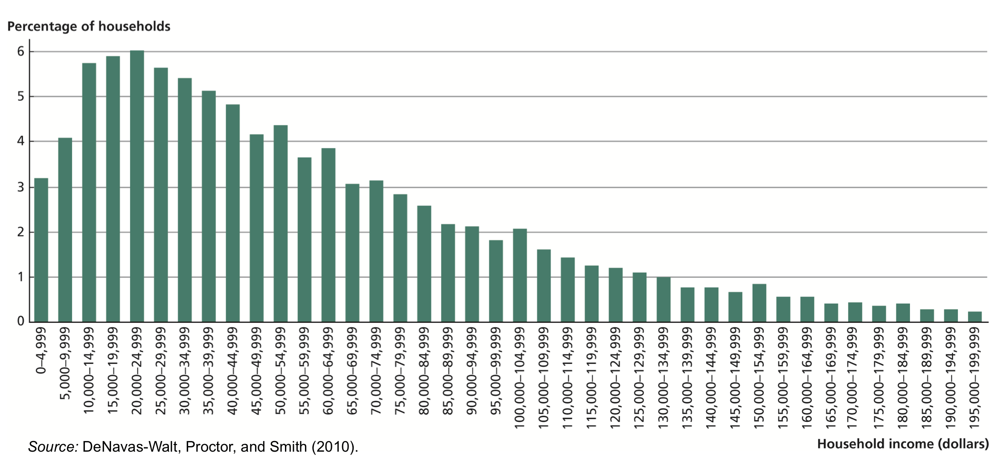
</center>

Graph from: Weil (2013)
.pull-left[
- Mean household income: $67,979
- Median household income: $49,777
]
.pull-right[
- Income distributions are always skewed
 - long right tail
]

---
### Disposable income distribution in the UK, 2017

.pull-left[
> **The equivalised disposable income** is the total income of a household, after tax and other deductions, that is available for spending or saving, divided by the number of household members converted into equalised adults. &ndash; Eurostat

- Mean income > Median income

- Skewed distribution
]

.pull-right[
<center>
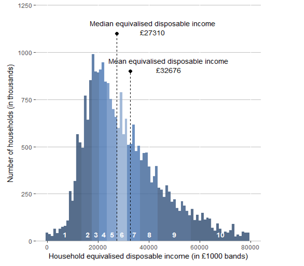
</center>

Source: ONS, 2017 data

]


---

###  Measuring Inequality ### 

&nbsp;

&nbsp;


* Top income shares

 * Share of total income going to top earners

* Gini coefficient

 * Derived from the Lorenz curve


---
### Measuring Inequality, Lorenz Curve

.pull-left[
* Arrange households from lowest to highest income

* Calculate the fraction of the total income earned by the poorest 1 percent

* Then, fraction of the total income earned by the poorest 2 percent

* So on

* Graph these data 

* The more bowed out is the Lorenz Curve, the more unequally income is distributed.

]

.pull-right[

#### The Lorenz Curve for the United States, 2009

<center>
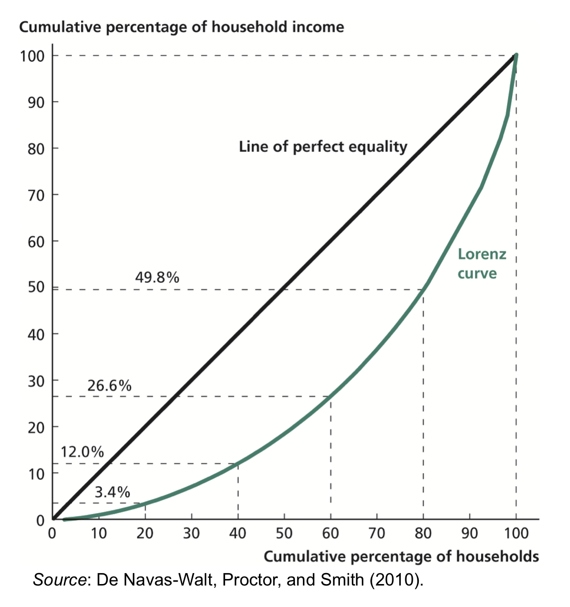
</center>

Graph from: Weil (2013)
]
---
### Measuring Inequality, Gini coefficient
.pull-left[

* Gini coefficient: 
 - the area between the Lorenz Curve and the line of perfect equality divided by the total area under the line of perfect equality

* Perfect equality: Gini coefficient = 0 (or 0%)

* Perfect inequality: Gini coefficient = 1 (or 100%)

* The closer is the coefficient to zero, the more income is distributed equally in a country

* Gini coefficient in the US: 0.468 (or 46.8%)

* Gini coefficient in the UK: 0.34 (or 34 %) (in 2014, World Bank)

]

.pull-right[

#### The Lorenz Curve for the United States, 2009

<center>

</center>

Graph from: Weil (2013)
]


---
class: middle

<center>

</center>

---
###  Market income inequality versus disposable income inequality ### 

* Market income:

 * Labor income
 
 * Capital income
 
* Disposable income (income that reaches people's pockets):

 * Labor income
 
 * Capital income
 
 * Transfers (e.g. social security)
 
 * Minus taxes


---
###  Market income vs disposable income inequality ###   

.pull-left[
[Milanovic (2018):](https://promarket.org/the-inequality-paradox-rising-inequalities-nationally-diminishing-inequality-worldwide/)

-  Out of 17 OECD countries (with comparable data) 

 - 15 saw an increase in disposable income inequality 
 - from mid 1980s to 2013-15.

- Inequality of market incomes went up by even more. 

- In both USA and Germany, disposable income inequality is less than market income inequality

- Market income inequality increased more in Germany than the US

- Disposable income inequality increased less in Germany than the US
]

.pull-right[
<center>

</center>

Source: [Milanovic (2018), ](https://promarket.org/the-inequality-paradox-rising-inequalities-nationally-diminishing-inequality-worldwide/)Calculated from Luxembourg Income Study (LIS) data


]
---
class: middle

<center>
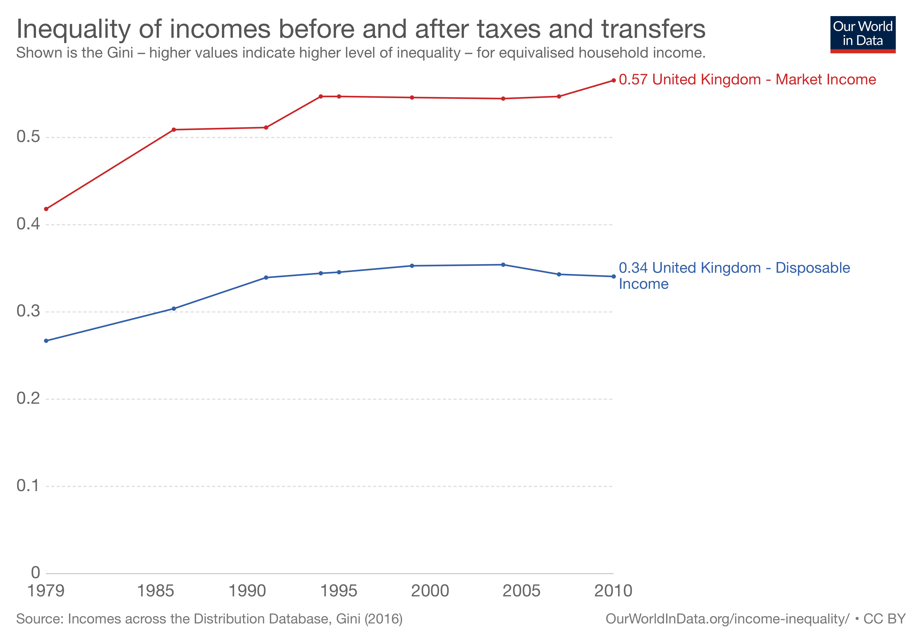
</center>


---
<center>
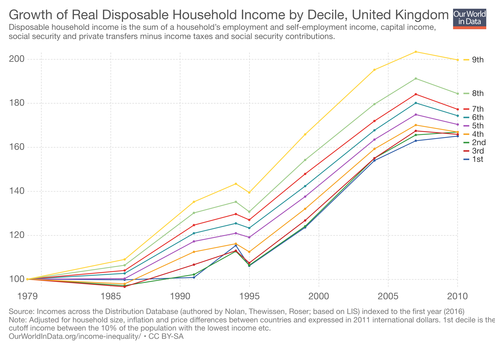
</center>

---
.pull-left[
###  Within country inequality versus global income inequality ### 

* So far we focused on with country inequality

 * Evidence that inequlity increases in many countries over the last decaded.
 
* Global income inequality

 * Income inequality among all the people in the world
 
 * Declined in the last decades
 
 * Gini in 2003: 0.687, Gini in 2013: 0.649 ( Tomáš Hellebrandt and Paolo Mauro (2015))

]

.pull-right[
<center>
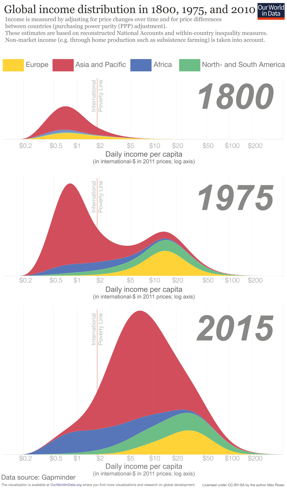
</center>

]

---
class: middle

<center>
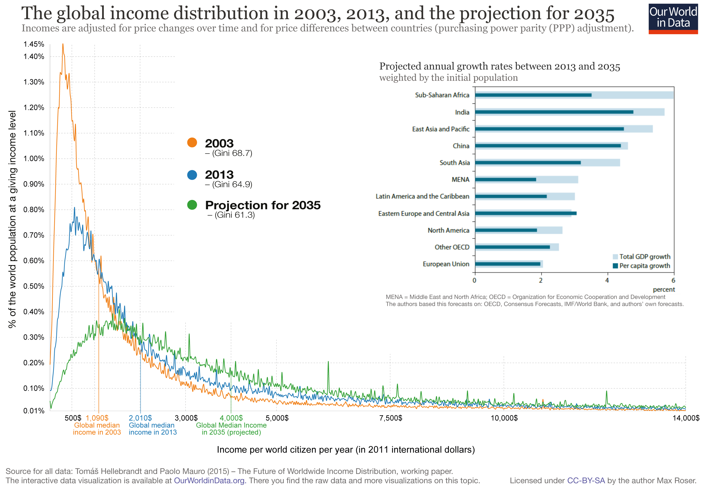
</center>

---

class: center, middle
name: sources

## Sources of income inequality

<html><div style='float:left'></div><hr color='#EB811B' size=1px width=796px></html>

---
### Sources of income inequality

Why is there income inequality?

- Characteristics of people that affect income

 * ownership of physical capital: inheritance, investment

 * human capital: health, education

 * occupation specific skills/talent: leadership, artistic skills, language skills etc.

 * geography/location: where people live

 * matching of characteristics with economic environment

- factors not related to productivity of people:

 - monopoly rents
 
 - corruption

---
### Education as a source of income inequality

<br>

<br>


* lower return to education reduces income inequality

 * the earning difference between the poor and the rich decreases 

* narrower distribution of years of education reduces income inequality

 * the fraction of middle income workers increases


---

class: center, middle
name: inequality-growth

## Income inequality and economic growth

<html><div style='float:left'></div><hr color='#EB811B' size=1px width=796px></html>

---
.pull-left[
### The Kuznets Curve

Simon Kuzents' hypothesis (1955): as a country develops, inequality should first rise and then fall


<center>
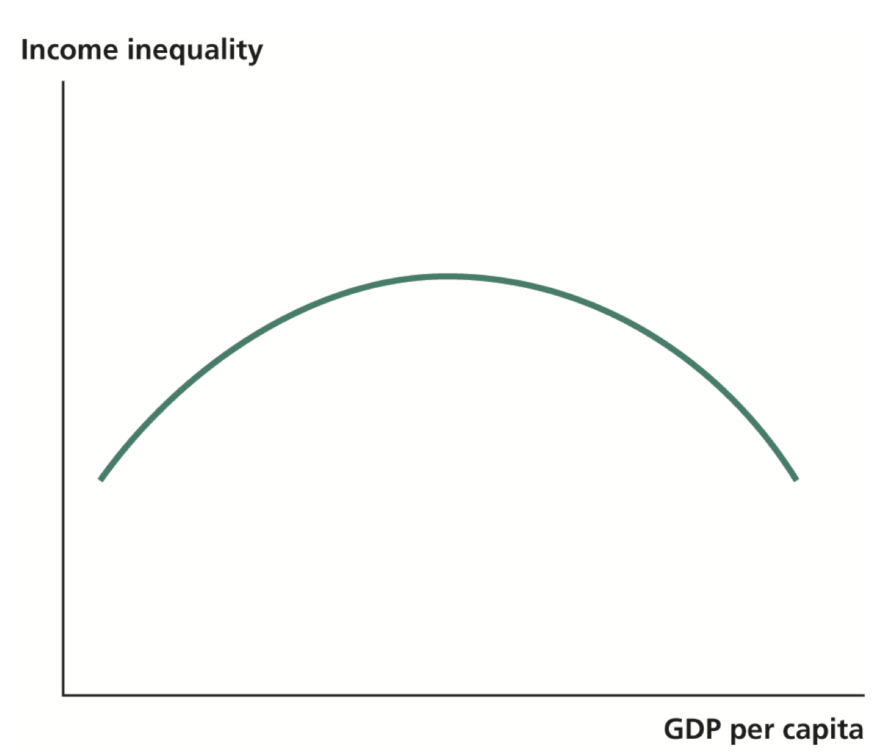
</center>

Graphic from: Weil (2013)

]
--
.pull-right[
### The Kuznets Curve in England and Wales, 1823--1915
<br>

<center>
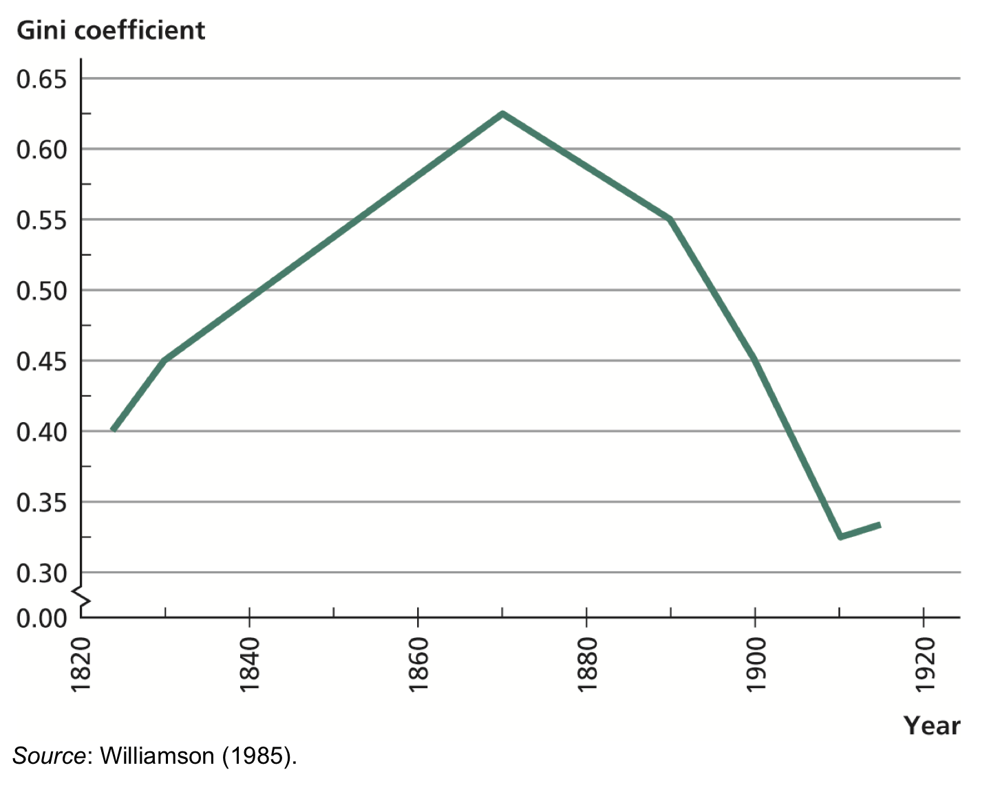
</center>

Graph from: Weil (2013)
]
---
### Income per capita versus inequality

.pull-left[
- Data in this graph does not provide evidence to Kuznets curve

- Many other factor contribute to inequality
  - If one controls for these factors, we may still get an inverse-U relationship between GDP per capita and inequailty
 
- Robert Barro estimates that the peak of the Kuznetz curve is about $5 thousond (in 2000 dollars)

]

.pull-right[
<center>
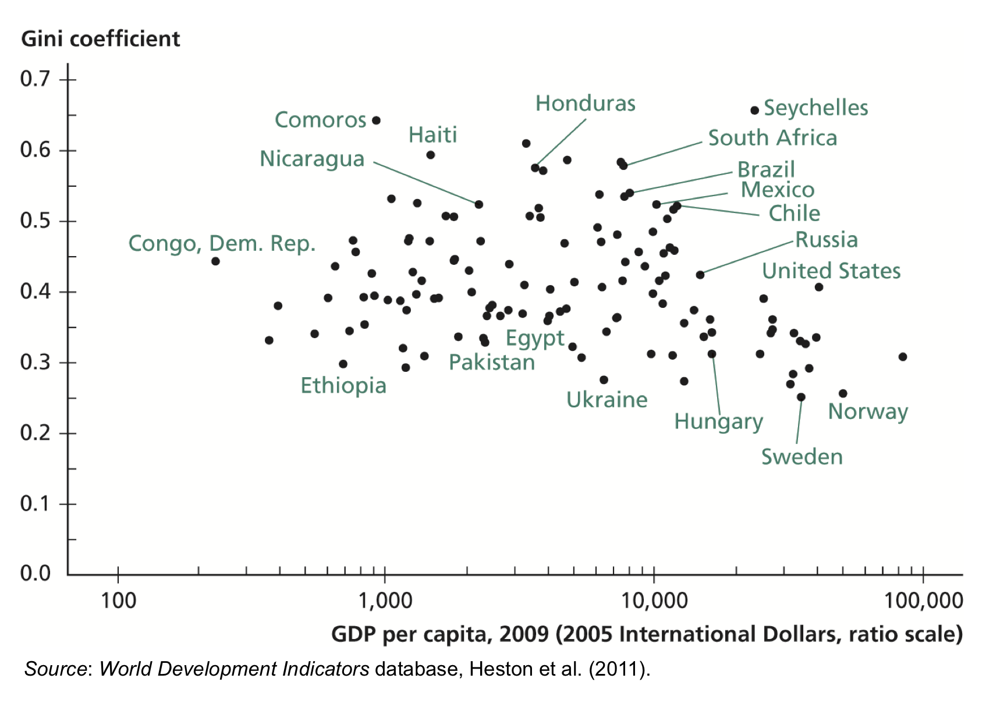
</center>

Graph from: Weil (2013)
]


---
### Explaining the Kuznets Curve

* Technological progress raises the returns to skills (education, entrepreneurial ability) 

 * marginal product of human capital increases 
 * skilled workers earn more
 * income inequality increases

* Technological progress raises returns to physical capital

 * technologies are often embedded in new capital goods
 * skills and capital are found at the higher end of distribution
 * inequality rises

--

* Resource reallocation gradually takes place

 * unskilled workers increasingly value education given the widened wage gap
 * workers flow into fast-growing regions/industries
 * as technological progress slows down, return to physical capital decreases
 * income inequality decreases


---
### Explaining the recent rise in income inequality

* Technological progress

 * rise of information technology: return on education should rise
 * Skill-biased technological change

* Increases in international trade

 * demand for internationally scarce resources: return on education should rise
 * owners of internationally scarce resources benefit

* Superstar dynamic 

 * people with the highest levels of some qualities earn much more than people with only slightly lower qualifications
 * sports, entertainment

* Government policies (deregulation, tax policy, etc)


---
class: middle

<center>

</center>


---
### Effect of Income Inequality on Economic Growth

<br>

Inequality leads to high capital accumulation

* rich people have a higher saving rate than poor people

* the greater proportion of income earned by the rich the higher the national savings rate

* greater income inequality leads to higher income per capita via physical capital accumulation

If a country is open to flows international capital flows

* Investment does not need to be financed by domestic savings

* Effects of inequality on physical capital accumulation will be diminished


---
### Effect of Income Inequality on Economic Growth, cont'd ### 

.pull-left[

Inequality leads to low human capital accumulation

* Human capital is installed in a specific person

 * marginal return decreases as human capital increases

* Physical capital can be rented to other people

 * marginal return does not depend on a person's investment


]

.pull-right[
<center>
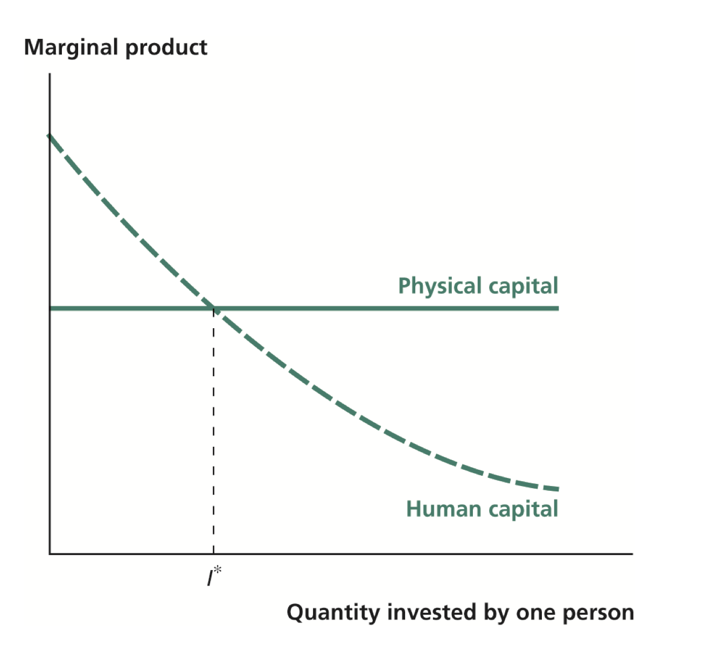
</center>

Graphic from: Weil (2013)

]


---
### Effects of inequality on human capital accumulation

.pull-left[
* Poor people invest mainly in education
* After one point, the rich stop investing in human capital
 * Gini coefficient for physical capital in the US: 0.78
 * Gini coefficient for years of education: 0.14

* If income is taken from the poor and given to rich
 * The poor decreases human capital
 * The rich do not invest in human capital
 * Total human capital decreases
 * Income decreases
* If a country is open to flows international capital flows
 * the negative effects of inequality on human capital remain

]

.pull-right[
<center>

</center>

Graphic from: Weil (2013)

]


---
### Income inequality, income redistribution, and efficiency

Redistributionary taxes leads to distortion

 * progressive tax charges higher tax rates on the more productive worker 

 * income tax discourages labor: inefficiency (dead-weight loss) increases 

 * greater income inequality leads to lower income per capita

There are counter arguments about this point.


---
### Empirical evidence

<br>

Available data is not sufficient to estimate the individual effects of inequality on growth

* no evidence that countries with higher income inequality has higher capital stock accumulation

* in countries where income inequality is higher the level of education is lower (matches predictions of this chapter)

* no evidence that higher income inequality leads to more redistributive taxation

---
### Summary

<br>

- Evidence of increasing income inequality within the advanced economies

- Evidence of decreasing income inequality in the world as whole

- Theoretical channels on the interrelationship between income inequality and economic growth are analyzed

#### To review this lecture

- Read Chapter 13 of Weil (2013)

- Read [The Inequality Paradox: Rising Inequalities Nationally, Diminishing Inequality Worldwide](https://promarket.org/the-inequality-paradox-rising-inequalities-nationally-diminishing-inequality-worldwide/)


- Take a look at [Income Inequality](https://ourworldindata.org/income-inequality) entry from ourworldindata.org