```{r setup, include=FALSE}
options(htmltools.dir.version = FALSE)
library(knitr)
opts_chunk$set(
  fig.align="center", ### fig.width=6, fig.height=4.5, 
  ###  out.width="748px", ### out.length="520.75px",
  dpi=300, ### fig.path='Figs/',
  cache=T### , echo=F, warning=F, message=F
  )
```

### Introduction

<br>

<br>


Importance of government policies on economic growth

- North and South Korea

- East and West Germany

- China (before and after liberalization) 

---

### Overview

<br>

<br>

- Defining the proper role of the government

- How government affects growth

- Why governments do things that are bad for growth

- Why poor countries have bad governments

---

class: inverse, center, middle
name: proper

## Goverment's proper role in the economy

<html><div style='float:left'></div><hr color='#EB811B' size=1px width=796px></html>


---
### Defining the proper role of the government

#### The case of government intervention in the economy:

_Market failure:_

- public goods
 - non-rivalrous, non-excludable: national defense, rule of law, infrastructure

- externalities

 - social net benefit $\neq$ private net benefit
 - R&D subsidies
 - patents
 - education
 
- natural monopoly
 - high sunk cost: public utilities (electricities, natural gas, water, public transportation)

- coordination failure
 - industrial policy: supply chain, infant industry

---
### Defining the proper role of the government, cont'd

#### The case against government intervention in the economy:

_Government failure:_
- lack of incentives/information for the government to operate properly

 - inefficient state enterprises/government-owned banks

 - industrial policies lead to rent-seeking

- government failure $>$ market failure ?

 - privatization and deregulation


#### Equity-efficiency trade-off in redistribution:
- benefit of redistribution: higher equity

- cost of redistribution: lower efficiency, bureaucratic cost

---

class: inverse, center, middle
name: affect-growth

## How governments affect growth

<html><div style='float:left'></div><hr color='#EB811B' size=1px width=796px></html>


---
### How governments affect growth

<br>

<br>

- Rule of law

- Taxation, efficiency, and the size of government

- Planning and other industrial policies

- Preventing civil conflicts


---
### Rule of law

.pull-left[
- a reliable legal system should lead to high factor accumulation

 - without property rights no one would save/invest

<center>
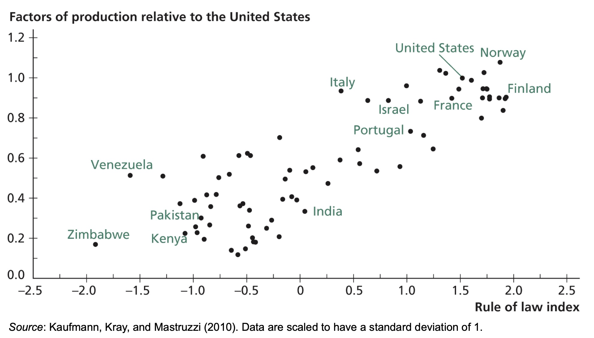
</center>

]

.pull-right[
- a reliable legal system should lead to high productivity

 - without contract enforcement no one would trade: no division of labor
 
<center>
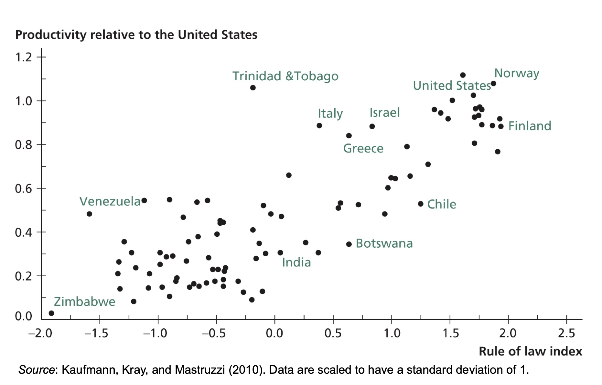
</center>
]


Graphics from Weil (2013)

---
### Taxation, efficiency, and the size of government

.pull-left[
#### Wagner's law
 - the size of a government will increase as countries become richer due to more complex regulations and advanced public goods provision
 
 - increase in expenditure requires increase in taxes

#### Taxes and output

 - increase in tax rates leads to lower efficiency <br>
 &ndash; distortionary taxes discourage economic activities <br>
 &ndash; dead weight loss represents the efficiency loss

]

.pull-right[
<center>
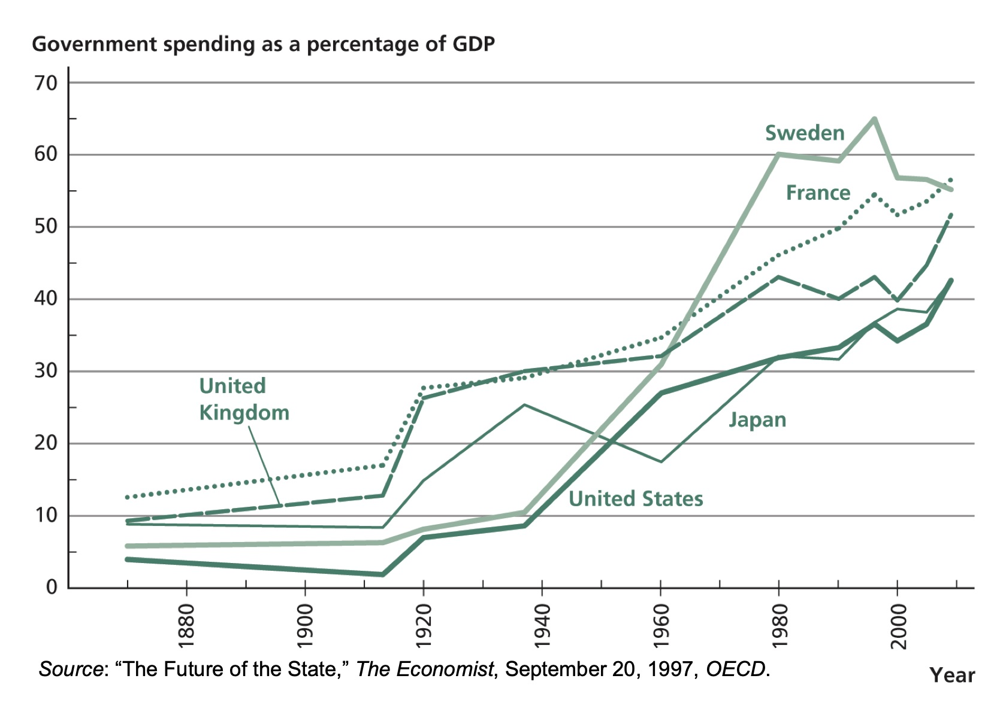
</center>
Graphic from Weil (2013)
]

---

### Planning and other industrial policies

<br>

- State enterprises

- Government-owned banks

 - China: 98% of bank assets (2006)
 - India: 75%
 - Egypt: 65%
 - Israel: 46%
 - Germany: 42% 
 
- Marketing boards

- Protection of infant industries with tariffs

---

### Planning is not always a failure

- South Korea
 
 - public enterprises in steel and petro-chemicals

 - directed investment into selected industries

 -  tariffs to protect infant industries

 - public enterprises operated as autonomous, profit-seeking entities

- Taiwan

 - foreign firms were able to sell products in Taiwan only with technology transfer

 - weaned infant industries from protection

- Korea: protection conditional on growing export

- Taiwan: protection conditional on meeting productivity targets

- Planning works when administered by an efficient, honest bureaucracy

---
### Recent evidence
.pull-left[
<center>
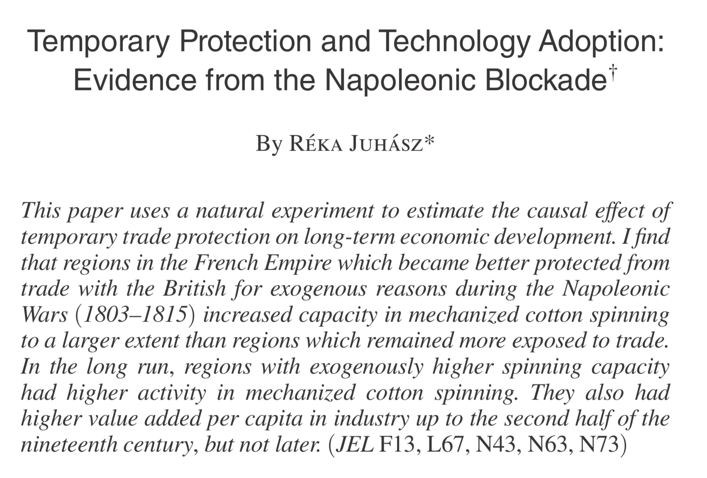
</center>

Juhasz, R. (2018). Temporary protection and technology adoption: Evidence from the napoleonic blockade. American Economic Review, 108(11), 3339-76.}
]

.pull-right[
<center>
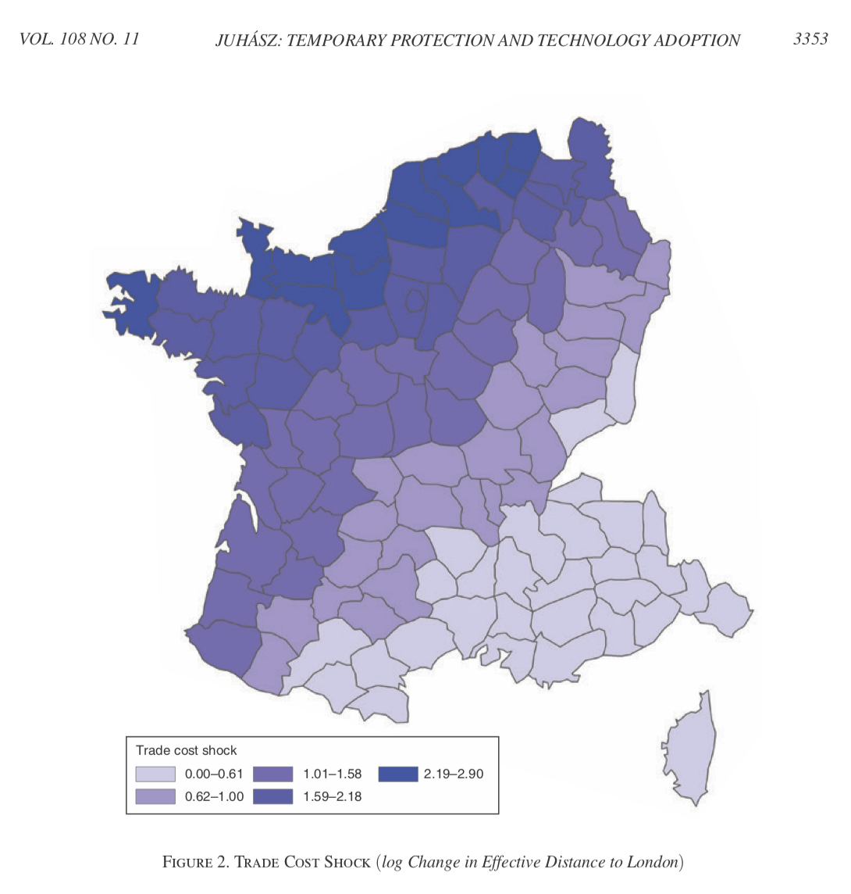
</center>
]

---
### Recent evidence, cont'd

.pull-left[
<center>

</center>
]

.pull-right[
<center>
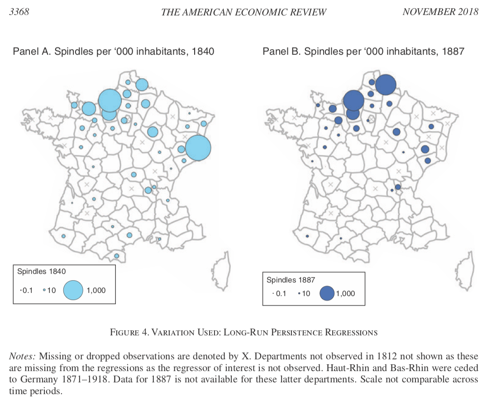
</center>
]

Juhasz, R. (2018). 

---
### Civil conflicts

- looting

- flight of refugees

- destruction of capital

- restriction of commerce

- weakening of social capital

- diminished supply of public goods

- humanitarian costs

---

class: inverse, center, middle
name: bad

## Why governments do things <br> that are bad for growth

<html><div style='float:left'></div><hr color='#EB811B' size=1px width=796px></html>


---
### Why governments do things that are bad for growth
- Some other goals
 - national defense, arts, foreign aid
 - anti-pollution regulations

- Corruption 

 - waste of government revenue
 - lower efficiency of production
 - undertake policies solely to generate more opportunities for bribery
 - undermine rule of law
 
- Self-preservation
 - new technologies can redistribute economic power
 - rising education may introduce destabilizing new ideas
 - movement of population from farms to cities may lead to revolutionary class
 - trade carries dangerous ideas

---
### Government corruption versus GDP per capita, 2009

<center>
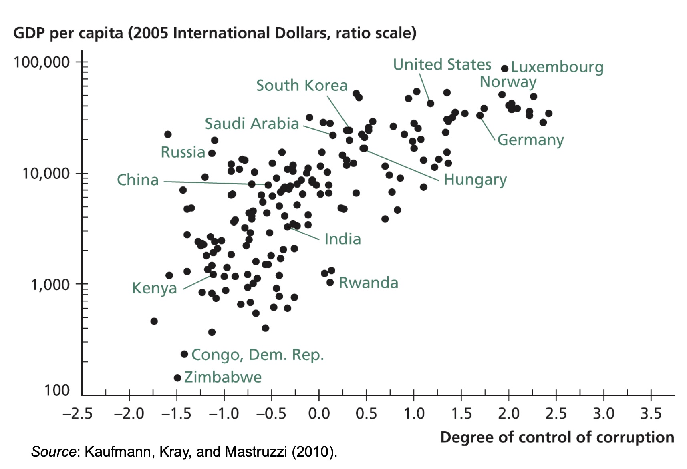
</center>

---
<center>
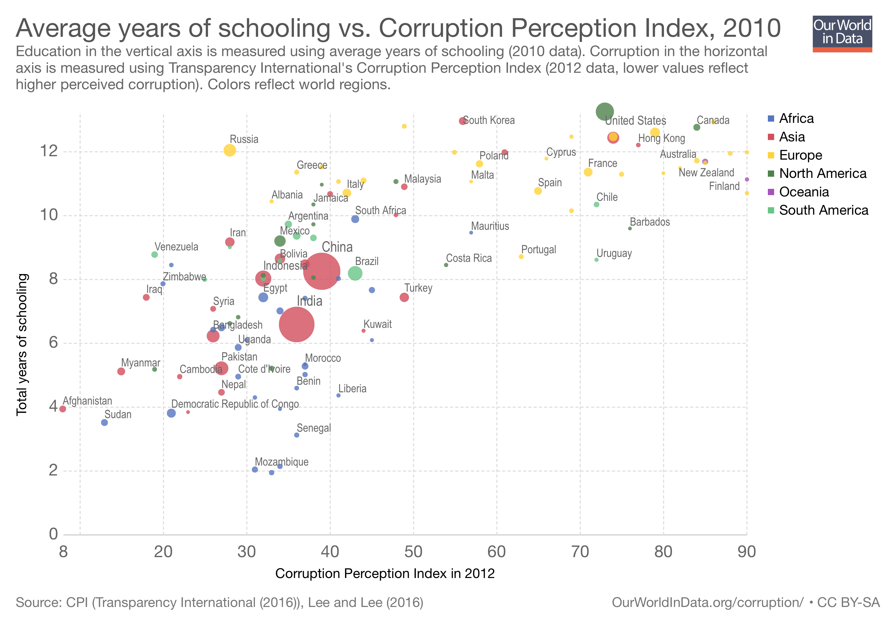
</center>

---
### Government regulation: helping hand or grabbing hand
Djankov et al. (2002)

.pull-left[

- Bolivia: follow 20 procedures, wait 82 days, pay $2,696 to establish a business

- Canada: 2 procedures, 2 days, $280
- Helping hand
 - regulate entry of new firms to protect consumers from low-quality products
 - limit negative externalities such as pollution

- Grabbing hand
 - benefit government bureaucrats
 - benefit people with good connections to government

]


.pull-right[

- Data supports grabbing hand

- Countries with more regulations did not have less pollution, higher-quality consumer products, or better health

- More democratic countries tend to have fewer regulations

]

---

class: inverse, center, middle
name: poor

## Why poor countries have bad governments

<html><div style='float:left'></div><hr color='#EB811B' size=1px width=796px></html>


---
### Why poor countries have bad governments

<br>

<br>


- Poor countries tend to have bad governments

- Are these countries poor because of their bad governments?

- Is bad government a symptom of poverty?

---
.pull-left[
### Causation running from income to government quality

- Until 1871, British army officers were appointed and promoted by purchasing of their positions

- History of New York City, _a cesspool of corruption_

- Yet, these countries and cities are now advanced economies with better governments

- Rich countries can afford to pay their civil servants reasonable wages

- larger pie to split, less of the destructive competition
]

.pull-right[
### Causation running from government quality to income

- South Korea vs North Korea

- Some countries have bad government that have nothing to do with their income

 - (e.g. former colonies)
]
---


<center>

</center>
Source: Acemoglu, D., Johnson, S., & Robinson, J. A. (2001). The colonial origins of comparative development: An empirical investigation. American economic review, 91(5), 1369-1401.

---
### Protection against expropriation risk

<br>


Related to:

- property rights enforcement

- checks against government power

- independent judiciary

- equal access to education

- civil liberties

---
### Institutions and income 

<center>
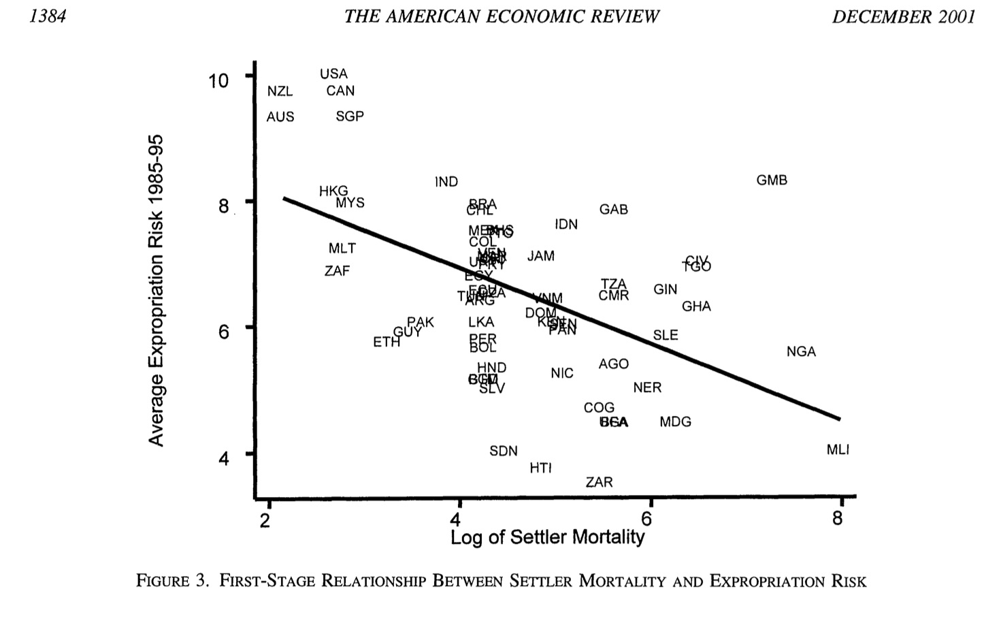
</center>
Source: Acemoglu, Johnson, and Robinson (2001)

---
### Democracy and GDP

<center>
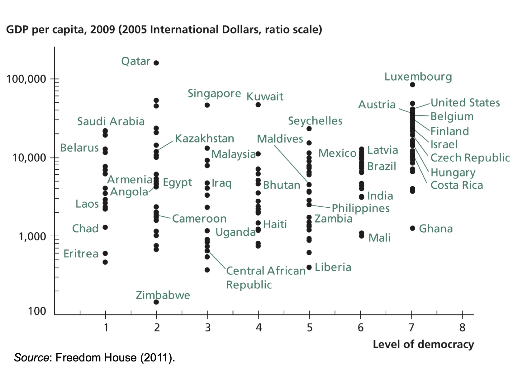
</center>
Graph from: Weil (2013)

---
### Democracy and economic growth

.pull-left[
- Political rights are greater in rich countries

- Democracy may not always good for economic growth

- positives

 - limits on the powers of rulers, avoid corruption
 
- negatives
 
 - prone to political instability
 
 - policies favoring short-run gains rather than long-run growth
]
.pull-right[
#### India vs China

- In 1980, India: $1,018 income per capita
 - China: $714 

- average growth rate, China: 1975-2009: 7.9% per year

 - India: 3.7% per year

- licensing of new investment projects

- modernizing regulations

- building infrastructure

- bickering between different levels of government

- changes of direction when politicians came into power
]

---

<center>
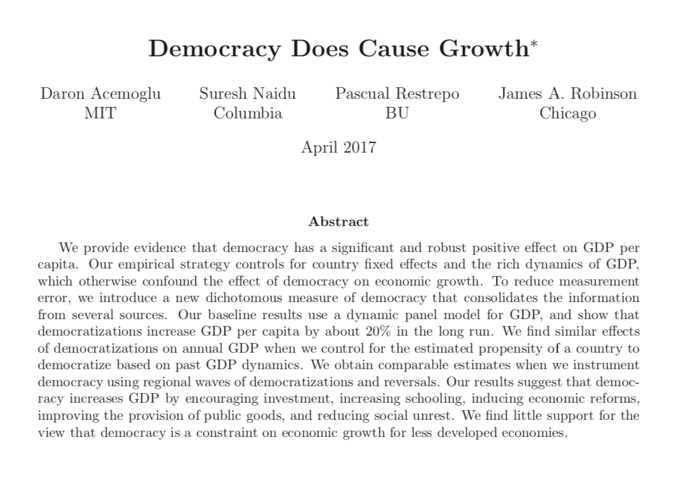
</center>

Acemoglu, D., Naidu, S., Restrepo, P., & Robinson, J. A. (2019). Democracy does cause growth. Journal of Political Economy, 127(1). 
---
<center>
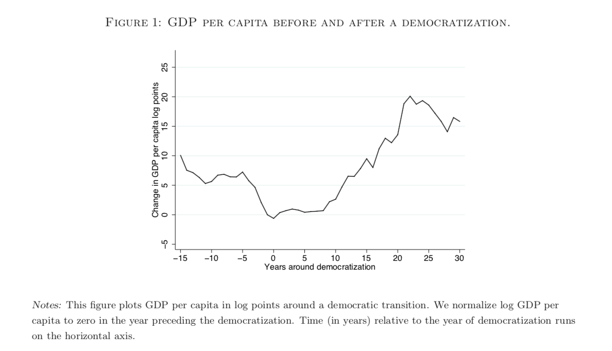
</center>

Acemoglu et al. (2019). 
---
<center>
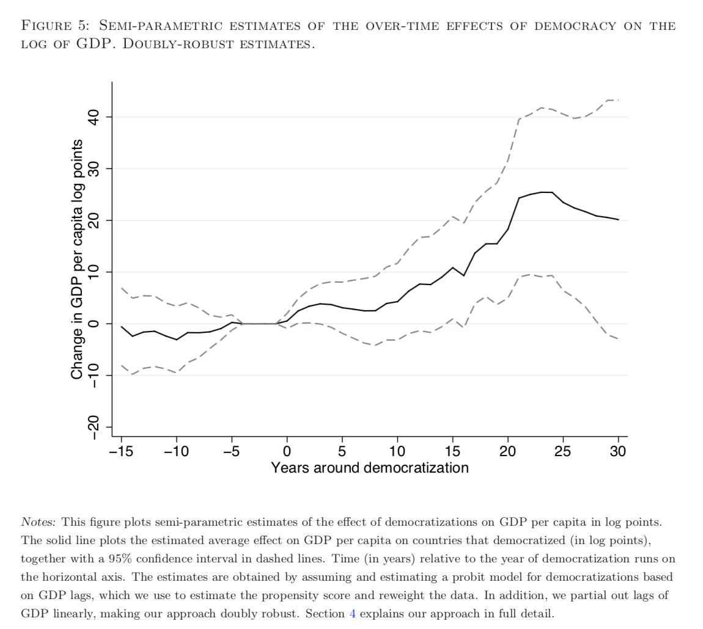
</center>

Acemoglu et al. (2019). 

---
### Podcast episodes with Daron Acemoglu

<!--
- Listen to these podcasts to get great insights about economic growth 

 - Conversations with Tyler; Daron Acemoglu on the Struggle Between State and Society [(Ep. 81)](https://medium.com/conversations-with-tyler/tyler-cowen-daron-acemoglu-history-economics-db440127ba6a)
 
 - Rocking our priors (by Dr. Alice Evans); ["The Narrow Corridor"](https://soundcloud.com/user-845572280/the-narrow-corridor-professor-daron-acemoglu): Professor Daron Acemoglu
--> 

.pull-left[
<center>
<iframe width="330" height="550" src="./files/tweet1.html" frameborder="0" allowfullscreen></iframe>
</center>
]


.pull-right[

<center>
<iframe width="450" height="600" src="./files/tweet2.html" frameborder="0" allowfullscreen></iframe>
</center>
]
---

### Conclusion

<br>

- rule of law is unambiguously good for economic growth

- complete government direction of the economy does not work

- government planning and the protection of infant industries with tariffs have often but not always failed

- government quality and income are interrelated to each other

<br>

#### To review this lecture:

- Read Chapter 12 (Government) of Weil (2013) 