```{r setup, include=FALSE}
options(htmltools.dir.version = FALSE)
library(knitr)
opts_chunk$set(
  fig.align="center", ### fig.width=6, fig.height=4.5, 
  ###  out.width="748px", ### out.length="520.75px",
  dpi=300, ### fig.path='Figs/',
  cache=T### , echo=F, warning=F, message=F
  )
```


.pull-left[
<center>
<iframe width="370" height="650" src="./img/nobel.html" frameborder="0" allowfullscreen></iframe>
</center>
]

.pull-right[

<br>

<br>

<center>
<iframe width="470" height="500" src="./img/wolfers.html" frameborder="0" allowfullscreen></iframe>
</center>

]


---
### Nordhaus' Nobel Lecture ###


<center>

<iframe width="760" height="415" src="https://www.youtube.com/embed/h1RkSuAs03Q" frameborder="0" allow="accelerometer; autoplay; encrypted-media; gyroscope; picture-in-picture" allowfullscreen></iframe>

</center>

<!--
Watch it on [YouTube, ](https://www.youtube.com/watch?v=h1RkSuAs03Q&feature=emb_title)
-->

[Slides here](https://www.nobelprize.org/uploads/2018/10/nordhaus-slides.pdf)


---

####  DICE (Dynamic Integrated model of Climate and the Economy) ####
#### RICE (Regional dynamic Integrated model of Climate and the Economy) ####

<center>
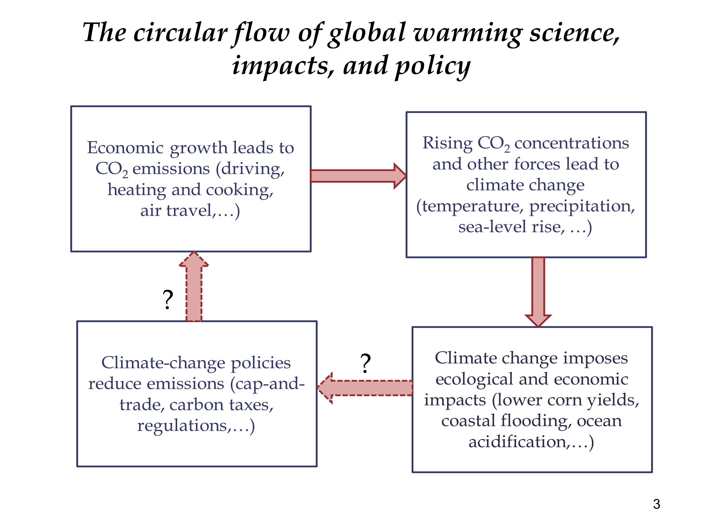
</center>

Source: William Nordhaus

---
###  DICE model

ECONOMIC GROWTH, TECHNOLOGICAL CHANGE, AND CLIMATE CHANGE

by The Committee for the Prize in Economic Sciences in Memory of Alfred Nobel:

> 1. a carbon-circulation model that maps emissions of fossil carbon to a path for atmospheric carbon-dioxide (CO2) concentration

> 2. a climate model that describes the evolution of the climate over time depending on the path of CO2 concentration

> 3. an economic model that describes how the economy and the society is affected by climate change over time, and – closing the loop – how the path of economic activity leads to emissions of fossil carbon.

---

class: inverse, center, middle
name: trends

## Trends in climate change

<html><div style='float:left'></div><hr color='#EB811B' size=1px width=796px></html>


---
### Economic growth ⇒ CO<sub>2</sub> Emissions

<center>
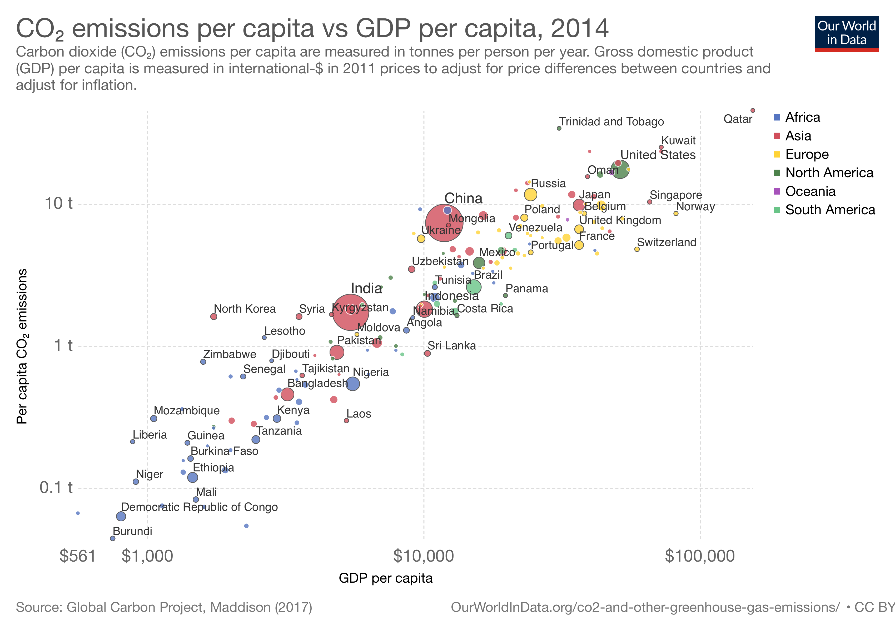
</center>

---
<center>
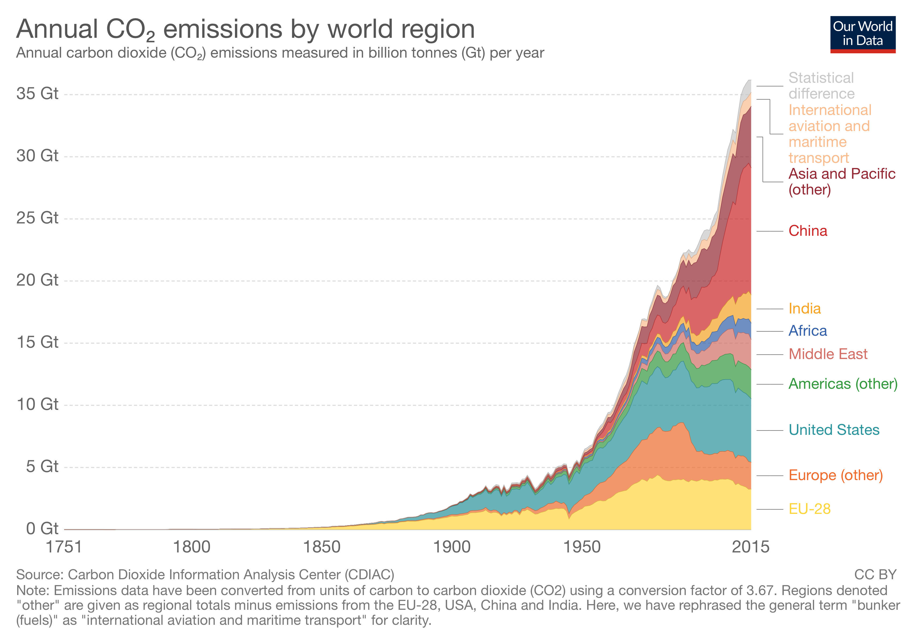
</center>

---

<center>
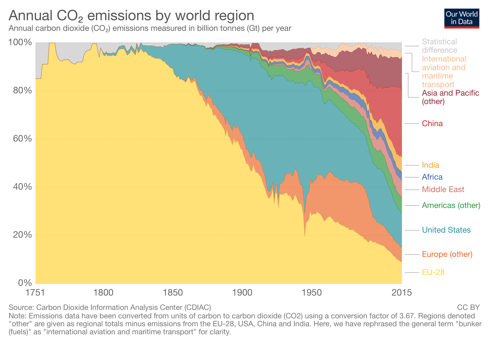
</center>

---
<center>
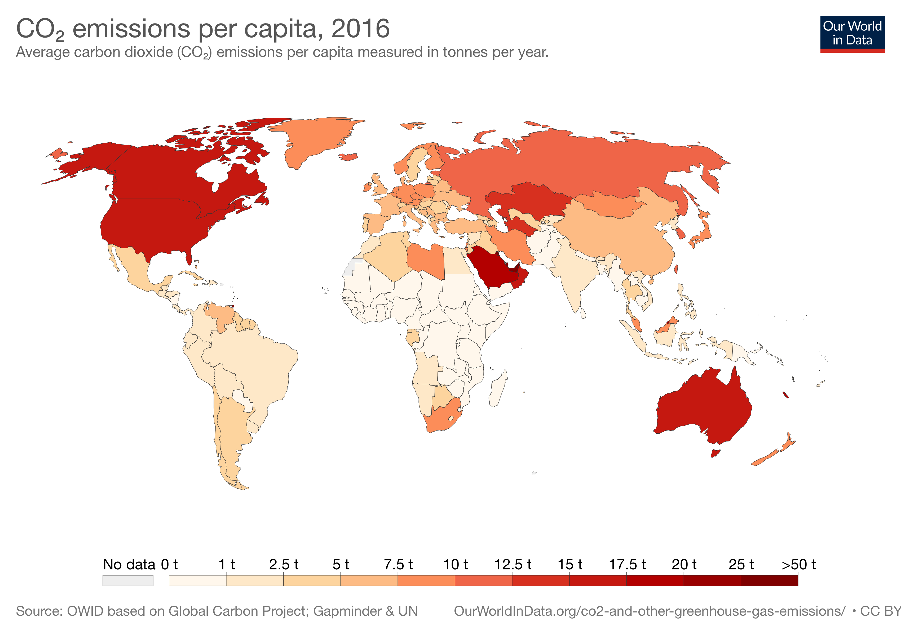
</center>

---
<center>
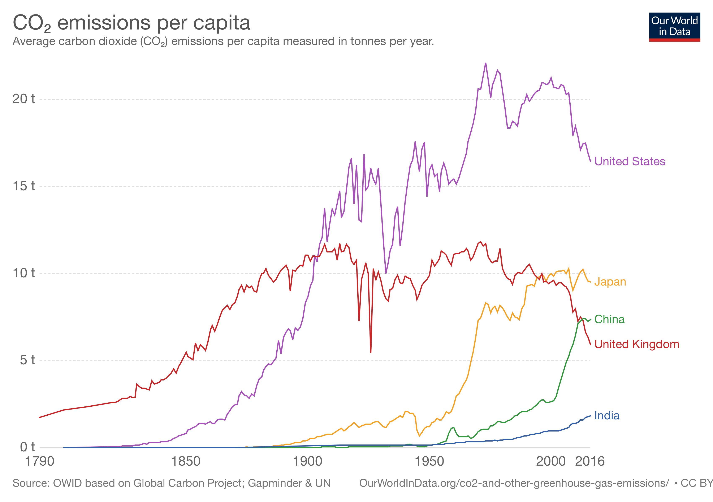
</center>

---
### CO<sub>2</sub> Emissions ⇒ CO<sub>2</sub> Concentrations

<center>
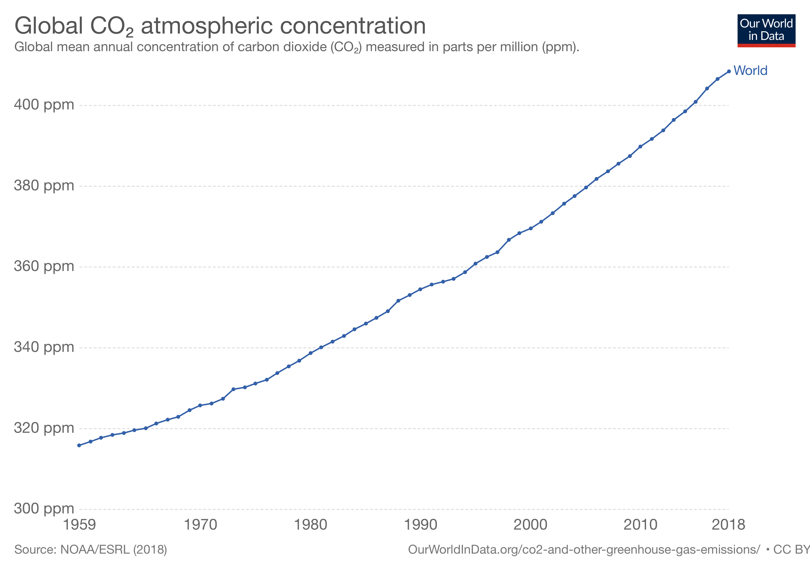
</center>


---
<center>
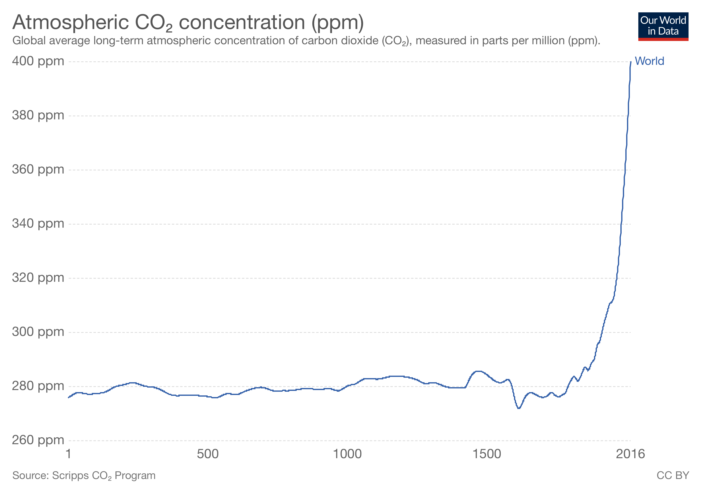
</center>


---


.pull-left[
### Climate Change ⇒ Economic and Ecological Impacts 
<br>

* Lower corn yields

* Coastal flooding 

- Extreme weather events

* Ocean acidification

]


.pull-right[
<center>
<iframe width="400" height="650" src="./img/anomalies.html" frameborder="0" allowfullscreen></iframe>
</center>
]

---


class: inverse, center, middle
name: policy

## Economic policy

<html><div style='float:left'></div><hr color='#EB811B' size=1px width=796px></html>


---
###  Climate Change ⇒ ?? Climate-change policies ?? ###

** Why do we need climate-change policies? **

Because of market failures

- Climate change is a public bad
  
  - Non-rival (everyone will lose from it)
  
  - Non-excludable (one cannot exclude themselves from the negative effects)
  
  - Free-rider problem: if a country keeps producing CO<sub>2</sub> emissions, but the rest of world reduces the emissions, that country will be better off without paying any costs
 
- Negative externality

 - negative impact of CO<sub>2</sub> emissions on others
 
 * global: emissions by people in one country have negative impacts on residents of far away countries
 
 * long-run: emissions today have negative impact on future generations

---
### Other factors

- Potential tipping point problem:

 - if the increase in global temperatures exceeds a point, it might be impossible to reverse the climate change
 - low probability but catastrophic event
 - necessitates prudential policies

<center>
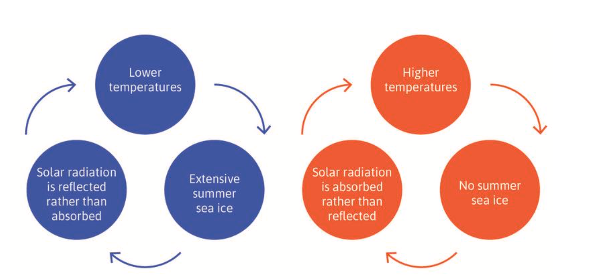
</center>

Figure from Core The Economy
---
### Design of optimal policies ###

.pull-left[

- People get utility from consumption

- They maximize discounted sum of utility from future consumption

 - subject to resource constraints: reductions CO<sub>2</sub> emissions require sacrifices from consumption
 
 - if CO<sub>2</sub> emissions is not reduced, the future consumption will be negatively affected.
 
- Question: **how do you reduce the CO<sub>2</sub> emissions most efficiently (with limited cost)?**

 - Models help us answer this question.

]


.pull-right[
<center>
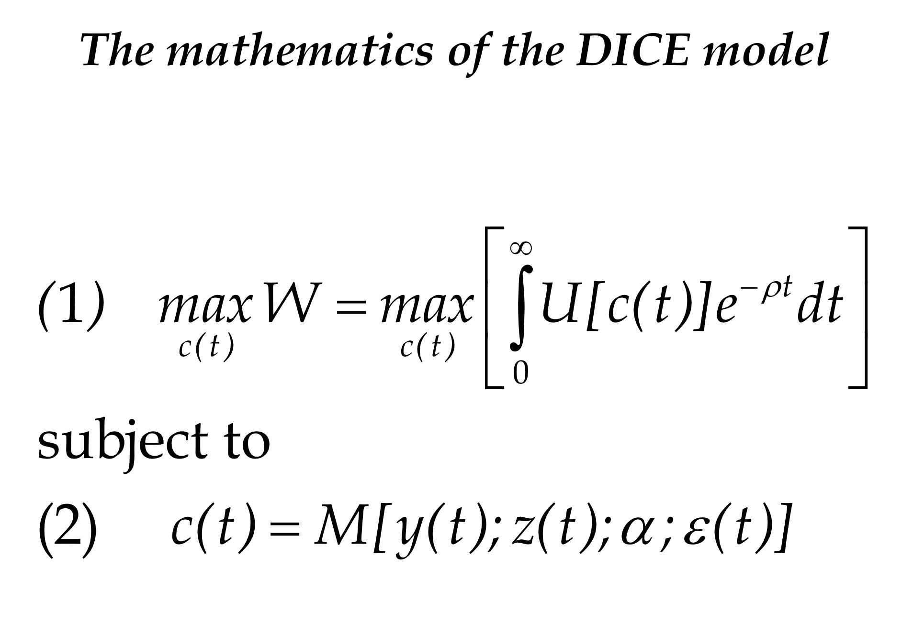
</center>

Source: William Nordhaus

]
---
### Modeling decisions ###

* Discount factor 
* Weight on the welfare of future generations
 * Positive
 * Normative

* Households do not derive utility from the welfare of other households 

 * How much weight should be put on the welfare of different regions?

* Policy implementation
 
 * carbon tax
 
 * tradable carbon emission permit
 
 


---


.pull-left[

### Alternative policies ###

<br>

* Business as usual (minimal policies)

* Cost-benefit optimum (two damage functions)

* Limit temperature increase (to 1.5 , 2, 2.5 °C) with hard cap

* Limit temperature increase (to 1.5 , 2, 2.5 °C) over 100-year or 200-year averaging period

]

.pull-right[
<center>
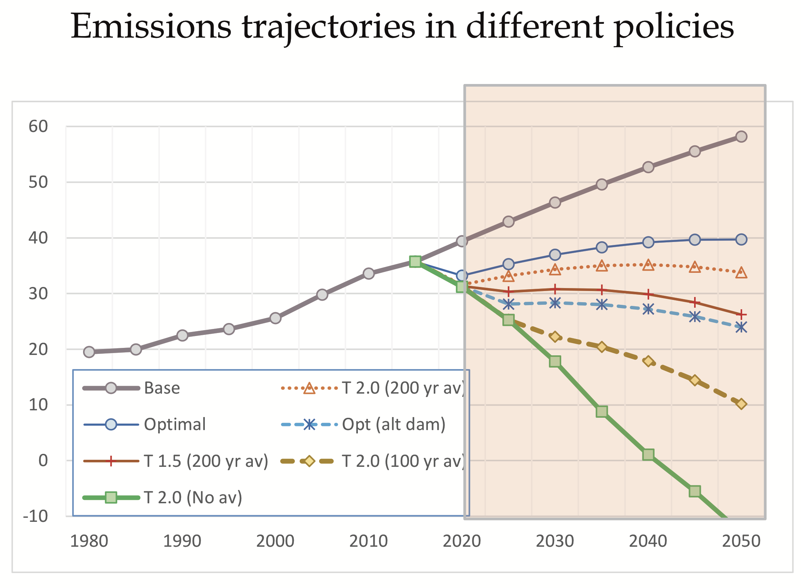
</center>

<center>
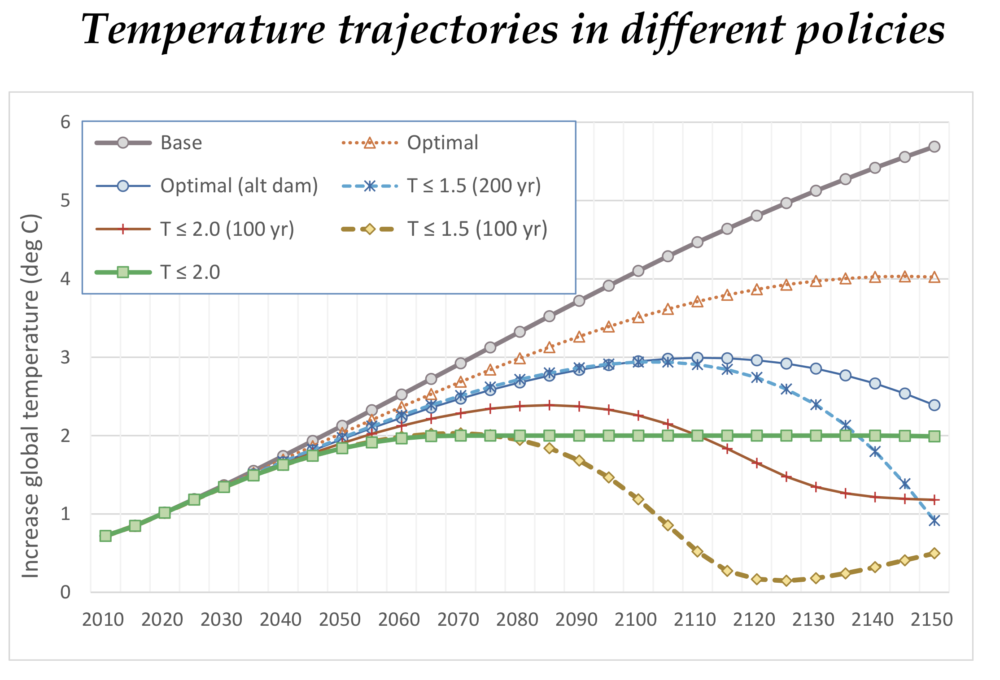
</center>


Source: William Nordhaus

]

---
### Social cost ###
<br>
Social cost: "the present value of the damage stream resulting from a marginal unit of fossil-fuel emissions"

<center>

</center>

Source: Nobel Committee

- Carbon taxes disincentivize carbon-intensive production and consumption

* Carbon tax should be set equal to the social cost

- An increasing carbon tax is the most efficient way to coordinate economic activity

 - Needs coordination of economic activity by billions of people
 
- Carbon taxes incentivizes innovation in green technologies
---
### Political economy ###

- Diverse group of countries/people with different incentives

* Pareto optimal allocation requires compensation of losers

* Free rider problem

* Proposal by Nordhaus
 
 * Form a climate club 
 * Target carbon price, say $50 per ton CO2
 * Penalty tariff on non-participants, say 3% uniform

* Without cooperation, equilibrium tax would much lower than the optimal tax

* Incentives for innovation

---
### Summary

We covered

- Surge in CO<sub>2</sub> emissions and atmospheric CO<sub>2</sub> concentration

- Market failures in carbon-intensive production/consumption

- Designing optimal policies

To review this lecture:

- Watch Bill Nordhaus' Nobel lecture

- Read the papers on Moodle (under essay)

- Read [Unit 20](https://core-econ.org/the-economy/book/text/20.html) of Core the Economy
