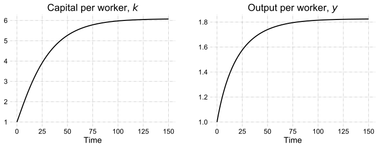
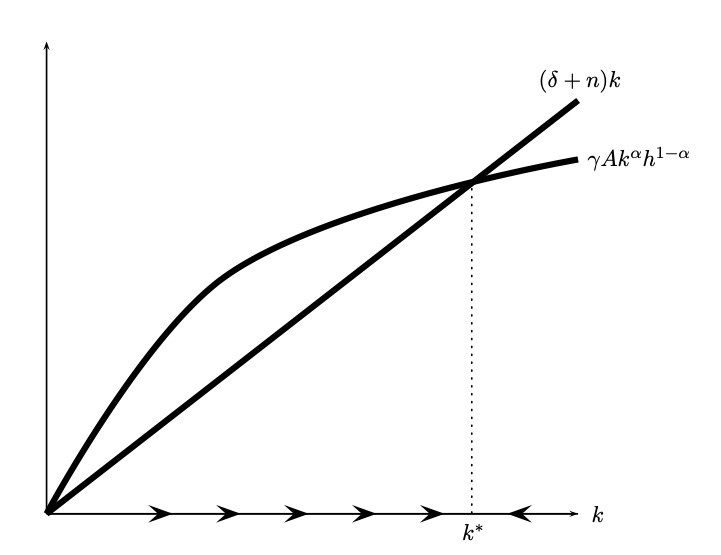
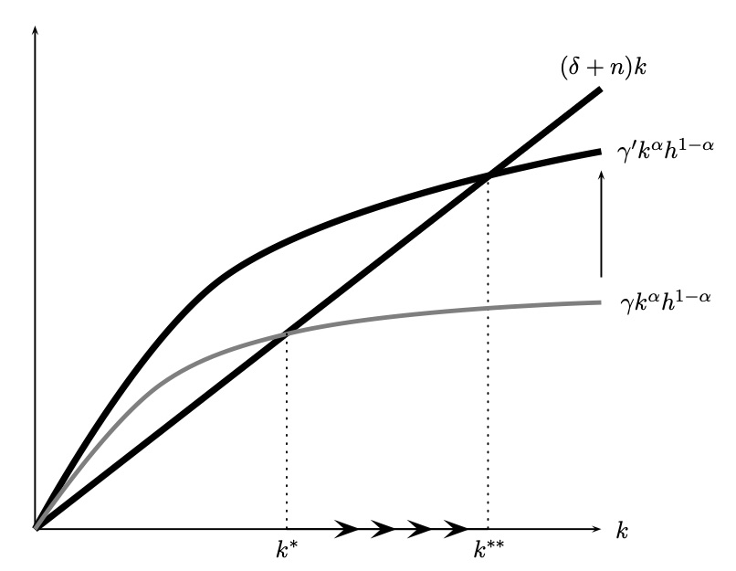
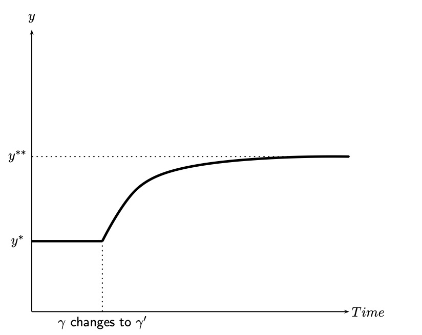
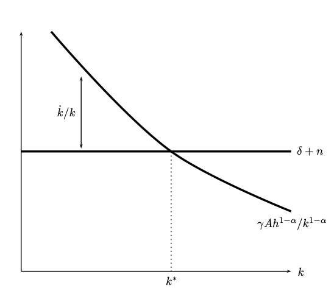
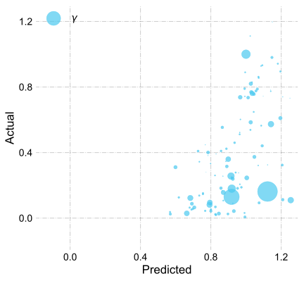
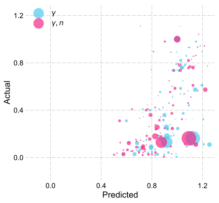
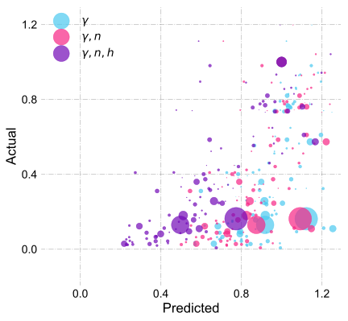

```{r setup, include=FALSE}
options(htmltools.dir.version = FALSE)
library(knitr)
opts_chunk$set(
  fig.align="center", ##fig.width=6, fig.height=4.5, 
  ## out.width="748px", ##out.length="520.75px",
  dpi=300, ##fig.path='Figs/',
  cache=T##, echo=F, warning=F, message=F
  )
```


### Last Lecture

- Highlighted the role of factor accumulation in economic growth in the short-run.

- Listed the assumptions of the Solow model

 - Production function displays constant returns to scale

 - Production function displays diminishing marginal product of capital

 - Everyone works in the economy: population = labor force

 - Population and labor force grow at a constant rate $n$

 - Society invests a constant fraction, $\gamma$, of output into capital stock

 - A constant fraction, $\delta$, of capital depreciates
 
- Starting from the (aggregate) capital accumulation equation: $\dot{K}=\gamma Y- \delta K$, derived capital per worker accumulation equation:

$$ \dot{k} = \gamma f(k) - (\delta +n)k$$
 - Change in capital per worker is equal to investment per worker minus dilution of capital per worker as a result of depreciation and population growth.


---
### Numerical example 

<br>


To understand $\dot{k} = \gamma f(k) - (\delta +n)k$, let's do a numerical example:


- $f(k)=Ak^\alpha h^{1-\alpha}$, $\alpha=1/3$, $A=1$, $k(0)=1$, $h=1$, $n=.01$, $\gamma = .2$, and $\delta = .05$, where $k(0)$ is capital per worker at time $t=0$.  

- Calculate $\dot{ k}(0)$, $k(1)$, $y(1)$.

First write down capital per worker accumulation equation

$$\dot{k}(0)  = \gamma f(k(0)) - (\delta+n)k(0)$$ 

Subsitute in the numerical values

$$\dot{k}(0)= .2\times 1^{1/3}-(.05+.01)\times 1 = .2 - .06= .14$$
---
### Numerical example, cont'd

Notice that next period's capital per worker is approximately equal to current capital per worker plus change in capital per worker
$$ k(1) \approx k(0) + \dot{k}(0) = 1 + .14 = 1.14 $$
$$ y(1) = f(k(1))=1.14^{1/3} = 1.044644$$

What about $k(2)$ and $y(2)$?

Repeat what we did before

$$\dot{k}(1)  = \gamma f(k(1)) - (\delta+n)k(1)$$ 

Subsitute in the numerical values

$$\dot{k}(1)= .2\times 1.14^{1/3}-(.05+.01)\times 1.14 =0.1405288$$

Then
$$k(2)\approx k(1)+\dot{k}(1) = 1.14 + 0.1405288 = 1.280529$$
$$y(2) = f(k(2)) = 1.280529^{1/3} =   1.0859$$
---
### Convergence and Steady State

- Keep iteration/simulating our numerical example, say 100 periods:

<center>

</center>

- Both capital per worker and output per worker increase rapidly when $k$ is low, then slowly when $k$ is high.

- Both series converges to particular values, which we call as the steady state.
---


### Steady State

.pull-left[

Accumulation of capital per worker:

$$\dot{k} = \gamma f(k) - (\delta+n)k $$

Capital per worker and output per worker are constant at the steady state.

- if $\gamma f(k) > (\delta+n) k$

 - then $\dot{k} > 0$
 - capital stock growing

- if $\gamma f(k) < (\delta+n) k$

 - then $\dot{k} < 0$
 - capital stock shrinking

- if $\gamma f(k) = (\delta+n) k$

 - then $\dot{k} = 0$
 - capital stock consant (**steady state**)
]

.pull-right[
#### The Solow Diagram
<center>

</center>
Source: Jones and Vollrath (2013)

$k^\ast$ is the steady state capital per worker level.
]

---
### Diminishing marginal product of capital per worker
<br>

.pull-left[
- As capital per worker increases it requires more and more capital to make labor more productive.

 - Intuition: a computer makes a worker more productive. However if you give her another computer, it will make her more productive but the benefit of the second computer will not be as large as the first computer.
 
- Hence the concave shape of the production function

- Eventually capital dilution $(\delta+n)k$ catches up with investment $\gamma f(k)$, and capital per worker cannot grow more.

- Hence no long run economic growth in the Solow model (when there is no technological progress).

]
.pull-right[
<center>

</center>
Source: Jones and Vollrath (2013)
]

---

### Steady State, analytical solution

.pull-left[
Assume production function is a Cobb-Douglas:
$$ y = A k^\alpha h^{1-\alpha}.$$
Then $\dot{k} = \gamma A k^\alpha h^{1-\alpha} - (\delta+n) k$

No change of capital stock per worker at the steady state

$$ 0 = \gamma A (k^{\ast})^\alpha h^{1-\alpha} - (\delta+n) k^{\ast}, $$

where $k^*$ is steady state level of capital per worker.
$$  \gamma A (k^{\ast})^\alpha h^{1-\alpha}= (\delta+n) k^{\ast} $$

**Steady state capital per worker:**
$$ k^{\ast} = h \left(\frac{\gamma A}{\delta+n} \right) ^{1/(1-\alpha)}$$ 
]


.pull-rigth[

Substitute steady state capital per worker into production function to find steady steady output per worker:
$$ y^{\ast}= A (k^{\ast})^\alpha h^{1-\alpha}$$
$$y^{\ast}= A \left[h \left(\frac{\gamma A}{\delta+n} \right) ^{1/(1-\alpha)}\right]^\alpha h^{1-\alpha} $$
Rearrange to get the **steady state output per worker:**
$$y^\ast = A^{1/(1-\alpha)}\left(\frac{\gamma}{\delta+n} \right)^{\alpha/(1-\alpha)}h$$

]

---

### Comparative Statics

$$ k^{\ast} = h \left(\frac{\gamma A}{\delta+n} \right) ^{1/(1-\alpha)}$$ 


$$ y^{\ast}=  A^{1/(1-\alpha)}\left(\frac{\gamma}{\delta+n} \right)^{\alpha/(1-\alpha)}h$$


- $k^\ast$ and $y^\ast$ are rising with investment rate $\gamma$, technology $A$, human capital $h$, 

- $k^\ast$ and $y^\ast$ are declining with depreciation rate, $\delta$, and population growth rate, $n$.

---
### Increasing the investment rate

.pull-left[
- As $\gamma \uparrow$ 
 - $k^{\ast} =h \left(\frac{\gamma A}{\delta+n} \right) ^{1/(1-\alpha)} \uparrow$
 - $y^{\ast}= A^{1/(1-\alpha)}\left(\frac{\gamma}{\delta+n} \right)^{\alpha/(1-\alpha)}h \uparrow$
 
- An increase in the investment rate leads to higher steady state capital per worker and output per worker.
]

.pull-right[
<center>

</center>
Source: Jones and Vollrath (2013)
]


---
### Output per workers increase after an increase in investment rate

.pull-left[
<br>

- Suppse the economy was at the steady state

- Invesment rates increase to $\gamma' > \gamma$

- This leads to _gradual_ increase of output (or income) per worker until it reaches to its new steady state values.

- Trajectory of capital per worker is similar.
]

.pull-right[

<center>

</center>
Source: Jones and Vollrath (2013)

]

---
### Consumption

- Income-expenditure identity in a closed economy (no international trade) without the government
$$ y = c+i,$$
where $c$ is consumption per worker. 

- $c = y- i = y - \gamma y =  (1-\gamma)y$

- investment-savings equality

\begin{eqnarray}
s&=& y - c \nonumber \\
s & = & i = \gamma y, \nonumber
\end{eqnarray}
where $s$ is savings per worker. Then $\gamma$ is also saving rate, savings/income.


---


### Growth Rates
.pull-left[
- The Solow model predicts that growth is faster, the farther away from steady state is an economy. 

- Look at the growth rate of $k$

$$ \frac{\dot{k}}{k} = \frac{\gamma A h^{1-\alpha}}{k^{1-\alpha}} - (\delta + n). $$
- As $k$ rises, the growth rate of $k$ falls.
]

.pull-left[

<center>

</center>
Source: Jones and Vollrath (2013)

]
---

### Growth Rates, cont'd
In the Solow model (current version)

- No long-run growth of output per worker:
$$ y^{\ast} = A (k^{\ast})^\alpha h^{1-\alpha}, \hspace{.3cm} \frac{\dot{y^{\ast}}}{y^{\ast}} = \alpha \frac{\dot{k^{\ast}}}{k^{\ast}} = 0$$ 

- Transitional growth

- Higher growth rate for lower capital stock countries

- **Convergence toward the steady state:** 

 - A country's per-worker output will grow or shrink from some initial position toward the steady-state level determined by the investment rate.

---
### Economics of Solow model

<br>

<br>

- What is the main source of economic growth in the Solow model?  

 - Capital accumulation


- Why cannot countries grow forever?

 - Diminishing marginal product of physical capital. 

---
### Long run growth rates of the Solow model

<br>


- What are the growth rates of the following variables at the steady state? 

| Variable | Steady state growth rate |
|:---|:---:|
| Capital per worker |  |
| Output per worker |  |
| Consumption per worker |  |
| Capital | |
| Output | |
| Consumption | |


---

### Relative Growth Rates, Predictions

<br>

<br>

- If two countries have the same rate of investment but different levels of income, the country with lower income will have higher growth.

- If two countries have the same level of income but different rates of investment, then the country with a higher rate of investment will have higher growth.

- A country that raises its level of investment will experience an increase in its rate of income growth.

---
### Solow predicted income differences 

<br>


Consider 2 countries $i$ and $j$:
$$ y_i^{\ast} = A_i^{1/(1-\alpha)}\left(\frac{\gamma_i}{\delta_i+n_i} \right)^{\alpha/(1-\alpha)} h_i,$$
$$ y_j^{\ast} = A_j^{1/(1-\alpha)}\left(\frac{\gamma_j}{\delta_j+n_j} \right)^{\alpha/(1-\alpha)}h_j.$$
Then,


$$ \frac{y_i^{\ast}}{y_j^{\ast}}= \left(\frac{A_i}{A_j}\right)^{1/(1-\alpha)}\left(\frac{\gamma_i}{\gamma_j}\right)^{\alpha/(1-\alpha)}\left(\frac{\delta_j+n_j}{\delta_i+n_i}\right)^{\alpha/(1-\alpha)}\left(\frac{h_i}{h_j}\right)$$

---

### Quantitative predictions

- Suppose country $i$ and $j$ differ only with respect to their investment rate

 - $A_i=A_j=A$, $\delta_i=\delta_j=\delta$, $h_i=h_j=h$, and $n_i=n_j=n$.

- Then 

$$ \frac{y_i^{\ast}}{y_j^{\ast}}= \left(\frac{\gamma_i}{\gamma_j}\right)^{\alpha/(1-\alpha)}$$
 
- Supporse country $i$ has an investment rate of 20% and country $j$ has an investment rate of 5%

- Assumue $\alpha=1/3$, hence $\alpha/(1-\alpha)= 1/2$


$$ \frac{y_i^{\ast}}{y_j^{\ast}}= \left(\frac{.2}{.05}\right)^{1/2} = 4^{1/2} = 2$$
- Income per capita in country $i$ would be twice the level of country $j$

---
### Data vs Model

$$ \frac{y_i^{\ast}}{y_j^{\ast}}= \left(\frac{A_i}{A_j}\right)^{1/(1-\alpha)}\left(\frac{\gamma_i}{\gamma_j}\right)^{\alpha/(1-\alpha)}\left(\frac{\delta_j+n_j}{\delta_i+n_i}\right)^{\alpha/(1-\alpha)}\left(\frac{h_i}{h_j}\right)$$

.pull-left[

- Suppose country $i$ and $j$ differ only with respect to their investment rate

$A_i=A_j=A$, $\delta_i=\delta_j=\delta$, $h_i=h_j=h$, $n_i=n_j=n$.

- Then 

$$ \frac{y_i^{\ast}}{y_j^{\ast}}= \left(\frac{\gamma_i}{\gamma_j}\right)^{\alpha/(1-\alpha)}$$ 

- Assume $j$ is the United States

- 2017 output per worker levels

- Investment rate is average over 1970-2017.
]


.pull-right[

<center>

</center>
Data source: Penn World Tables, version 9.1

Correlation of predicted vs actual values: .55
]

---
### Data vs Model, cont'd

$$ \frac{y_i^{\ast}}{y_j^{\ast}}= \left(\frac{A_i}{A_j}\right)^{1/(1-\alpha)}\left(\frac{\gamma_i}{\gamma_j}\right)^{\alpha/(1-\alpha)}\left(\frac{\delta_j+n_j}{\delta_i+n_i}\right)^{\alpha/(1-\alpha)}\left(\frac{h_i}{h_j}\right)$$

.pull-left[

- Suppose country $i$ and $j$ differ with respect to their investment rate and employment growth rates

$A_i=A_j=A$, $\delta_i=\delta_j=0.05$, $h_i=h_j=h$.

- Then 

$$ \frac{y_i^{\ast}}{y_j^{\ast}}= \left(\frac{\gamma_i}{\gamma_j}\right)^{\alpha/(1-\alpha)}\left(\frac{.05+n_j}{.05+n_i}\right)^{\alpha/(1-\alpha)}$$ 

- Assume $j$ is the United States

- 2017 output per worker levels

- Employment growth rate is average over 1970-2017.
]


.pull-right[

<center>

</center>
Data source: Penn World Tables, version 9.1

Correlation of predicted vs actual values: .59
]

---
### Data vs Model, cont'd (2)

$$ \frac{y_i^{\ast}}{y_j^{\ast}}= \left(\frac{A_i}{A_j}\right)^{1/(1-\alpha)}\left(\frac{\gamma_i}{\gamma_j}\right)^{\alpha/(1-\alpha)}\left(\frac{\delta_j+n_j}{\delta_i+n_i}\right)^{\alpha/(1-\alpha)}\left(\frac{h_i}{h_j}\right)$$

.pull-left[

- Suppose country $i$ and $j$ differ with respect to their investment rate, employment growth rates, and human capital

$A_i=A_j=A$, $\delta_i=\delta_j=0.05$.

- Then 

$$ \frac{y_i^{\ast}}{y_j^{\ast}}= \left(\frac{\gamma_i}{\gamma_j}\right)^{\alpha/(1-\alpha)}\left(\frac{.05+n_j}{.05+n_i}\right)^{\alpha/(1-\alpha)}\left(\frac{h_i}{h_j}\right)$$

- Assume $j$ is the United States

- 2017 output per worker levels

- Human capital is the 2017 level.
]


.pull-right[

<center>

</center>
Data source: Penn World Tables, version 9.1

Correlation of predicted vs actual values: .69
]


---
### Next lecture

<br>

- Learn about the role of population on eonomic growth

- Learn about the role of human capital on economic growth

<br>

### Suggested readings to review the previous two lectures 

- From Jones and Vollrath, read introduction of Chapter 2 and Chapter 2.1.

 - or, you may read Chapter 3 from Weil.

<br> 
### Suggested readings to prepare for the next lecture

- From Jones and Vollrath, read Chapter 3.1

- From Weil, read Chapter 6

- From Weil, introduction of Chapter 4 and Chapter 4.2. 

