```{r setup, include=FALSE}
options(htmltools.dir.version = FALSE)
library(knitr)
opts_chunk$set(
  fig.align="center", ##fig.width=6, fig.height=4.5, 
  ## out.width="748px", ##out.length="520.75px",
  dpi=300, ##fig.path='Figs/',
  cache=T##, echo=F, warning=F, message=F
  )
```
```{r xaringan-themer, include=FALSE, warning=FALSE}
library(xaringanthemer)
style_mono_accent(
  base_color = '#000000',
  title_slide_text_color = '#000000',
  title_slide_background_color = '#FFFFFF',
  header_font_google = google_font("Josefin Sans"),
  text_font_google   = google_font("Montserrat", "300", "300i"),
  code_font_google   = google_font("Fira Mono"),

)
```

### Questions

<br>

<br>

- What's the role of population growth on income differences across countries?

- What's the role of human capital on economic growth?


---


class: center, middle
name: pop

# Population

<html><div style='float:left'></div><hr color='#EB811B' size=1px width=796px></html>

---
### Population growth rate and GDP per capita

.pull-left[

- There is a negative correlation between population growth rate and GDP per capita

]

.pull-right[
<center>
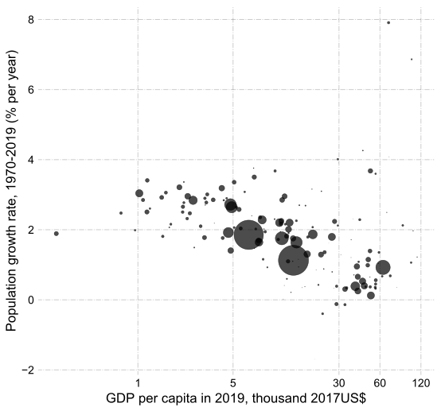
</center>
Data source:[Penn World Tables (10.0)](https://www.rug.nl/ggdc/productivity/pwt/?lang=en)

]


---
### Population growth rate and GDP per capita

.pull-left[
- There is a negative correlation between population growth rate and GDP per capita

- Countries like The Democratic Republic of the Congo (COD) have high population growth rate and very low GDP per capita

- India and China how moderate population growth rate and middle income per capita 

- Germany, the US, the UK have low population growth rates but high income per capita

- How about Qatar (QAT)?

 - Immigration?
]

.pull-right[
<center>
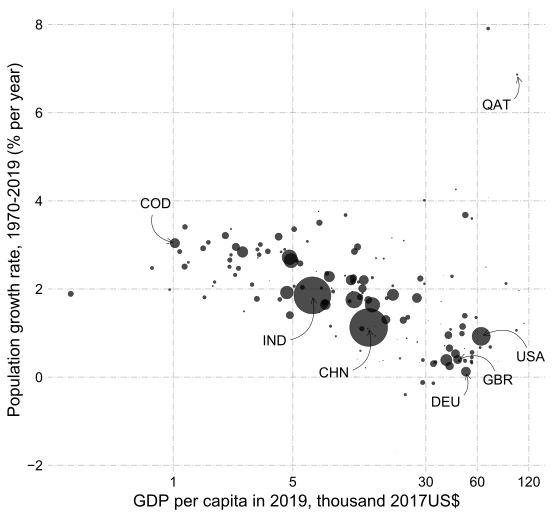
</center>
Data source: [Penn World Tables (10.0)](https://www.rug.nl/ggdc/productivity/pwt/?lang=en)

]


---
### Population growth in the Solow model

.pull-left[

- Law of motion for capital per worker
$$ \dot{ k} = \gamma f(k) - (\delta+n)k,  $$where $n$ is the population growth rate.

- At the steady state
$$  \gamma f(k^{\ast}) = (\delta+n) k^{\ast}  $$
- As $n \uparrow$, $k^{\ast}\downarrow$ (from $k_1^{ss}$ to $k_2^{ss}$)
 - Notice that both $k^\ast$ and $k^{ss}$ mean steady-state capital per worker.

 
- Countries with high population growth are poorer.

- Higher population growth dilutes per-worker capital stock more quickly

- Lower steady state level of output per worker

]


.pull-right[
<center>
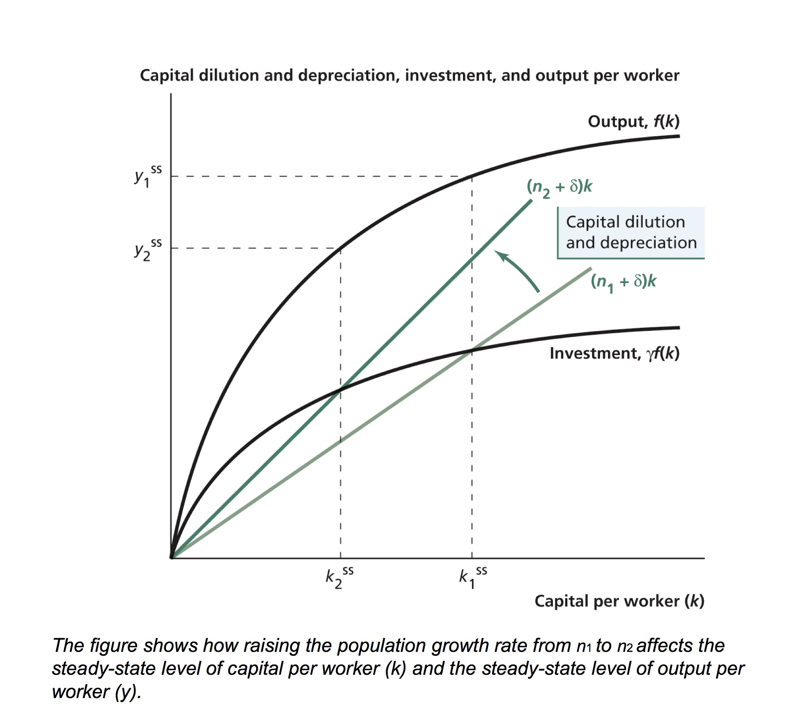
</center>
Diagram from: Weil (2013)

]
---
### Exercise

<br>

<br>

- Sketch a graph of (log of) capital per worker and output per worker over time with and without a decrease in the population growth rate.


---
### Solow model's predictions of income differences

- Recall income per worker of country $i$ relative to the country $j$,

$$ \frac{y_i^{\ast}}{y_j^{\ast}}= \left(\frac{A_i}{A_j}\right)^{1/(1-\alpha)}\left(\frac{\gamma_i}{\gamma_j}\right)^{\alpha/(1-\alpha)}\left(\frac{\delta_j+n_j}{\delta_i+n_i}\right)^{\alpha/(1-\alpha)}\left(\frac{h_i}{h_j}\right)$$
- Remember that in the Solow model income per worker ratio is equal to income per capita ratio as everyone works.

- Suppose country $i$ and country $j$ differ only with respect to their population growth rates and $\alpha=1/3.$

  $A_i=A_j=A$, $\delta_i=\delta_j=\delta=0.05$, $h_i=h_j=h$, and $\gamma_i=\gamma_j=\gamma$.

- Then,


$$ \frac{y_i^{\ast}}{y_j^{\ast}}= \left(\frac{0.05+n_j}{0.05+n_i}\right)^{\alpha/(1-\alpha)}$$


---

### Solow model's predictions vs data

.pull-left[
- If country $i$ and $j$ differ only with respect to their population growth rates

- Substitute in average population growth rates from 1970 and 2019, and calculate actual and predicted income per capita ratios relative to the US.

- There is still a positive correlation but not very strong.

- We did not take into account:

 - Differences in investment rates
 - Differences in human capital
 - Differences in productivity
 - Employment growth rate is not equal to population growth rate in the data in cotrast to the model
]

.pull-right[
<center>
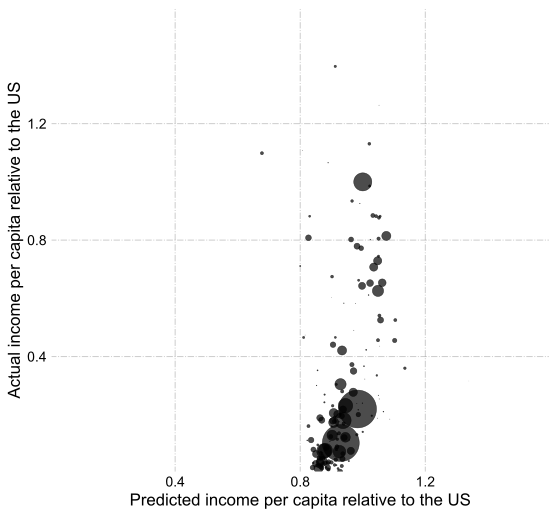
</center>
Data source: [Penn World Tables (10.0)](https://www.rug.nl/ggdc/productivity/pwt/?lang=en)

Correlation of predicted vs actual values =  0.22
]
---
### What's the unrealistic critical assumption of the Solow model in regards to population growth rate?

 - Constant population growth rate assumption of the model
 
 - Population growth rate is decreasing throughout the world
  - As countries get richer, fertility rate tends to decrease.

.pull-left[

<center>
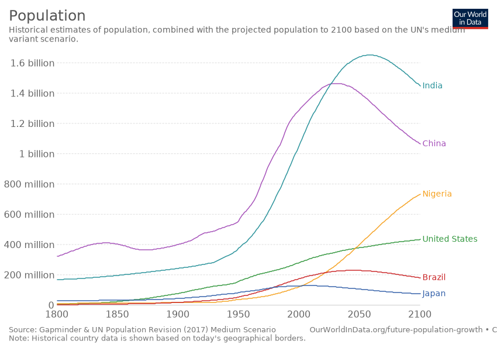
</center>
Graph from: [Our World in Data](https://ourworldindata.org/grapher/projected-population-by-country) 

]

.pull-right[

<center>
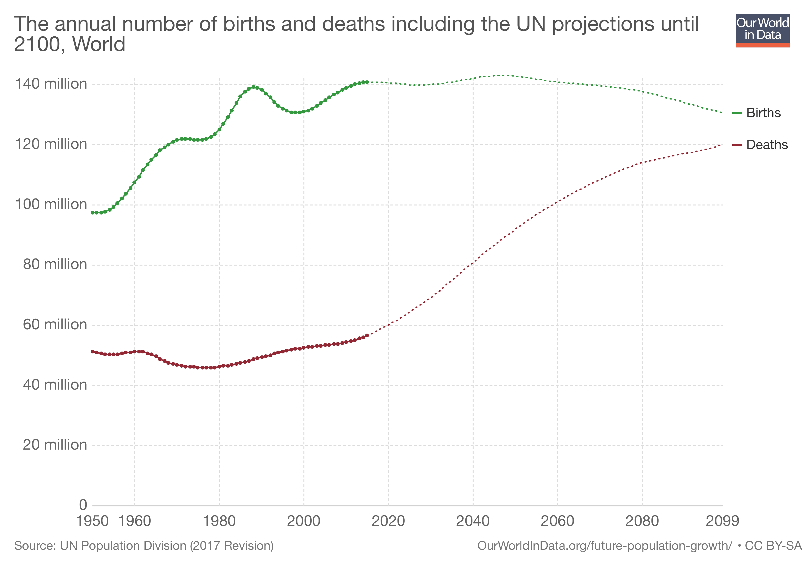
</center>
Graph from: [Our World in Data](https://ourworldindata.org/grapher/births-and-deaths-projected-to-2100) 


]

---
### Why does lower population growth have negative impacts on the economy?

.pull-left[
<!-- <iframe src="https://ourworldindata.org/grapher/population-by-broad-age-group?tab=chart&stackMode=relative&country=~JPN&region=World" loading="lazy" style="width: 100%; height: 400px; border: 0px none;"></iframe> -->
<center>

</center>
Graph from: [Our World in Data](https://ourworldindata.org/grapher/population-by-broad-age-group?tab=chart&stackMode=relative&country=~JPN&region=World) 

]

.pull-right[
- Lower population growth rate leads to aging of the society
 
- Working age population/total population goes down
 
- GDP per capita  = GDP per worker $\times$ $\frac{Employment}{Population}$

- A reduction in $\frac{Employment}{Population}$ pushes down GDP per capita growth.

- The second factor, which is very important, is assumed away in the Solow model.

]

---
### Summary

<br>

<br>


Solow Model

- Accounts for the negative correlation of population growth rate and income per capita

 - higher population growth rate dilutes capital quickly, and hence countries cannot accumulate as much capital per worker

- Population growth rate is exogenous

- Cannot account for the reduction in population growth rate as countries get richer

Reduction in the population growth push down GDP per capita growth.
---


class: center, middle
name: hc

# Human capital

<html><div style='float:left'></div><hr color='#EB811B' size=1px width=796px></html>

---
### Quality of labor

<br>


<br>


- So far, we have mostly treated quality of labor as same across countries and over time.

- Quality of labor that a worker supplies depends on whether the worker is 

 - weak or strong
 
 - ill or healthy
 
 - ignorant or educated
 
---
.pull-left[
### Human Capital

**Human capital:** Qualities of labor that

- are productive (characteristics that enable workers to produce more),

- are produced (investment in human capital),

- earns a return (higher wage for owners of human capital),

- depreciates.


Human capital can be 

- in the form of health,

- in the form of education.


#### How do human capital in the form health and in the form education affect per capita income of countries?

]

--

.pull-right[


#### 'LeBron James Spends About $1.5 Million Per Year To Maintain His Body' (from CBS [Cleveland](https://cleveland.cbslocal.com/2016/11/15/lebron-james-spends-about-1-5-million-per-year-to-maintain-his-body/))

<!-- Link to the tweet in the html file: [twitter](https://twitter.com/NBATV/status/1258803856328269824?ref_src=twsrc%5Etfw%7Ctwcamp%5Etweetembed%7Ctwterm%5E1258803856328269824%7Ctwgr%5E%7Ctwcon%5Es1_c10&ref_url=file%3A%2F%2F%2FUsers%2Fgunerilhan%2FDropbox%2FKent-Teaching%2FEconomicGrowth%2Feconomicgrowth%2Flecture4%2Ffiles%2Fjames.html) -->


<center>
<iframe width="330" height="490" src="./files/james.html" frameborder="0" allow="accelerometer; autoplay; encrypted-media; gyroscope; picture-in-picture" allowfullscreen></iframe>
</center>


]

---
### Calorie intake

.pull-left[

- Calorie intake is a determinant of human capital in the form health

- There is a positive correlation between calorie intake per person and income per capita

]

.pull-right[
<center>
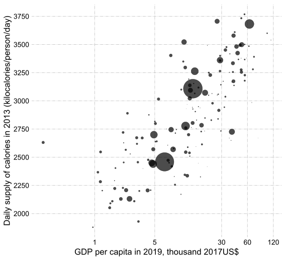
</center>
Data source: [Penn World Tables (10.0)](https://www.rug.nl/ggdc/productivity/pwt/?lang=en) and FAO (via [Our World in Data](https://ourworldindata.org/food-supply#caloric-supply-by-region))

]

---
### Calorie intake

.pull-left[

- Calorie intake is a determinant of human capital in the form health

- There is a positive correlation between calorie intake per person and income per capita

- In richer countries like the UK, Germany and the US daily calorie intake per person is greater than 3250

- In a poor country like Central African Republic (CAF) daily calorie intake per person is less than 2000

 - Half of calorie intake of Americans

]

.pull-right[
<center>
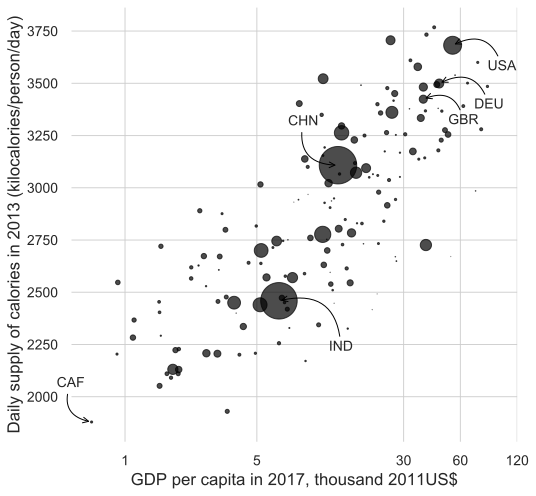
</center>
Data source: [Penn World Tables (10.0)](https://www.rug.nl/ggdc/productivity/pwt/?lang=en) and FAO (via [Our World in Data](https://ourworldindata.org/food-supply#caloric-supply-by-region))

]

---
.pull-left[
### Life expectancy at birth

> "Life expectancy at birth indicates the number of years a newborn infant would live if prevailing patterns of mortality at the time of its birth were to stay the same throughout its life." &ndash; [the World Bank](https://data.worldbank.org/indicator/SP.DYN.LE00.IN)

- Life expectancy is a critical measure of health

- People in richer countries are expected to live longer

]

.pull-right[
<br>
<center>
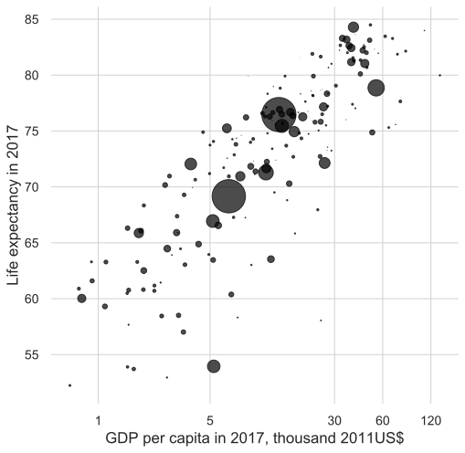
</center>
Data source: [Penn World Tables (10.0)](https://www.rug.nl/ggdc/productivity/pwt/?lang=en) and World Bank (via [Our World in Data](https://ourworldindata.org/life-expectancy#differences-in-life-expectancy-across-the-world))

]

---

.pull-left[
### Life expectancy at birth

> "Life expectancy at birth indicates the number of years a newborn infant would live if prevailing patterns of mortality at the time of its birth were to stay the same throughout its life." &ndash; [the World Bank](https://data.worldbank.org/indicator/SP.DYN.LE00.IN)

- Life expectancy is a critical measure of health

- People in richer countries are expected to live longer

- A new born in richer countries is expected to live about 80 years

- Whereas, a new born in Nigeria is expected to live about 55 years.


Why the life expectancy in the US is lower than othe reach countries? Read [Deaths of despair and the future of capitalism by Anne Case and Angus Deaton](https://librarysearch.kent.ac.uk/client/en_GB/kent/search/detailnonmodal/ent:$002f$002fSD_ILS$002f0$002fSD_ILS:1733687/ada?qu=deaths+of+despair&if=el%09edsSelectFacet%09FT1&d=ent%3A%2F%2FSD_ILS%2F0%2FSD_ILS%3A1733687%7EILS%7E1&ir=Both&h=8)
]

.pull-right[
<br>
<center>
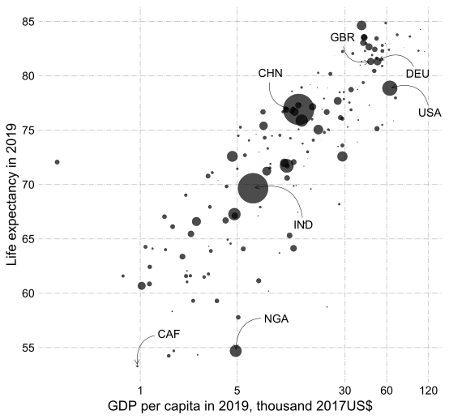
</center>
Data source: [Penn World Tables (10.0)](https://www.rug.nl/ggdc/productivity/pwt/?lang=en) and World Bank (via [Our World in Data](https://ourworldindata.org/life-expectancy#differences-in-life-expectancy-across-the-world))

]


---
### Human Capital in the form of health

.pull-left[
- Better nutrition, healthier workers $\Rightarrow$ Higher income

 - healthier workers can work harder and longer
 - healthier people can think more clearly
 
- Higher income $\Rightarrow$ better nutrition, healthier workers 
 - United Nations Development Program (2000):
 - richer OECD countries: 2.2 doctors per thousand people
 - developing countries: .8 doctors per thousand people
 - sub-Saharan Africa: .3 doctors per thousand people
 
- Health and income are endogenous
]

.pull-right[
<br>

<center>
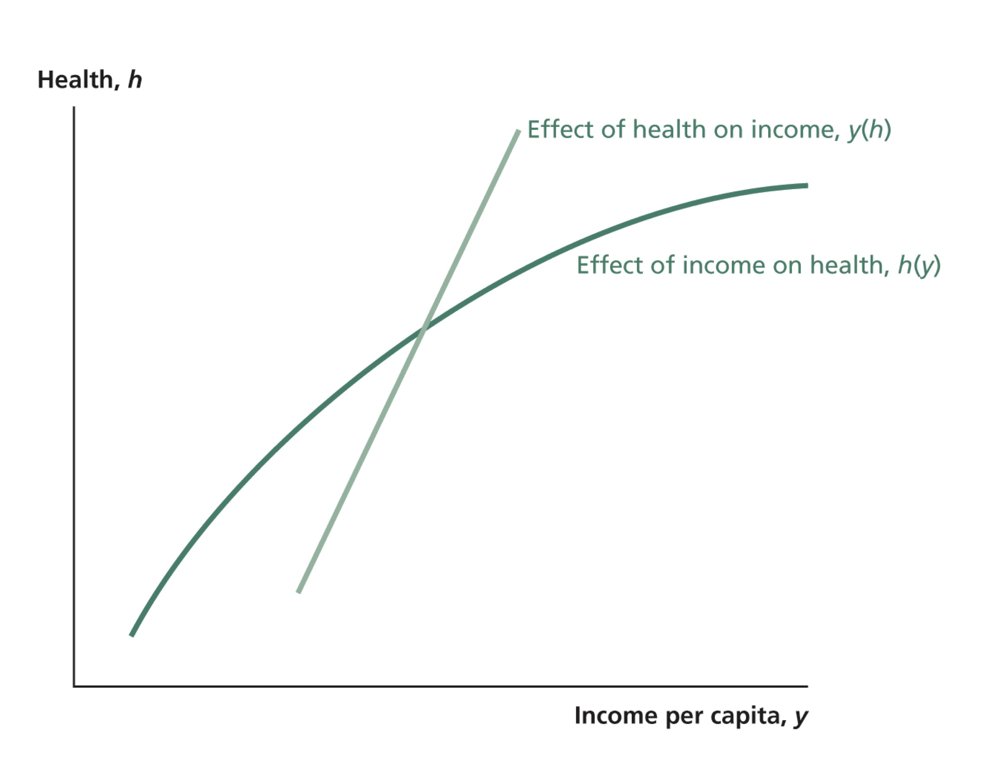
</center>

Graph from Weil (2013)
]


---
### Impact of an exogenous increase in income on the economy

.pull-left[

<br>


- Exogenous increase in income leads to increase in health outcomes

- Increase in health leads to further increase in income

]

.pull-right[
<br>

<center>
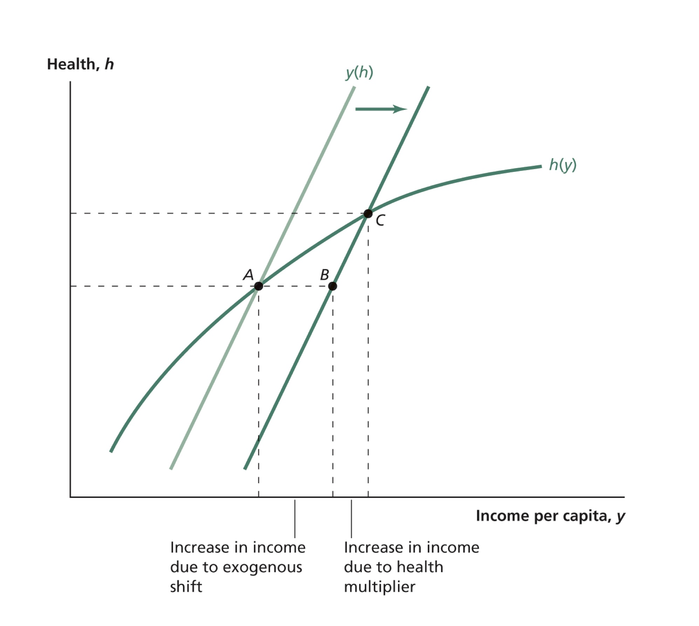
</center>

Graph from Weil (2013)
]


---
### Human Capital in the form of education

.pull-left[

- Intellectual ability is as important as health in determining a person's human capital

- People invest in human capital through education

- People in richer countries get educated longer than people in poorer countries

]

.pull-right[

<center>
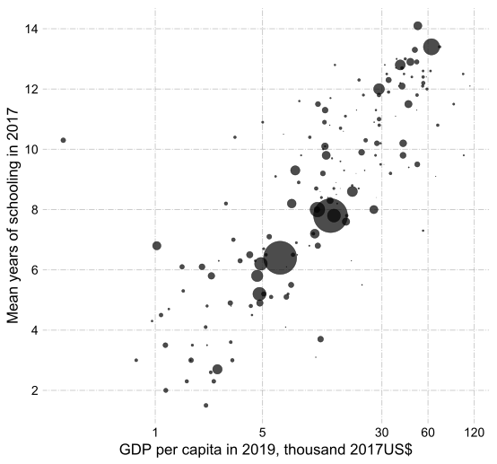
</center>

Data from [Penn World Tables (10.0)](https://www.rug.nl/ggdc/productivity/pwt/?lang=en); Lee-Lee (2016); Barro-Lee (2018) and UNDP HDR (2018) via [Our World In Data](https://ourworldindata.org/grapher/mean-years-of-schooling-long-run?tab=chart) 
]

---
### Human Capital in the form of education

.pull-left[

- Intellectual ability is as important as health in determining a person's human capital

- People invest in human capital through education

- People in richer countries get educated longer than people in poorer countries

- Chinese spend about 8 years in school 

- Whereas, Germans spend on average 14 years in school


]

.pull-right[

<center>
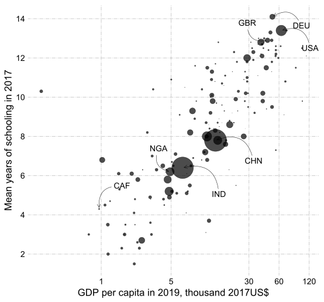
</center>

Data from [Penn World Tables (10.0)](https://www.rug.nl/ggdc/productivity/pwt/?lang=en); Lee-Lee (2016); Barro-Lee (2018) and UNDP HDR (2018) via [Our World In Data](https://ourworldindata.org/grapher/mean-years-of-schooling-long-run?tab=chart) 
]

---
### People are more educated than before

.pull-left[

- In almost everywhere in the World, people are more educated than before

- The number of people with no educated has declined substantially, and projected to decline even further

]

.pull-right[

<center>
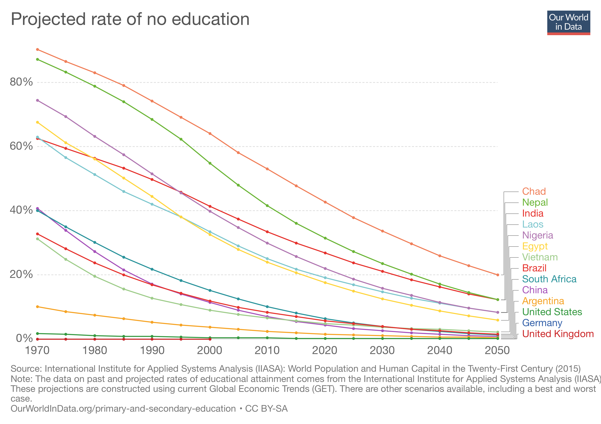
</center>

Graph from [Our World In Data](https://ourworldindata.org/grapher/projections-of-the-rate-of-no-education-based-on-current-global-education-trends-1970-2050) 
]

---
### Measuring human capital

#### How do we put a value on $h$ in the production fucntion $y=Ak^\alpha h^{1-\alpha}$?

<br>


Human capital = 
- A weighted average years of education

 - returns to education in each year of schooling are used as weights 

- Click for [details](#measure)
---
### Quantitative analysis

- Recall income per worker of country $i$ relative to the country $j$,

$$ \frac{y_i^{\ast}}{y_j^{\ast}}= \left(\frac{A_i}{A_j}\right)^{1/(1-\alpha)}\left(\frac{\gamma_i}{\gamma_j}\right)^{\alpha/(1-\alpha)}\left(\frac{\delta_j+n_j}{\delta_i+n_i}\right)^{\alpha/(1-\alpha)}\left(\frac{h_i}{h_j}\right)$$

- Suppose country $i$ and country $j$ differ only with respect to their human capital

$$A_i=A_j=A, \text{ } \delta_i=\delta_j=\delta,\text{ } n_i=n_j=n, \text{ and } \gamma_i=\gamma_j=\gamma$$.

- Then $$\frac{y_i^{\ast}}{y_j^{\ast}}= \frac{h_i}{h_j}$$

- If we measure human capital, we can calculate income differences predicted by human capital differences using the above equation


---

### Solow model's predictions vs data

.pull-left[

- Substitute in human capital levels in 2019 into $$\frac{y_i^{\ast}}{y_j^{\ast}}= \frac{h_i}{h_j}$$

- Compute predicted income per worker ratio relative to the US for each country

- Compare predicted values with actual values from data

 - There is a strong and positive correlation (0.71) between the two
 
- Human capital is a strong predictor of income differences across countries

]

.pull-right[
<center>
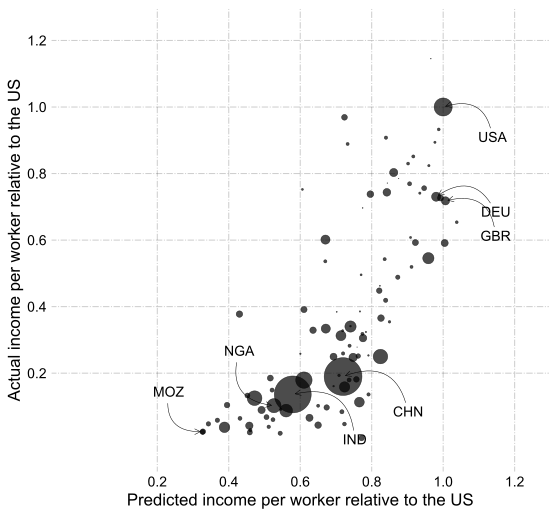
</center>
Data source: [Penn World Tables (10.0)](https://www.rug.nl/ggdc/productivity/pwt/?lang=en)

Correlation of predicted vs actual values =  0.71
]

---
### Exercise

<br>

<br>


Analyze the impact of an increase in human capital level in the Solow economy using a Solow diagram. Also, sketch a graph of (log of) capital per worker and output per worker over time with and without an increase in the human capital.


---
### Problems in comparing education levels across countries


.pull-left[
- quality of schooling might be different across countries

 - high income countries tend to have ''better" schooling

 - average years of schooling understates the difference in human capital

- externalities

 - human capital could affect technology and efficiency levels 

 - private return vs social return of education
]

.pull-right[
<center>
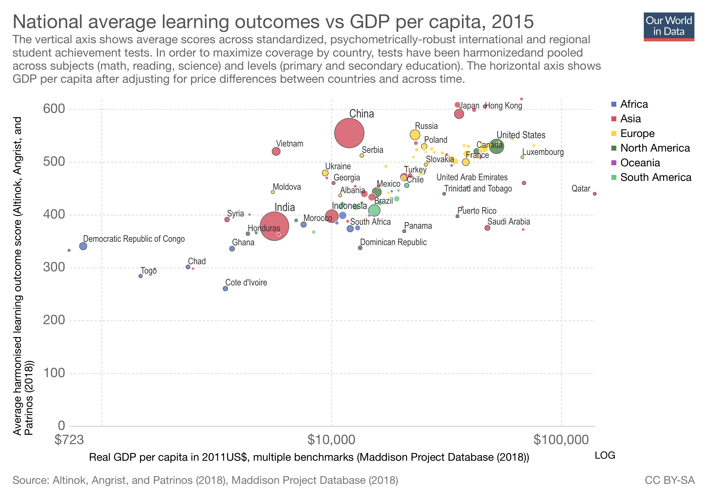
</center>

Graph from [Our World in Data](https://ourworldindata.org/grapher/learning-outcomes-vs-gdp-per-capita)
]

---
### Quality of schooling over time 

<center>
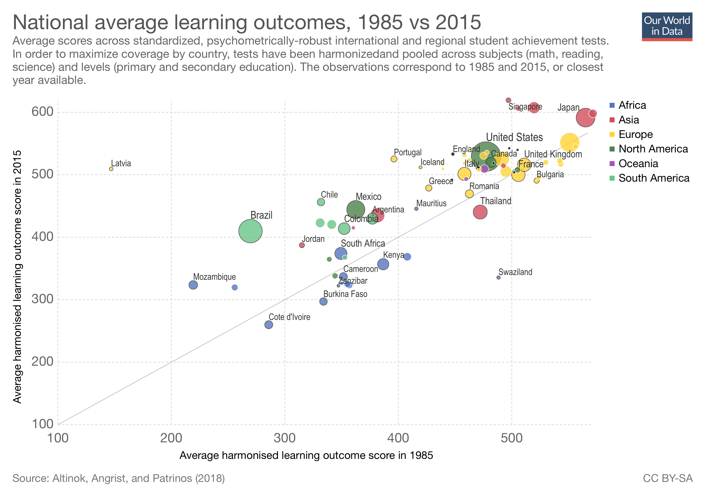
</center>

Graph from [Our World in Data](https://ourworldindata.org/grapher/learning-outcomes-1985-vs-2015)

---
### Summary


- Human capital in the form of health and education have positive effects on income.

- High income countries have higher years of schooling, and higher schooling quality.

- Years of schooling and quality of schooling have been improving all around the world.

#### Suggested readings for this lecture

- From Jones and Vollrath, read Chapter 3.1

- From Weil, read Chapter 6

- From Weil, introduction of Chapter 4 and Chapter 4.2. 

#### Suggested readings for the next lecture

- From  Jones and Vollrath read Chapter 3.2 (Convergence of countries)

- From Jones and Vollrath rad Chapter 2.2 (The Solow model with technology)

---

class: center, middle
name: appendix

# Appendix

<html><div style='float:left'></div><hr color='#EB811B' size=1px width=796px></html>


---
name: measure
### Measuring human capital

<br>


#### How can we measure human capital in a country?

1. Measure the value of spending one more year in school in different education levels

2. Characterize the distribution of years of schooling people have in a country

3. Find human capital for different education levels using step 1

4. Combining the 2nd and 3rd steps, generate a human capital index
 - Human capital index is a measure of average human capital in a country


---
### (Private) returns to education

_Step 1 in measuring human capital_

.pull-left[
- **Returns to education:** Increase in wages that a worker would receive if she had one more year of schooling.

 - a measure of spending one more year in school

- Estimates from Hall and Jones (1999)

 - First 4 years (grades 1 &ndash; 4): 13.4%

 - Next four years (grades 5 &ndash; 8): 10.1%

 - Beyond eight years: 6.8%

]

.pull-right[
<center>

</center>

]


---

### Breakdown of the population by schooling and wages

_Step 2 in measuring human capital_

<center>
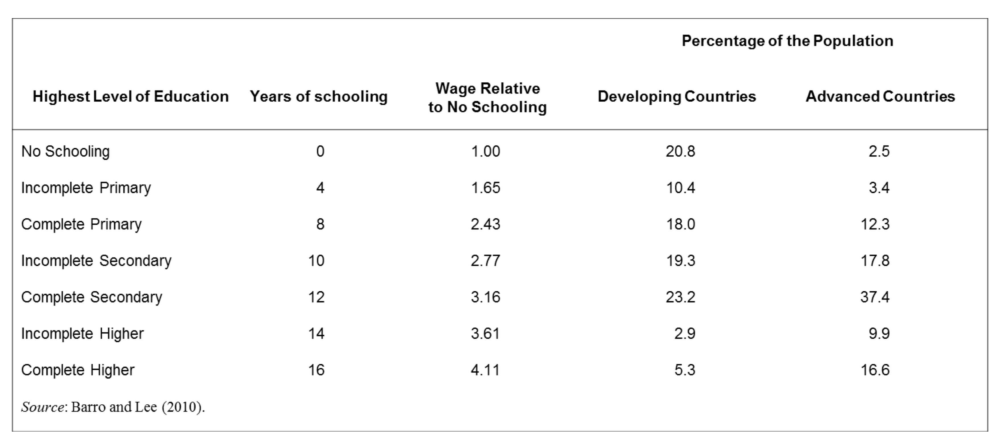
</center>

Table from Weil (2013)

---
.pull-left[
### Measuring human capital

_Steps 3 and 4 in measuring human capital_

How can we measure human capital in the form of education?
 $$ h = h_0 \times \left(\left( \frac{w_1}{w_0}\right)^{t_1} \times \left( \frac{w_2}{w_1}\right)^{t_2} \times \dots  \right)$$

- $h_0:$ level of labor input per worker with no schooling

- $\frac{w_i}{w_{i-1}}:$ annual wage premium paid to education level $i$ (primary, secondary, higher)

- $t_i:$ years spend in education level $i$

Then take a weighted mean of worker specific human capital to mesure average human capital in a country:
 
]

.pull-right[

<br>

<center>

</center>

Example: Percentage of people with primary education times human capital of a worker with primary education, plus percentage of people with high school education times human capital of a worker with high school degree, and so on.

]


---
### Human capital's share of wages

<br>


- Wage is paid to the combination of the hours worked (raw labor) and their quality (human capital)

- How much is paid to raw labor?

- How much is paid to human capital?

- Suppose a worker has five years of education.

- His wage would be $1.1344^4 \times 1.101 = 1.82$ times wage of a worker with no education

- $0.82/1.82 = 45\%$ to human capital, $55\%$ to raw labor

- Now, apply this method to entire labor force

---
### Share of human capital in wages
.pull-left[
#### Developing countries
<center>
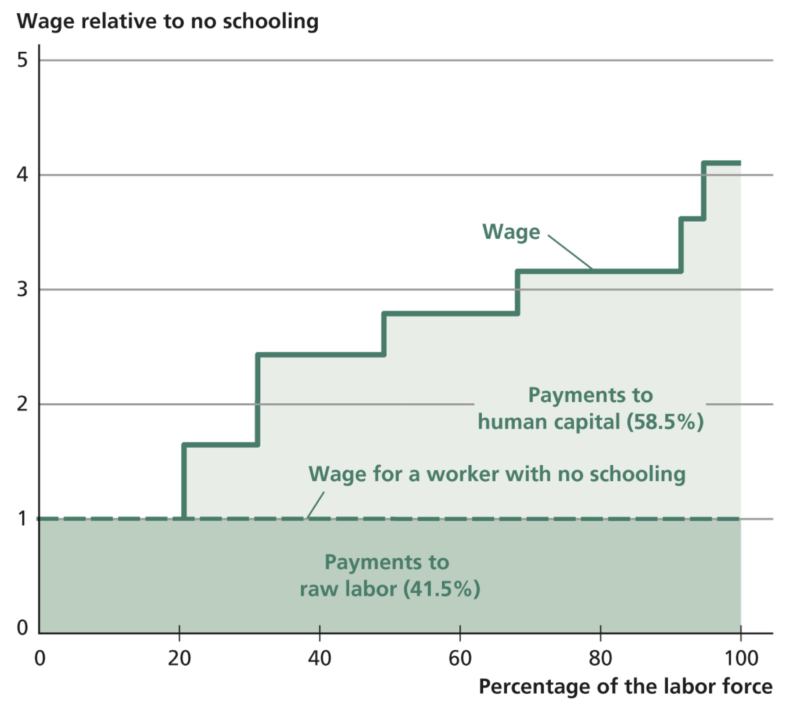
</center>
 human capital's share of national income in developing countries = $2/3 \times 58.5\%=40\%$
]
.pull-right[
#### Developed countries
<center>

</center>
human capital's share of national income in developed countries = $2/3 \times 67.7\%=45\%$
]

Charts from Weil (2013)

