```{r setup, include=FALSE}
options(htmltools.dir.version = FALSE)
library(knitr)
opts_chunk$set(
  fig.align="center", ##fig.width=6, fig.height=4.5, 
  ## out.width="748px", ##out.length="520.75px",
  dpi=300, ##fig.path='Figs/',
  cache=T##, echo=F, warning=F, message=F
  )
```

### Questions

<br>

<br>

- What's the role of tehnological progress on economic growth?

- Do relative low income countries grow faster than high income countries?


---
class: middle, center

### What's the long-run growth rate of income per capita <br> in the Solow Model? 

<br>

--


<p style="font-size:108px;">0</p>

---
### Economies do grow over time

<center>
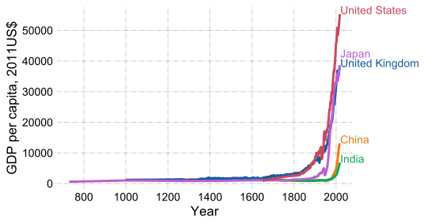
</center>

---
### Countries get more productive

.pull-left[
- TFP stands for total factor productivity

- TFP = total real output / total inputs into production
<center>
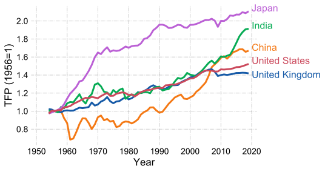
</center>


]

.pull-right[
- It does not mean that India is more productive than the US

- It means the TFP of India has grown more than the US TFP since 1954

<center>
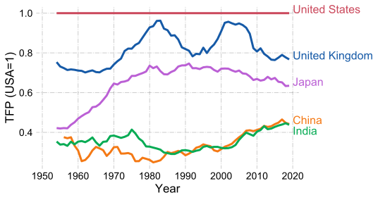
</center>


]


Data source: [Penn World Tables, version 9.1](https://www.rug.nl/ggdc/productivity/pwt/)
---
### Extended Solow Model

- Retain assumptions:

 - Constant returns to scale production function: $F(K,ehL)$
 
 - A constant fraction, $\gamma$, of output is invested.
 
 - A constant fraction, $\delta$, of physical capital stock depreciates.
 
 - Labor force participation rate is constant
 
 - Population grows at a constant rate, $n$.
 
 - Human capital, $h$, is constant.

- Differently, assume

 - There is labor augmenting productivity growth, $F(K,{\color{red}e}hL)$

 - Labor augmenting productivity, $e$, grows at a constant rate, $g$.

 $$ \frac{\dot{e}}{e} = g \Leftrightarrow e(t)=e_0e^{gt}$$

---
### Clarification...
- Previously, we assumed production function is $AF(K,hL)$
 
 - Here, $A$ is Hicks-neutral technology

- In the Extended Solow model, technology needs to be labor-augmenting: $F(K,ehL)$

 - Here, $e$ is labor-augmenting or Harrod-neutral technology
 
- In Cobb-Douglas production, this distinction is not important.
 
 - $K^\alpha(ehL)^{1-\alpha} = AK^\alpha(hL)^{1-\alpha},$ where $A\equiv e^{1-\alpha}$

---
### Accumulation of physical capital


- Change in capital stock = Investment - Depreciation
$$ \dot{K} = I - D$$

- A constant fraction, $\gamma$, of output is invested 
$$ I = \gamma Y$$

- A constant fraction, $\delta$, of capital depreciates
$$ D = \delta K$$
- Change in capital stock:
$$ \dot{K} = \gamma Y - \delta K$$
---
### Accumulation of capital-technology ratio

<br>

<br>


- Goal: derive a formula for the accumulation of capital-technology ratio, $\tilde{k} \equiv \frac{K}{eL}$

- Capital-technology ratio, $\tilde{k}$, sometimes referred as capital per effective labor. 

- Why do we need to convert physical capital accumulation equation into capital-technology units?

 - Because capital stock will grow as a result of increasing population and higher productivity.

---
### Accumulation of capital-technology ratio, cont'd


- Accumulation of capital
$$ \dot{K} = \gamma Y - \delta K$$

- How do we transform $\dot{K}$ into $\dot{\tilde{k}}$?

 - make use of $\tilde{k}\equiv \frac{K}{eL}$

 - take log of $\tilde{k}(t)\equiv \frac{K(t)}{e(t)L(t)}$:

$$ \ln(\tilde{k}(t))= \ln \left(\frac{K(t)}{e(t)L(t)} \right) = \ln(K(t)) -\ln(e(t)) - \ln(L(t))  $$ 

 - Then differentiate with respect to time, $t$,

 $$ \frac{\dot{\tilde{k}}(t)}{\tilde{k}(t)} = \frac{\dot{K}(t)}{K(t)} - \frac{\dot{e}(t)}{e(t)} - \frac{\dot{L}(t)}{L(t)}, \hspace{.5cm} \frac{\dot{\tilde{k}}}{\tilde{k}} = \frac{\dot{K}}{K} - g -n \Rightarrow \frac{\dot{K}}{K} = \frac{\dot{\tilde{k}}}{\tilde{k}} + g + n  $$

 - Remember chain-rule: $\frac{df(g(x))}{dx} = \frac{df}{dg}\frac{dg}{dx}$

---
### Accumulation of capital-technology ratio, cont'd (2)

- Divide each side of $\dot{K} = \gamma Y - \delta K$
 by $K$:
$$ \frac{\dot{K}}{K} = \frac{\gamma Y}{K} - \delta  $$
-  Then,
$$ \frac{\dot{\tilde{k}}}{\tilde{k}} + g +n =  \frac{\dot{K}}{K} = \frac{\gamma Y}{K} - \delta $$
$$ \frac{\dot{\tilde{k}}}{\tilde{k}} + g +n  = \frac{\gamma Y/(eL)}{K/(eL)} - \delta $$
$$ \frac{\dot{\tilde{k}}}{\tilde{k}} + g +n  = \frac{\gamma \tilde{y}}{\tilde{k}} - \delta,  \text{ where } \tilde{y} \equiv \frac{Y}{eL} $$
$$ \frac{\dot{\tilde{k}}}{\tilde{k}}  = \frac{\gamma \tilde{y}}{\tilde{k}} -( \delta+ g +n ) \hspace{.3cm} \Rightarrow  \hspace{.3cm} \dot{\tilde{k}}  = \gamma \tilde{y}-( \delta+ g +n )\tilde{k} $$

---

### Steady State
.pull-left[
$$ \dot{\tilde{k}}  = \gamma \tilde{y}-( \delta+ g +n )\tilde{k}, \text{ or }$$ 
$$ \dot{\tilde{k}}  = \gamma f(\tilde{k})-( \delta+ g +n )\tilde{k} $$  
where $\tilde{y}=f(\tilde{k}) = F(K,ehL)/(eL)$


Capital-technology ratio is constant at the steady state.

- if $\gamma f(\tilde{k}) > (\delta+g+n) \tilde{k}$, then $\dot{\tilde{k}} > 0$

- if $\gamma f(\tilde{k}) < (\delta+g+n) \tilde{k}$, then $\dot{\tilde{k}} < 0$

- if $\gamma f(\tilde{k}) = (\delta+g+n) \tilde{k}$, then $\dot{\tilde{k}} = 0$: **steady state**

- If $\tilde{k} < \tilde{k}^\ast$, capital-technology ratio will increase. 
- If $\tilde{k} > \tilde{k}^\ast$,  capital-technology ratio will decrease.


]

.pull-right[
<center>
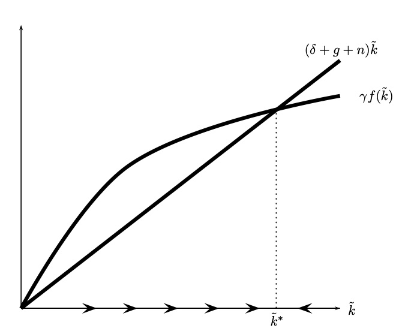
</center>
Graphic from Jones and Vollrath (2013)


]
---
### Steady State, cont'd
.pull-left[
- Cobb-Douglas production function
$$ Y = K^\alpha(ehL)^{1-\alpha} $$
$$ \frac{Y}{eL} = \frac{K^\alpha(ehL)^{1-\alpha}}{(eL)^\alpha (eL)^{1-\alpha}}$$
$$ \tilde{y} = \tilde{k}^\alpha h^{1-\alpha}$$
- Law of motion of capital-technology ratio
$$ \dot{\tilde{k}} = \gamma \tilde{k}^\alpha h^{1-\alpha} - (\delta+g+n)\tilde{ k} $$
- No change of capital-technology ratio at the steady state
$$ 0 = \gamma (\tilde{k}^{\ast})^\alpha h^{1-\alpha} - (\delta+g+n) \tilde{k}^{\ast} $$
$$ \Downarrow$$
$$  \gamma (\tilde{k}^{\ast})^\alpha h^{1-\alpha}= (\delta+g+n) \tilde{k}^{\ast} $$

]
- Steady state capital-technology ratio
 
 - (capital-technology ratio = capital per effective labor) 
 
$$ \tilde{k}^{\ast} = \left(\frac{\gamma }{\delta+g+n} \right) ^{1/(1-\alpha)}h $$ 


- Steady steady output-technology ration:

 - (output-technology ratio = output per effective labor) 

$$ \tilde{y}^{\ast}= (\tilde{k}^{\ast})^\alpha h^{1-\alpha} = \left(\frac{\gamma}{\delta+g+n} \right)^{\alpha/(1-\alpha)}h$$

---
### Per worker values

.pull-left[
Output per worker:

$$ y(t) = e(t) \tilde{y}(t) $$ 
 - Recall that $$y(t) =\frac{Y(t)}{L(t)} = e(t)\frac{Y(t)}{e(t)L(t)} = e(t) \tilde{y}(t)$$

Capital per worker:
$$ k(t) = e(t) \tilde{k}(t) $$ 

 - Recall that $$k(t) =\frac{K(t)}{L(t)} = e(t)\frac{K(t)}{e(t)L(t)} = e(t) \tilde{k}(t)$$


]

.pull-right[
Output per worker at the steady state:
$$ y(t) = e(t) \tilde{y}^\ast = e(t) \left(\frac{\gamma}{\delta+g+n} \right)^{\alpha/(1-\alpha)}h$$ 
- Since $\tilde{y}^\ast$ is constant at the steady state, $y$ at the steady state grows at the same rate as $e$: $g$.

Capital per worker:
$$ k(t) = e(t) \tilde{k}^\ast = e(t) \left(\frac{\gamma }{\delta+g+n} \right) ^{1/(1-\alpha)}h $$ 

- Since $\tilde{k}^\ast$ is constant at the steady state, $k$ at the steady state grows at the same rate as $e$: $g$.

]

---
### Comparative Statics
Capital-technology ratio at the steady state:
$$ \tilde{k}^{\ast} = \left(\frac{\gamma }{\delta+g+n} \right) ^{1/(1-\alpha)}h $$ 
Output-technology ratio at the steady state:

$$ \tilde{y}^{\ast}= \left(\frac{\gamma}{\delta+g+n} \right)^{\alpha/(1-\alpha)}h$$


- $\tilde{k}^\ast$ and $\tilde{y}^\ast$ are rising with investment rate $\gamma$, and human capital $h$, 

- $\tilde{k}^\ast$ and $\tilde{y}^\ast$ are declining with depreciation rate, $\delta$, population growth rate, $n$, and rate of technological progress, $g$.

---
### Increasing the investment rate
As $\gamma \uparrow$, $\tilde{k}^{\ast} =\left(\frac{\gamma }{\delta+g+n} \right) ^{1/(1-\alpha)} h \uparrow$, 
$\tilde{y}^{\ast}= \left(\frac{\gamma}{\delta+g+n} \right)^{\alpha/(1-\alpha)}h \uparrow$

<center>
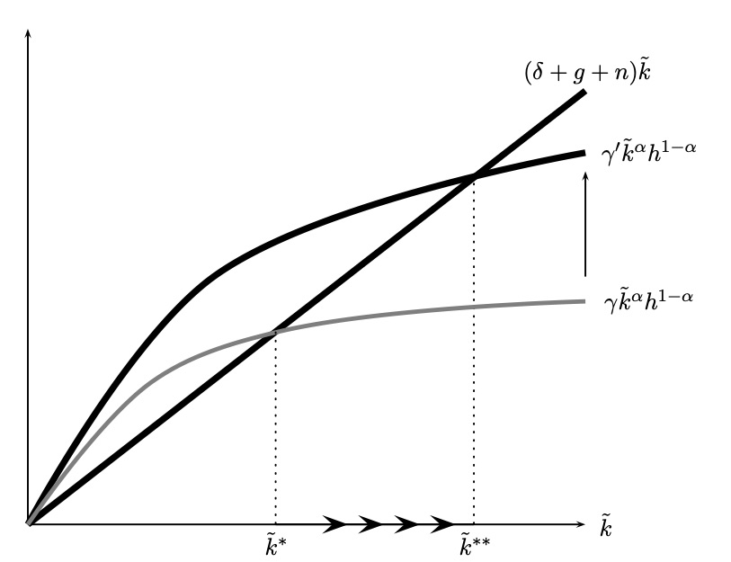
</center>
Graphic from Jones and Vollrath (2013)
---
### Increasing the investment rate, cont'd

.pull-left[
#### Output-technology ratio over time
<center>
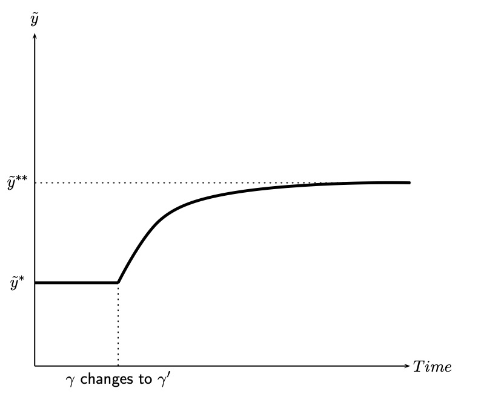
</center>

- Notice that $\tilde{k}$ has a similar trajectory as $\tilde{y}$
]

.pull-right[
#### Output per worker over time
<center>
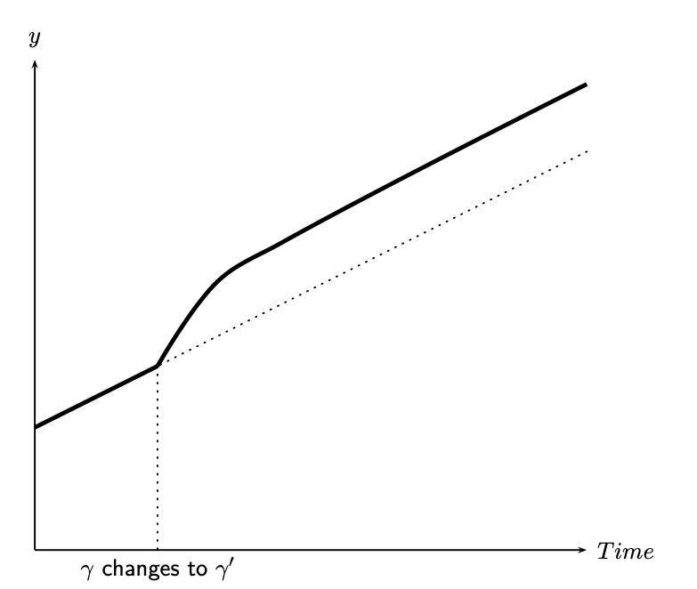
</center>
- Notice that $k$ has a similar trajectory as $y$
]


---
### Growth rate of capital-technology ratio after an increase in investment rate
.pull-left[
<center>
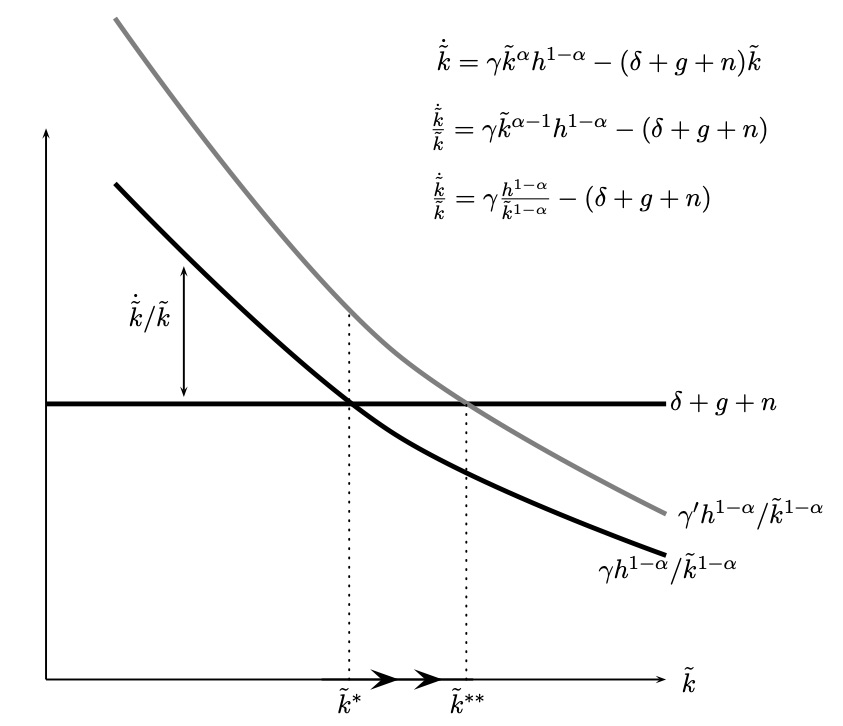
</center>

- An increase in the investment rate leads to an increase in the growth rate of capital per worker in the short-run.

]

.pull-right[

<center>
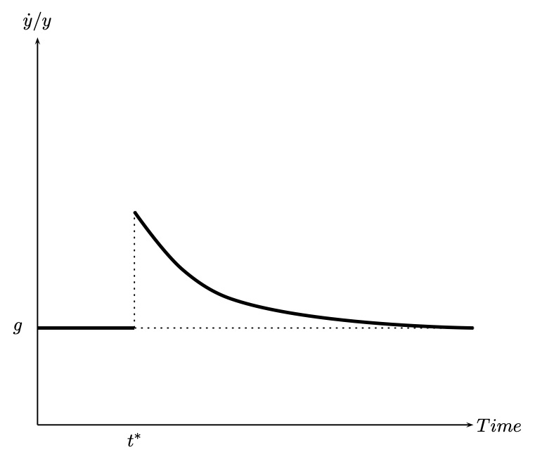
</center>


- Long-run growth rates of output per worker and capital per worker are not affected.


]

---
### Exercise

<br>

<br>


<br>

Conduct comparative statics for changes in $n,$ $\delta,$ $g$, and $h.$

---
### Effects of an increase in investment rate


<br>


**Short-run:**

- Growth rates of capital per worker and income per worker increase.

- Capital per worker and income per worker increases.

** Long-run (steady-state):**

- Capital per worker and income per worker increase.

- Growth rate of capital per worker and income per worker do not change.

---
### Steady state growth rates

| Variable | Notation| Definition | Growth rate as the s.s. |
|:---: | :---: | :---: | :---: | 
|Capital-technology ratio | $\tilde{k}$  | $\frac{K}{eL}$ | ? |
|Output-technology ratio | $\tilde{y}$  | $\frac{Y}{eL}$  | ? |
|Consumption-technology ratio | $\tilde{c}$  | $\frac{C}{eL}$ | ? |
| Capital per worker | $k$ | $\frac{K}{L}$ | ? |
| Output per worker | $y$ | $\frac{Y}{L}$ | ? |
| Consumption per worker | $c$ | $\frac{C}{L}$ | ? |
| Capital | $K$ | $K$ | ? |
| Output | $Y$ | $Y$ | ? |
| Consumption | $C$ | $C$ | ? |

---
### Exogenous Growth Model

<br>


- Technology is the only source of long-run growth.

- Technology is exogenous: not a results of interactions of agents in the model

- Hence, the extended Solow model is an example of  _exogenous growth models._

- It is also referred as _Neo-classical growth model_

- In upcoming lectures, we will analyze _endogenous growth models_

 - Technological progress as a result of actions of model agents.

---


class: inverse, center, middle
name: pop

# Convergence

<html><div style='float:left'></div><hr color='#EB811B' size=1px width=796px></html>


---
### Convergence

<br>

<br>


- Are _poor_ countries growing faster than _rich_ countries?

- Are _poor_ countries _closing the gap_?

- **Converge:** The phenomenon of _poor_ countries catching up with the _rich_ countries.

---
### Convergence in a sample of industrialized countries, 1870-2008

<center>
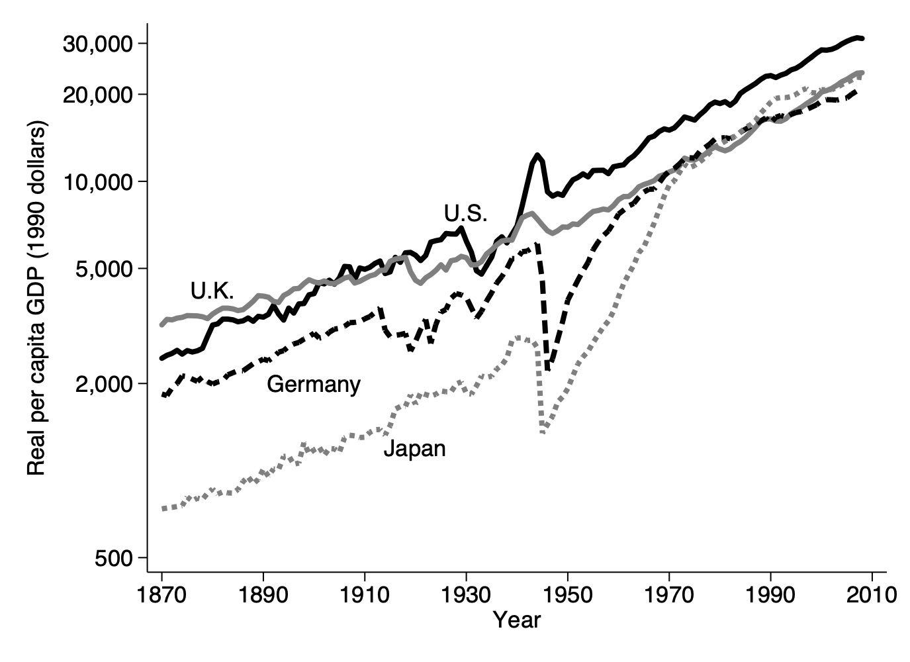
</center>


Data source: Maddison (2010)

Graph from: Jones and Vollrath (2013) 
---
### Convergence in a sample of industrialized countries, cont'd, 1870-2008

<center>
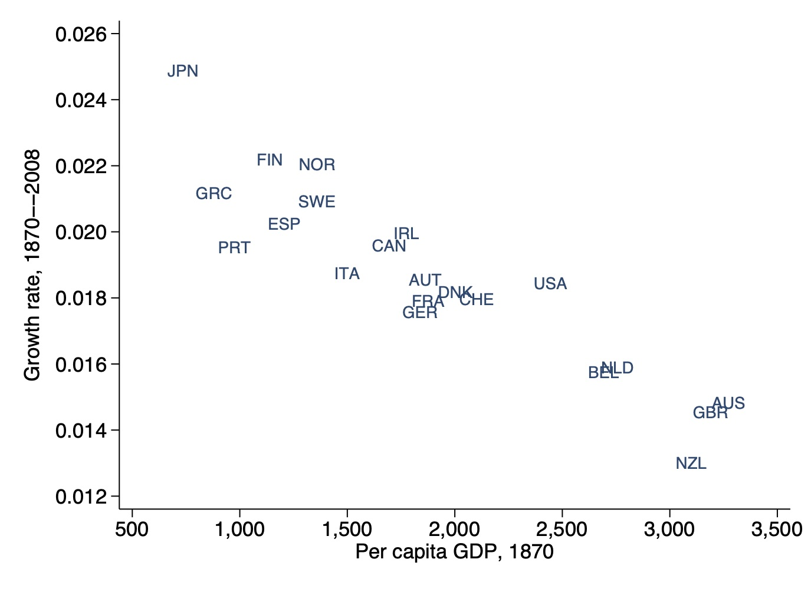
</center>

Data source: Maddison (2010)

Graph from: Jones and Vollrath (2013) 
---
### Convergence in OECD countries, 1960-2008

<center>

</center>

Data source: Penn World Tables Mark 7.0 and Summers and Heston (1991)

Graph from: Jones and Vollrath (2013) 

---
### The lack of convergence for the World, 1960-2008

<center>
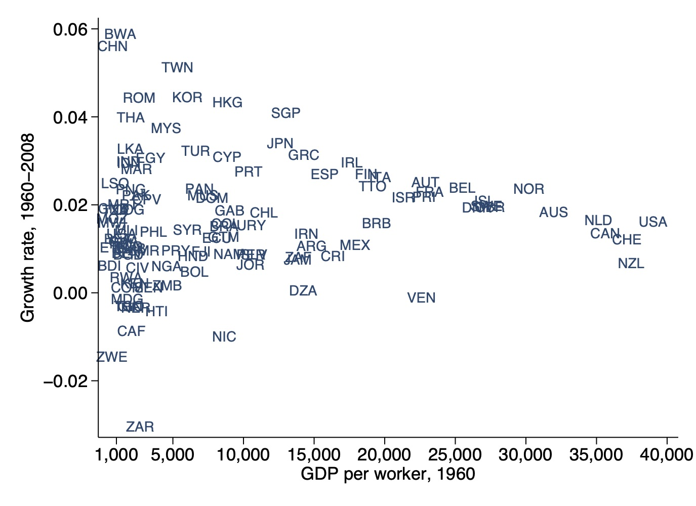
</center>


Data source: Penn World Tables Mark 7.0 and Summers and Heston (1991)
Graph from: Jones and Vollrath (2013)

#### Notice that, in our last seminar, we looked at the convergence of the countries with the most recent data, and there was convergence of countries after 1995.

---

### Convergence (?)

- How do we reconcile the converge in OECD but lack of convergence for the world?

-  Prediction of the Solow model:

 - Among the countries with the same steady state, poor countries should grow faster than rich countries.

-  Steady state depends on investment rate, population growth rate, technological progress rate

- OECD countries show similarities in investment rate, population growth rate, rate of technological progress. 

- More variation in the World in these statistics.

---
### Conditional convergence

- Mankiw, Romer, and Weil (1992), and Barro and Sala-i-Martin (1992):

- Convergence of countries "conditional on"  their steady states

- Countries that are poor relative to their steady states tend to grow faster.

---
### _Conditional_ convergence for the World, 1960-2008


<center>
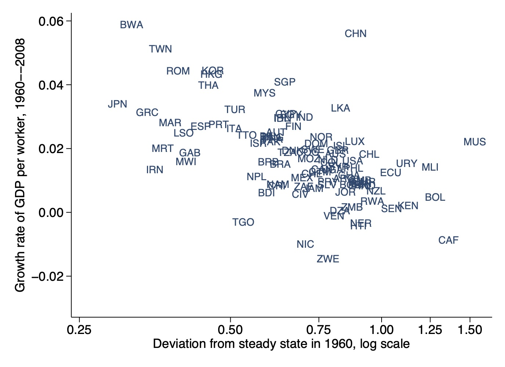
</center>

Data source: Author's calculations using Penn World Tables 7.0, update of Summers and Heston (1991).

Note: The variable on the x-axis is $\hat{y}_{60}/\hat{y}^\ast$. Estimates of A for 1970 are used to compute the steady state.

Graph from: Jones and Vollrath (2013) 

---
### Summary

<br>


- We developed a model in which technological progress is the only source of long-run growth

- We looked at the convergence of countries: countries with similar steady states converge but not all countries.

- Most recent data, as discussed in our last seminar, actually show convergence.
