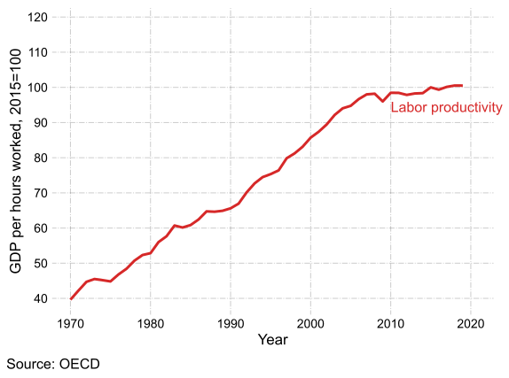
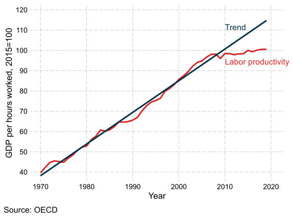
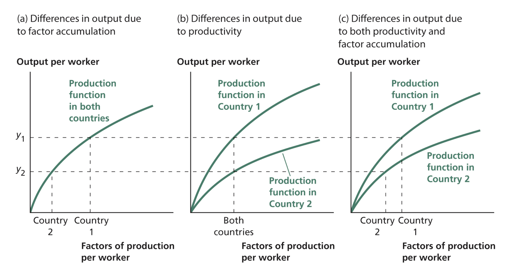
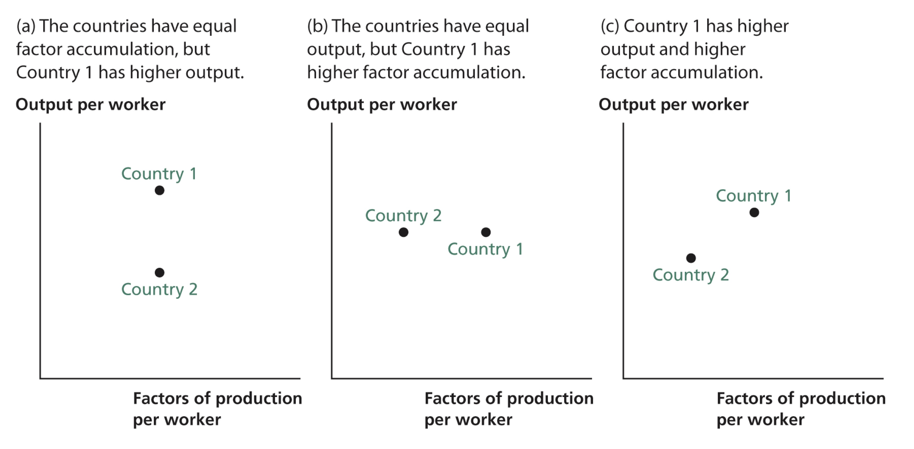
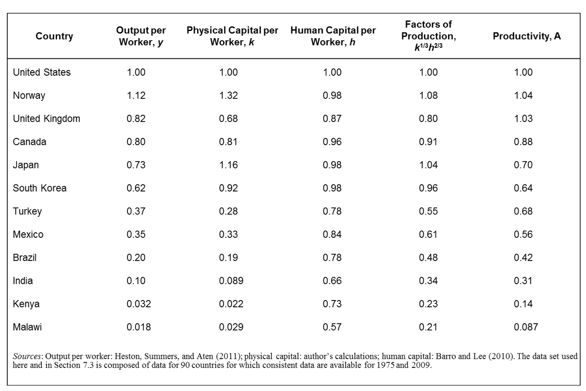
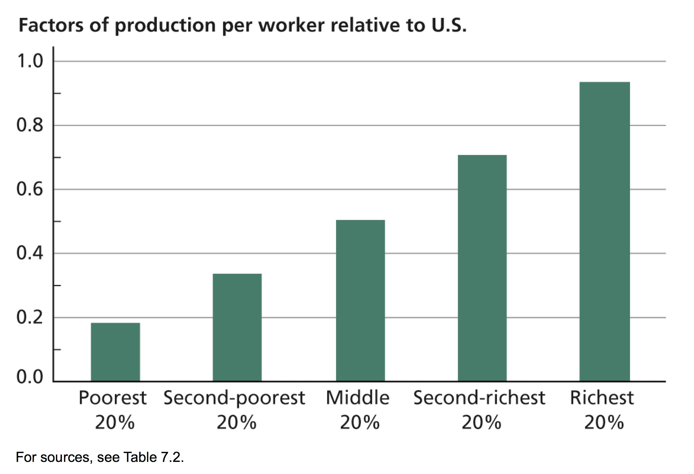
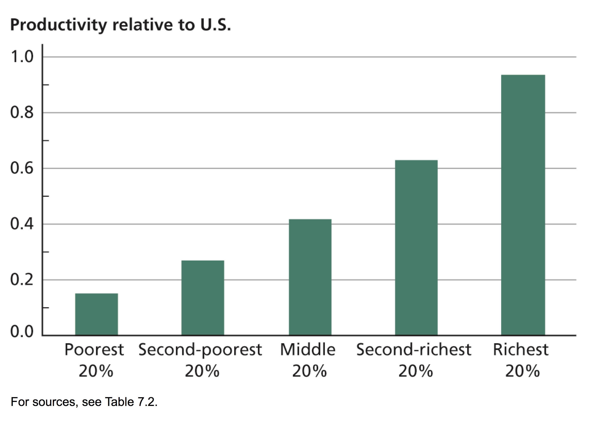
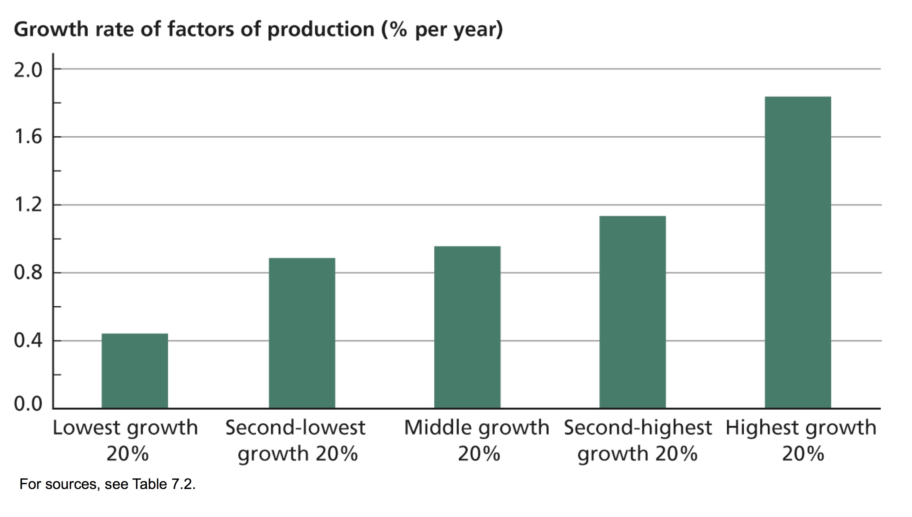
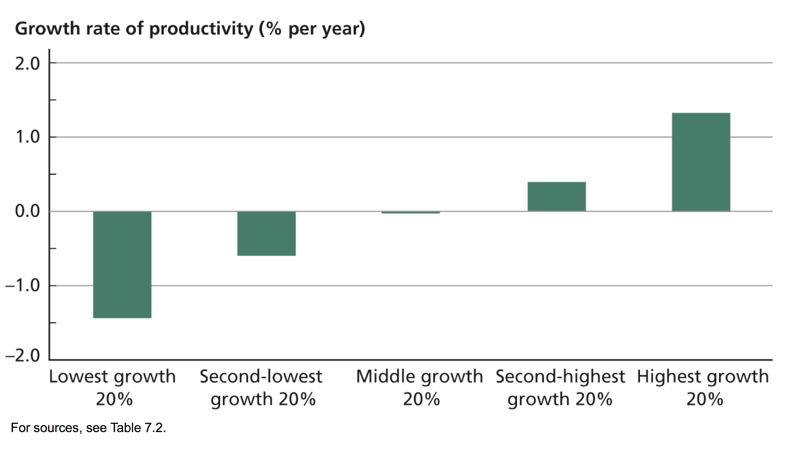

```{r setup, include=FALSE}
options(htmltools.dir.version = FALSE)
library(knitr)
opts_chunk$set(
  fig.align="center", ##fig.width=6, fig.height=4.5, 
  ## out.width="748px", ##out.length="520.75px",
  dpi=300, ##fig.path='Figs/',
  cache=T##, echo=F, warning=F, message=F
  )
```

### Introduction

- Some aspects of factor accumulation &ndash;
 - investment rate, 
 - population growth rate, 
 - human capital 
 
 &ndash; explain some variation in income differences across countries.

- Taken together, do the different aspects of factor accumulation explain all of the variation among countries? 
 
 - Answer: **No**
 
- Productivity explains the remaining part of the variation among countries


---
### Productivity

- **Productivity:** Effectiveness with which factors of production are converted into output.

- Productivity = Output / Input

- Output = Nominal GDP / Price Deflator (CPI or PPI)

- Labor productivity = Output / Hours Worked

- Total Factor Productivity (TFP) = Output / Index of all inputs to production

- $A$ in our Cobb-Douglas production functions is an example of TFP
$$ y = Ak^\alpha h^{1-\alpha} \Rightarrow A = \frac{y}{k^\alpha h^{1-\alpha}}$$ 
- In this module, main focus is on total factor productivity

 - When we say 'productivity', we mean total factor productivity

---
### Labor productivity


.pull-left[
- Labor productivity = Output / Hours Worked

- Commonly used measure of productivity

- Easy to calculate and interpret

- Capital accumulation leads to labor productivity gains

]


---
### Labor productivity


.pull-left[
- Labor productivity = Output / Hours Worked

- Commonly used measure of productivity

- Easy to calculate and interpret

- Capital accumulation leads to labor productivity gains

- Slowdown in the UK labor productivity growth after 2008

 - Also known as _producitivity puzzle_
 
 - Avearge annual labor productivity growth from 1970 to 2008: 2.4% 
 
 - Avearge annual labor productivity growth from 2008 to 2018: 0.25% 

]

.pull-right[

<center>

</center>

Data from OECD, [GDP per hour worked](https://data.oecd.org/lprdty/gdp-per-hour-worked.htm)
]

---
### Labor productivity


.pull-left[
- Labor productivity = Output / Hours Worked

- Commonly used measure of productivity

- Easy to calculate and interpret

- Capital accumulation leads to labor productivity gains

- Slowdown in the UK labor productivity growth after 2008

 - Also known as _producitivity puzzle_
 
 - Avearge annual labor productivity growth from 1970 to 2008: 2.4% 
 
 - Avearge annual labor productivity growth from 2008 to 2018: 0.25% 

- Had the labor productivity grown at the pre-crisis level, each household would have earned 12% more.
]

.pull-right[

<center>

</center>

Data from OECD, [GDP per hour worked](https://data.oecd.org/lprdty/gdp-per-hour-worked.htm)
]

---
### Productivity slowdown

- Many advanced economies experienced slowdown in labor productivity growth in the last decade

- UK experienced the severest slowdown

| Country   |   Labor productivity growth (%), 2008-2018 |
|:-----------|:--------------:|
| United Kingdom       |          0.25 |
| Germany        |          0.72 |
| New Zealand        |          0.79 |
| Japan        |          0.84 |
| France      |          0.88 |
| United States        |          0.99 |

Data from OECD, [GDP per hour worked](https://data.oecd.org/lprdty/gdp-per-hour-worked.htm)

---
### More on (labor) productivity

.pull-left[


<iframe width="560" height="650" src="./files/bls-prod.html" frameborder="0" allowfullscreen></iframe>

]

.pull-right[

<br>


Read Andrew G Haldane's (Chief Economist, Bank of England) speech, [Productivity Puzzles](https://www.bankofengland.co.uk/-/media/boe/files/speech/2017/productivity-puzzles.pdf?la=en&hash=708C7CFD5E8417000655BA4AA0E0E873D98A18DE) 
]


---
### Overview

- Countries differ in their output because of 

 - differences in factor accumulation

 - differences in productivity

- In this lecture, we ask:

 - How much does productivity differ across countries?
 
 - How much of the variation in income per worker among countries is explained by productivity differences?
 
 - How much does productivity growth differ among countries?
 
 - How much of the variation in growth rates among countries is explained by variation in productivity growth, and how much by variation in factor accumulation?

---
### Possible sources of differences in output per worker


<center>

</center>
Graphic from Weil (2013)

---
### Inferring productivity from data on output and factor accumulation

<br>

.pull-left[

a. Country 1 is more productive than country 2

b. Country 2 is more productive than country 1

c. Need to know the production function to make a comparison

]

.pull-right[
<center>

</center>
Graphic from Weil (2013)

]

---

### Measuring productivity differences among countries

- Assume production function is a Cobb-Douglas

$$ Y = A K^\alpha (hL)^{1-\alpha}$$

- Output per worker $y = A k^\alpha h^{1-\alpha}$

- factors of production = $k^\alpha h^{1-\alpha}$

- output = productivity $\times$ factors of production

---
### Productivity differences

- Output per worker of country 1 and country 2
$$ y_1 = A _1 k_1^\alpha h_1^{1-\alpha}$$
$$ y_2 = A_2 k_2^\alpha h_2^{1-\alpha}$$

- Output per worker ratios:
$$ \frac{y_1}{y_2} = \left(\frac{A_1}{A_2} \right)\left(\frac{ k_1^\alpha h_1^{1-\alpha}}{ k_2^\alpha h_2^{1-\alpha}} \right) $$ 

$$ \text{ratio of output per worker} = \text{ratio of productivity } \times \text{ ratio of factors of production} $$
- Ratio of productivity

$$ \text{ratio of productivity } = \frac{A_1}{A_2}  = \frac{\text{ratio of output per worker}}{\text{ ratio of factors of production}} = \frac{\left( \frac{y_1}{y_2} \right)}{\left(\frac{ k_1^\alpha h_1^{1-\alpha}}{ k_2^\alpha h_2^{1-\alpha}} \right)} $$

---
### Numerical example
$$ \frac{A_1}{A_2} = \frac{\left( \frac{y_1}{y_2} \right)}{\left(\frac{ k_1^\alpha h_1^{1-\alpha}}{ k_2^\alpha h_2^{1-\alpha}} \right)} $$ 
$$ \text{ratio of productivity } = \frac{ \text{ratio of output}}{\text{ ratio of factors of production}} $$


| | Output per worker, $y$ | Physical capital per worker, $k$ | Human capital per worker, $h$ |
|:--- | :---: | :---: | :---: |
| Country 1 | 24 | 27 | 8 |
| Country 2 | 1 | 1 | 1 |


$$ \frac{A_1}{A_2} = \frac{\left( \frac{24}{1} \right)}{\left( \frac{27^{1/3}\times8^{2/3}}{1^{1/3}\times 1^{2/3}} \right)} = \frac{24}{\left(\frac{3 \times 4}{1} \right)}=2$$
- Country 1 is twice as productive as country
---

class: inverse, center, middle
name: development

# Development accounting

<html><div style='float:left'></div><hr color='#EB811B' size=1px width=796px></html>


---
### Development accounting 

<br>

**Development Accounting:** Breaking down income differences into parts accounted for by

- productivity differences

- factor accumulation differences

---
### Development accounting, algorithm


Using data in a given year, say $t$:

1. Pick a base country

2. Find output per worker of country $i$ relative to the  base country, $\frac{y_i}{y_{base}} = ?$

3. Find physical capital per worker of country $i$ relative to the  base country, $\frac{k_i}{k_{base}} = ?$

4. Find human capital per worker of country $i$ relative to the base country, $\frac{h_i}{h_{base}} = ?$ 

5. Find factors of production of country $i$ relative to the base country, $\frac{k^\alpha _i h_i^{1-\alpha}}{k^\alpha _{base} h_{base}^{1-\alpha}} = ?$

6. Find productivity of country $i$ relative to the base country,  $\frac{A_i}{A_{base}} = ?$ 

7. Comment on the values you found in above steps 

---
### Development accounting, cont'd 

.pull-left[

- Large differences in productivity

- South Korean productivity = 64% of US productivity

- Japan has significantly higher level of physical capital, but it's productivity is 70% of the US productivity.

- Canada and UK: similar income, UK more productive, Canada higher factor accumulation
]


.pull-right[
<center>

</center>
Table from Weil (2013)

- Data is from 2009
]

---
### Roles of factors of production and productivity in determining output per Worker, 2009

.pull-left[
<center>

</center>
]
.pull-right[
<center>

</center>
]

Graphics from Weil (2013)
---
### Accounting for output per worker differences

<br>

- Productivity among the poorest one-fifth of countries is 15% of the US level.

- Similar contributions of productivity and factor accumulation to ouput per worker differences

- Productivity is slightly more important (except the richest 20%)

- 47%  of variation in output per worker is due to factor accumulation

- 53% of the variation is due to productivity

---
class: inverse, center, middle
name: growth

# Growth accounting

<html><div style='float:left'></div><hr color='#EB811B' size=1px width=796px></html>


---
### Differences in the growth rate of productivity among countries

**Growth accounting:** Breaking a country's growth into parts accounted for by

- growth in productivity

- growth in the quantity of factors of production

We ask

- How much income growth on average is accounted for by the productivity growth?

- How much income growth on average is accounted for by increases in factors of production?


---
### Measuring a country's productivity growth


$$ \text{output}=\text{productivity}\times \text{factors of production}$$
- growth rate of output  = growth rate of productivity + growth rate of factors of production

- growth rate of productivity = growth rate of output - growth rate of factors of production

--

- Assume a Cobb-Douglas production function

- Output per worker, $y= Ak^\alpha h^{1-\alpha}$

- Take natural log of each side of equation
$$ \ln(y)= \ln(Ak^\alpha h^{1-\alpha}) = \ln(A) + \alpha \ln(k) + (1-\alpha)\ln(h) $$

- Differentiate with respect to time
$$\frac{\frac{dy}{dt}}{y} = \frac{\frac{dA}{dt}}{A}+ \alpha  \frac{\frac{dk}{dt}}{k} + (1-\alpha) \frac{\frac{dh}{dt}}{h}$$ 
$$ \hat{y} = \hat{A} + \alpha \hat{k}+ (1-\alpha) \hat{h} \Rightarrow \hat{A} = \hat{y} - (\alpha \hat{k}+ (1-\alpha) \hat{h})  $$
where $\hat{x}$ is the growth rate of $x$.
---
### Growth accounting, algorithm

.pull-left[
For a country, $i$, from year $t$ to year $t+n$, find

1. the average annual growth rate of income per worker, $\hat{y} = \frac{\ln y_{i,t+n}-\ln y_{i,t}}{n}$

2. the average annual growth rate of physical capital per worker, $\hat{k} = \frac{\ln k_{i,t+n}-\ln k_{i,t}}{n}$

3. the average annual growth rate of human capital per worker, $\hat{h} = \frac{\ln h_{i,t+n}-\ln h_{i,t}}{n}$

4. the average annual growth rate of factors of production per worker, $\hat{f.o.p.} = \alpha \hat{k} + (1-\alpha) \hat{h}$

5. the average annual growth rate of productivity, $\hat{A} = \hat{y} - \hat{f.o.p}$

]

.pull-right[
Comment on the above stats, in particular highlight

1. percentage of output per worker growth accounted for by the productivity growth, $\frac{\hat{A}}{\hat{y}}$

2. percentage of output per worker growth accounted for by the factors of production, $\frac{\hat{f.o.p}}{\hat{y}}$

 - percentage of output per worker growth accounted for by the physical capital accumulation, $\frac{\alpha \hat{k}}{\hat{y}}$

 - percentage of output per worker growth accounted for by the human capital accumulation, $\frac{(1-\alpha) \hat{h}}{\hat{y}}$

]


---
### Numerical example

$$  \hat{A}  = \hat{y} - \alpha \hat{k} -  (1-\alpha) \hat{h} $$ 


| | Output per worker, $y$ | Physical capital per worker, $k$ | Human capital per worker, $h$ |
|:--- | :---: | :---: | :---: |
| Erewhon in 1975 | 1 | 20 | 5 |
| Erewhon in 2010 | 4 | 40 | 10 |
| Annual growth rate | 4% | 2% | 2% |

$$ \text{growth rate of output} = \left(\frac{\ln (\text{output in 2010}) - \ln(\text{output in 1975})}{35} \right)=.04 $$
$$ \hat{A} = .04 - \frac{1}{3} \times .02 - \frac{2}{3} \times .02 = .02$$
---
### Growth Accounting for the US

- Years 1975 &ndash; 2009

- 1.34% output growth annually

- physical capital stock growth rate of 2.20% per year

- human capital growth rate of .11% per year

- $\alpha=1/3$

$$ \hat{A} = .0134 - \frac{1}{3} \times .022 - \frac{2}{3} \times .0011 = .0054 $$

- Productivity growth explains 40% of income growth (.0054/0.0134 = 40%)

- 60% of growth is explained by the accumulation of factors of production

---

### Roles of Factors of Production and Productivity in Determining Growth, 1975 &ndash; 2009
.pull-left[
<center>

</center>
]
.pull-right[
<center>

</center>
]

---

### Growth accounting

- Growth rate of factors of production ranges from .43% to 1.83% (1.40% gap)

- Productivity growth in the fastest growing one-fifth of countries is 1.33% per year

- Productivity growth in the slowest growing one-fifth of countries is -1.42% per year

- Gap between highest and lowest productivity growth is 2.75%

- Productivity growth is much more important source of income growth

- 68% of variation in the growth rates is the result of variation in productivity growth

- 32% of the variation is due to variation in factor accumulation

---
### Problems with measuring productivity

- Quality of schooling

- Misreporting of investment

- Many different types of assets

- Quality differences across different versions of same asset

- Finding appropriate weights to sum up real quantities of  different assets 

- Production function is not necessarily constant

- Factor shares vary across countries

---
### Summary

- **Development Accounting:** Breaking down income differences into parts accounted for by

 - productivity differences

 - factor accumulation differences

- **Growth accounting:** Breaking a country's growth into parts accounted for by

 - growth in productivity

 - growth in the quantity of factors of production
 
#### To review this lecture:
Read Chapter 7 of Economic Growth by David N. Weil
