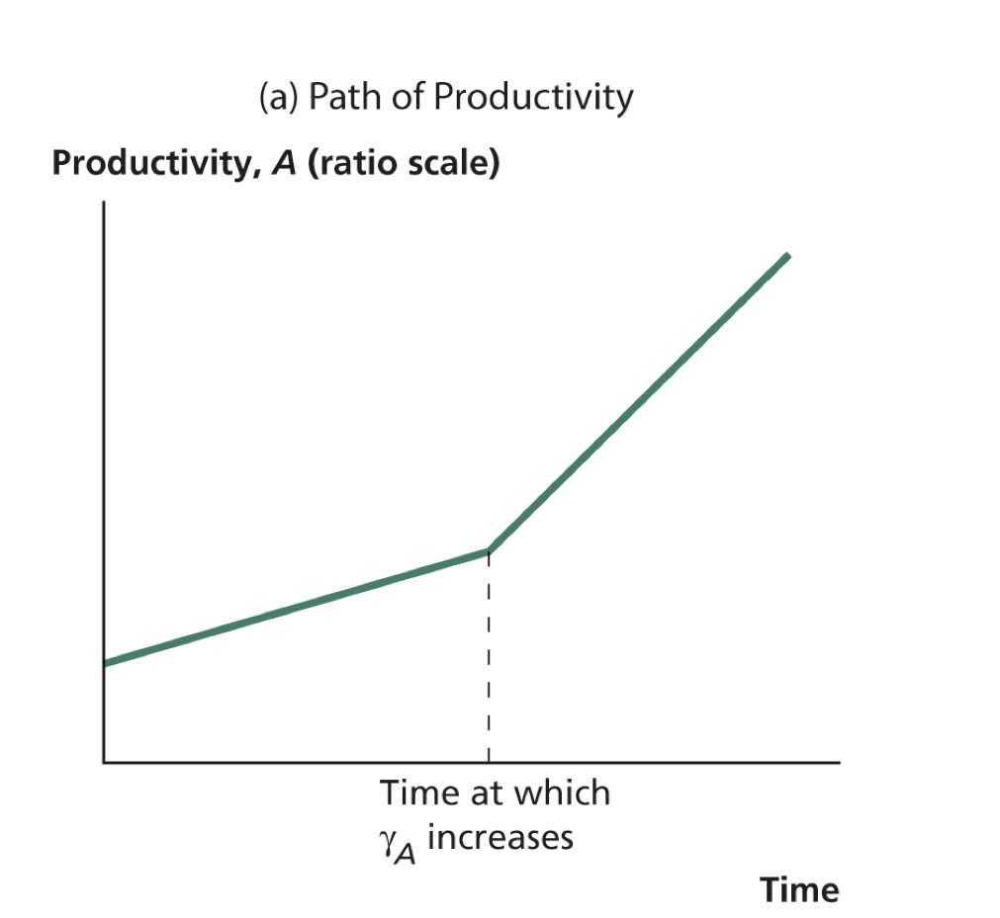
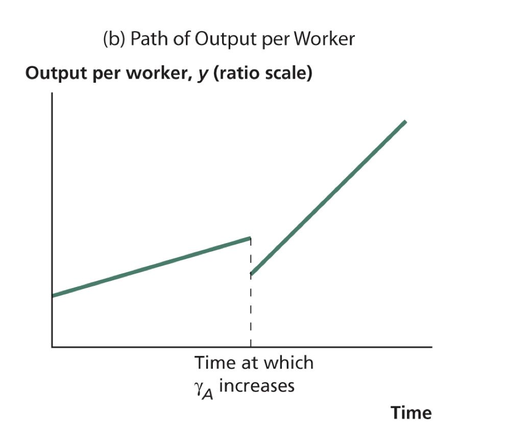
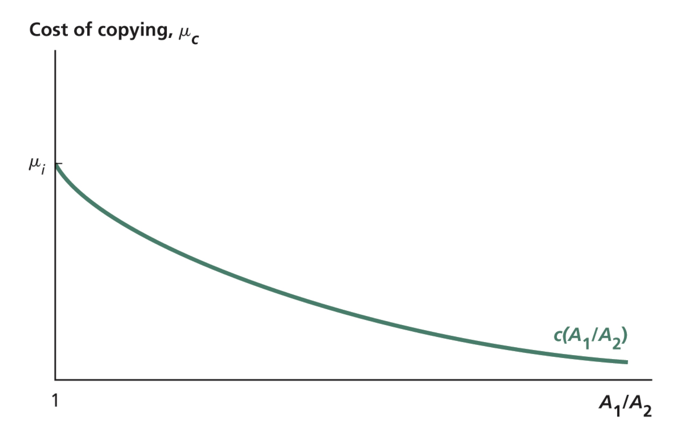
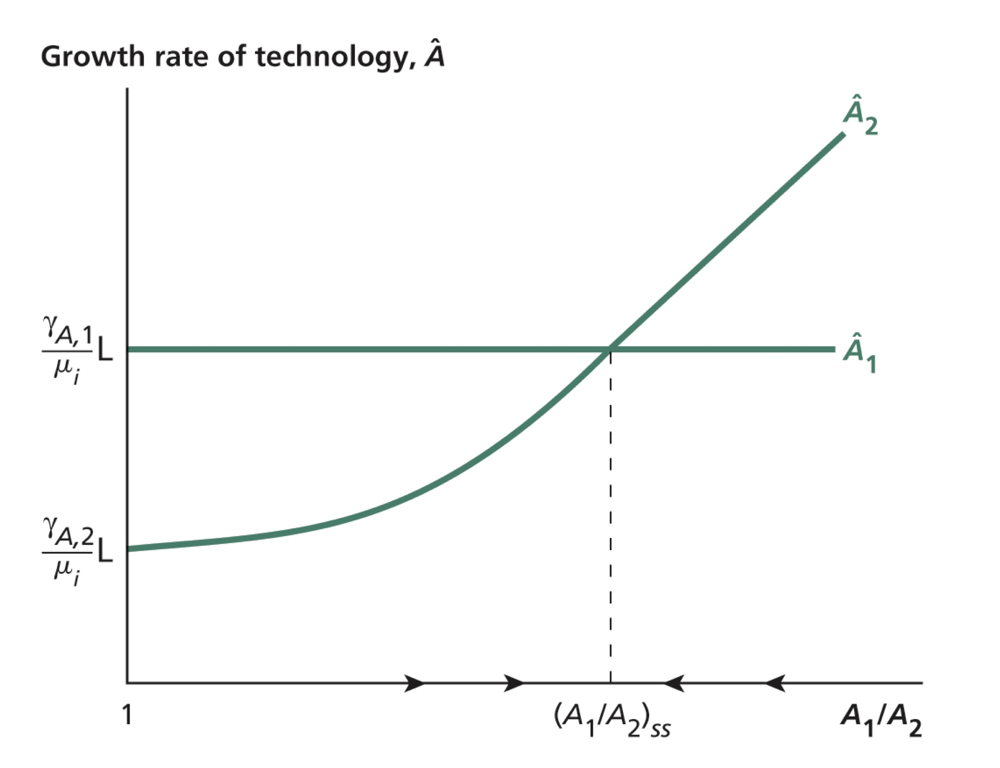
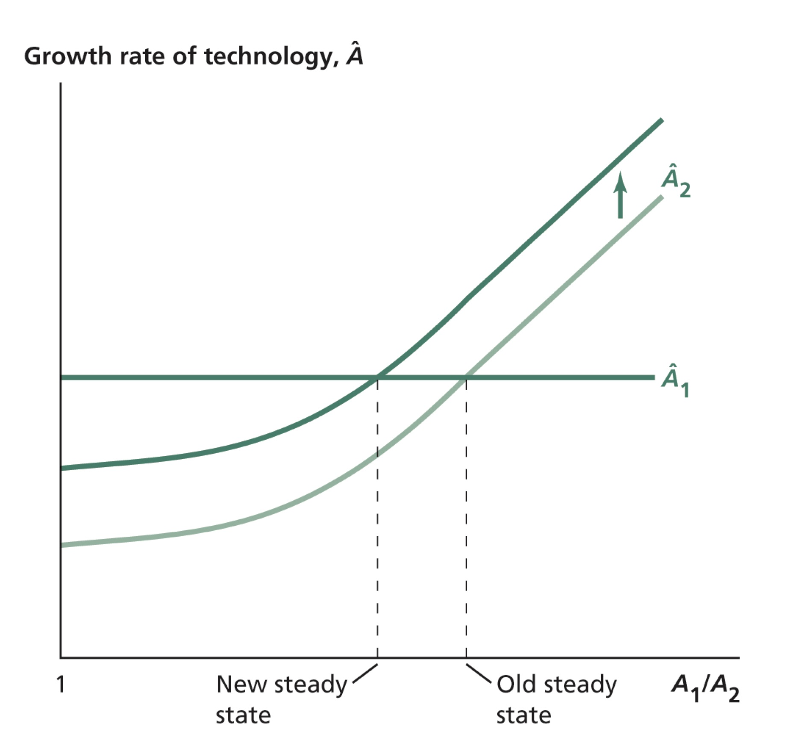
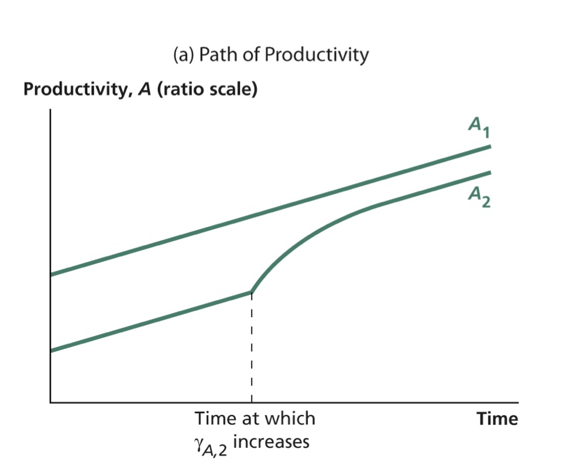
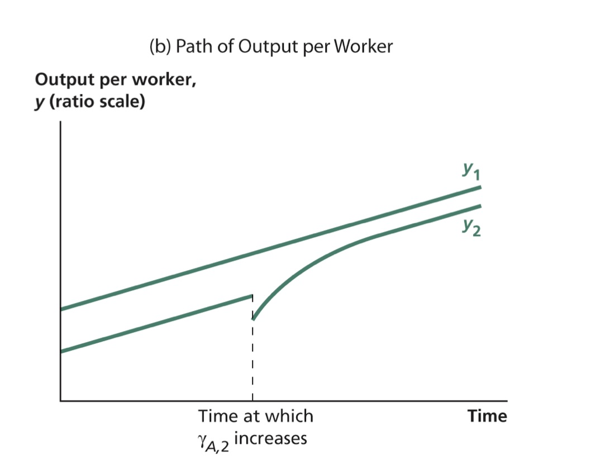

```{r setup, include=FALSE}
options(htmltools.dir.version = FALSE)
library(knitr)
opts_chunk$set(
  fig.align="center", ##fig.width=6, fig.height=4.5, 
  ## out.width="748px", ##out.length="520.75px",
  dpi=300, ##fig.path='Figs/',
  cache=T##, echo=F, warning=F, message=F
  )
```

### The nature of technological progress

<br>

<br>


- Productivity and technology, $A = T \times E$

 - technology: knowledge about how factors of production can be combined to produce output

 - efficiency: how effectively given technology and factors of productions are actually used


---
### What determines productivity

- Watch this [video](https://www.youtube.com/watch?time_continue=13&v=q9kYwVciFnI&feature=emb_logo) of John Van Reenen, a World leading expert on productivity

<br>

<center>
<iframe width="560" height="315" src="https://www.youtube.com/embed/q9kYwVciFnI" frameborder="0" allow="autoplay; encrypted-media" allowfullscreen></iframe>
</center>


---
### Technological progress

Solow model: no long-run (economic) growth

--

Extended Solow model (or Solow model with technological progress): 

- long-run growth as a result of exogenous technological progress

--

Endogenous growth models:

- Technological progress as result of efforts by

 - researchers

 - entrepreneurs
 
 - inventors

- Technology (or ideas) are produced

 - designs

 - blueprints

---
### Ideas vs objects


- Technology is **non-rival** in its use

 - it can be used by many at the same time

 - technology can be shared with others 

 -  it is transferable across firms and countries

--

- technology is (often) **non-excludable** (per se)

 - owner of the technology cannot prevent others from using it without permission

 - reduces incentive for creating technology

 - cutting edge technology is usually protected by patents

--

- Standard goods are rival

 - a machine can be used in only one location at a time

- Goods are excludable:

 - machines stored in a factory protected by professional guards

---
class:center

### Economics of Ideas

<br>

Ideas

$$\Downarrow$$

Non-rivalry
 $$\Downarrow$$
 
 Increasing returns to scale and Imperfect competition
---
### Ideas and increasing returns to scale


- Standard replication argument

 - To double the output of factory, say bicycle factory, you can replicate the same factory across the street

 - Therefore, constant returns to scale

--

- You don't need to re-produce the blueprints of bicycle production

- Constant returns to scale in rivalrous inputs (capital, labor, material) $$\Downarrow$$

.center[Increasing returns to scale in rivalrous inputs plus ideas]

- Output per person depends on the total stock of knowledge, not knowledge per person.

- One more machine (physical capital), one worker more productive

- One more idea, any number of workers more productive
---
### Ideas and imperfect competition

- Creating new ideas (technologies) requires investment

--

- Ideas have **high fixed costs**, a lot of effort to create a drug

- Ideas have **low (zero) marginal costs**.

--

- Fixed cost, low marginal cost necessitate imperfect competition


--

- Incentive to innovate: profits 

- With perfect competition, firms will not invest in R&D, as they will have negative profits.

--

- involves externalities

 - non-exclusiveness leads to spillovers

 - later inventors and researchers benefit from the insights of those who came before.

 - market investment in ideas may not be socially optimum

---
### Readings

<br>

<br>


- You should always read the relevant chapters of the course textbooks.

- Chapter 4.2 (The Economics of Ideas) of Jones and Vollrath (2013)

- Chad Jones, [New ideas about new ideas: Paul Romer, Nobel laureate](https://voxeu.org/article/new-ideas-about-new-ideas-paul-romer-nobel-laureate), VOX, 12 October 2018 

---
### Implications of Investment in Ideas

<br>

<br>


- Set aside, temporarily, the decision of how much to invest in technology

- Focus on implications of technology investment on

 - the output per worker level
 
 - growth rate of output per worker

---
### One-country model of technology creation and growth

- Draws on Lucas(1988) and Mankiw(1995)

- The only input to production is labor. (Ignore physical capital and human capital for now)

- Labor is employed on either output production or new technology creation  (R&D)

$$L = L_Y+L_A$$

- $\gamma_A$: fraction of labor force engaging in R&D.
$$ \gamma_A = \frac{L_A}{L}$$
- Labor employed for output production:
$$L_Y = (1-\gamma_A)L $$
- Output:
$$ Y = AL_Y = A(1-\gamma_A)L $$


---
### One-country model of technology creation and growth, cont'd

- Output per worker:
$$ y = A(1-\gamma_A) $$

- Notice that output per worker depends on total level of technology, not technology per worker

-  $A \uparrow$ $\Rightarrow$ $y \uparrow$

- For given $A$, $\gamma_A \uparrow$ $\Rightarrow$ $y \downarrow$

- Trade-off: 

 - Higher investment in R&D reduces output per worker in the short run

 - Higher investment in R&D increase output per worker by increasing $A$

---

### Productivity Growth

- Productivity growth rate:
$$ \hat{A} = \frac{L_A}{\mu},$$
where $\mu$ is the price of a new invention in units of labor.

- The larger $\mu$ is, the more labor must be devoted to R&D to achieve a given rate of technological growth. 

- Re-writing
$$ \hat{A} = \frac{\gamma_A}{\mu}L $$

- As long as $\gamma_A$ constant, $y = A(1-\gamma_A)$ $\Rightarrow$
$$\hat{y} = \hat{A}= \frac{\gamma_A}{\mu}L$$
- Increase in the population involved in R&D, $\gamma_A \uparrow$ $\Rightarrow$ $\hat{y} \uparrow$ 

- Decrease in the cost of innovation, $\mu \downarrow$ $\Rightarrow$ $\hat{y} \uparrow$

---
### Effect of Shifting Labor into R&D (an increase in $\gamma_A$)


.pull-left[
Remember that $\hat{A} = \frac{\gamma_A}{\mu}L$
<center>

</center>
]

.pull-right[
$y = A(1-\gamma_A)$ and $\hat{y} = \hat{A}= \frac{\gamma_A}{\mu}L$
<center>

</center>
]

Graphics from: Weil (2013)

---

### Predictions

- Some similarity to increase in the investment rate in the Solow model

 - Consumption is lower in the short-run, higher in the long-run

- Long run economic growth rate is increasing with the resources allocated to R&D:
$$ \hat{y} = \hat{A}= \frac{\gamma_A}{\mu}L$$

- No evidence that countries with larger population grow faster 

 - the share of researchers are different across countries 
 
 - the level of human capital is important in reality (ignored in this model)

 - the closed economy setting could be false 
 
 - international technology transfer/spillover

---

### Two-country model of technology creation and growth

- Draws on Barro and Sala-i Martin (1997)

- Two countries: country 1 and country 2 

$$y_1 = A_1(1-\gamma_{A,1})$$
$$y_2 = A_2(1-\gamma_{A,2})$$

- Two means of acquiring a technology

 - **Innovation:** the invention of a new technology
 
 - **Imitation:** copying of a technology from elsewhere, available only to _technology follower_
 
- Suppose, country 1 is the **technology leader:** $A_1>A_2$ 

- Country 2 is the **technology follower:** $A_1 > A_2$ 
 
- Assume $\gamma_{A,1}>\gamma_{A,2}$

 - This assumption along with equal labor force sizes guarantees that country 1 is the technology leader in the model's steady state.


---

### Productivity Growth Rates
- Productivity growth rate in the leader country
$$\hat{A}_1 = \frac{\gamma_{A,1}}{\mu_i}L_1,$$ where $\mu_i$ is the cost of _invention_.

- Productivity growth rate in the follower
$$\hat{A}_2 = \frac{\gamma_{A,2}}{\mu_c} L_2,$$ 
where $\mu_c$ is  cost of _copying_ (or _imitation_)


---

### Cost of Copying for the Follower Country

.pull-left[
- Cost of _copying_ is a function of technology gap between leader and follower:
$$ \mu_c = c\left(\frac{A_1}{A_2} \right) $$

- As technology gap widens, cost of copying decreases

- As $\frac{A_1}{A_2} \rightarrow \infty$,  $\mu_c = c\left(\frac{A_1}{A_2} \right) \rightarrow 0$

]

.pull-right[
<center>

</center>

Graphics from: Weil (2013)

]

---

### Steady State in the Two-Country Model

.pull-left[

- If $A_1/A_2 =1$, then cost of invention would be the same, and country 1 will grow faster since $\gamma_{A,1}>\gamma_{A,2}$

- If  $A_1/A_2 =\infty$, then cost of copying would be 0 for country 2, and it will grow much faster than country 1

- At some point $1<A_1/A_2<\infty$ the countries will grow at the same rate

-  Steady state is stable: 

 - If $A_1/A_2 > (A_1/A_2)_{ss}$, $A_2$ will grow faster and $A_1/A_2 \downarrow$

 - If $A_1/A_2 < (A_1/A_2)_{ss}$, $A_1$ will grow faster and $A_1/A_2 \uparrow$

]

.pull-right[
- Remember that $\hat{A}_2 = \frac{\gamma_{A,2}}{\mu_c} L_2,$  $\mu_c$ $\downarrow$ as $A_1/A_2$ $\uparrow$
<center>

</center>

Graphics from: Weil (2013)

]

---

### Steady state 


- In the steady state, countries grow at the same rate
$$\frac{\gamma_{A,1}}{\mu_i}L = \hat{A}_1 = \hat{A}_2 = \frac{\gamma_{A,2}}{\mu_c}L$$
- Cost of copying:
$$\mu_c = \frac{\gamma_{A,2}}{\gamma_{A,1}}\mu_i$$
- Country 2 has lower cost of technology acquisition

- Once we know $\mu_c$, we can solve for $A_1/A_2$ s.t. $c(A_1/A_2)=\mu_c= \frac{\gamma_{A,2}}{\gamma_{A,1}}\mu_i$

- Is the technology-leading country necessarily better off than the follower?


---

### Effect of an Increase in R&D in the Follower Country on the Steady State

.pull-left[
- Increase $\gamma_{A,2}$ but still lower than $\gamma_{A,1}$

- Technology level of the follower country come closer to the technology level of the leader country

- Since  $\gamma_{A,2} < \gamma_{A,1}$, $A_1>A_2$ in the long run
]

.pull-right[
<center>

</center>

Graphics from: Weil (2013)

]

---

### Effect of an Increase in $\gamma_{A,2}$ on Productivity and Output

.pull-left[
<center>

</center>

Graphics from: Weil (2013)

]

.pull-right[
<center>

</center>

]

- Increase in $\gamma_{A,2}$ causes a temporary increase in growth rates, in contrast to permanent increase in one-country model
 - Similar to increase in investment rate in the Solow model

- In contrast, an increase in $\gamma_{A,1}$ leads to permanent changes in the growth rates


---
### Summary

- Ideas are non-rival and non-excludable

 - leads to increasing returns to scale
 
 - necessitates imperfect competition

--

- Technological progress is a result of endogenous efforts of researchers

--

- Technological progress involves a trade-off:

 - current consumption versus future consumption
 
 - similar to saving decision in this regard
 
 - Growth rate of a country is permanently affected, unline the investment rate

--

- Countries can also imitate technology:

 - lower cost, lower technology level 
 
 - but achieve the same growth rates of the leader countries

---

### Next week

- Analyze investment in R&D

- Efficiency


### To review this lecture read

- Chapter 4 (Introduction), 4.1 and 4.2 of Jones and Vollrath (2013)

- Chapter 8 of Weil (2013)
