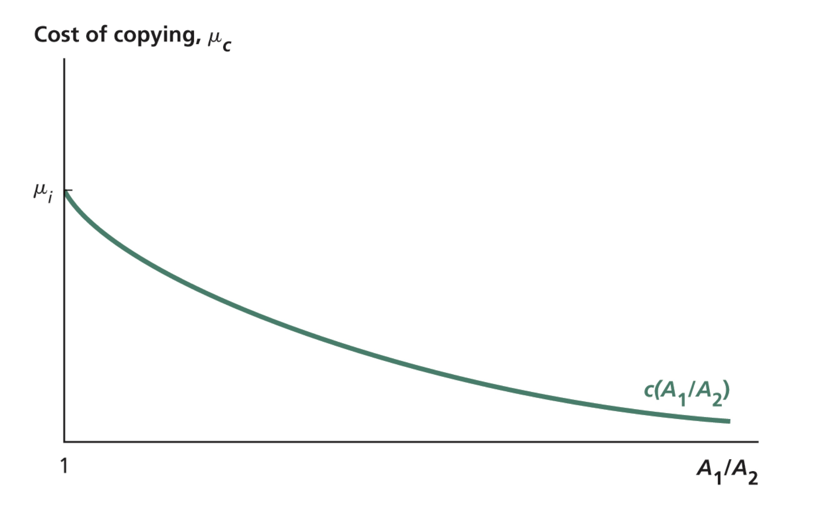
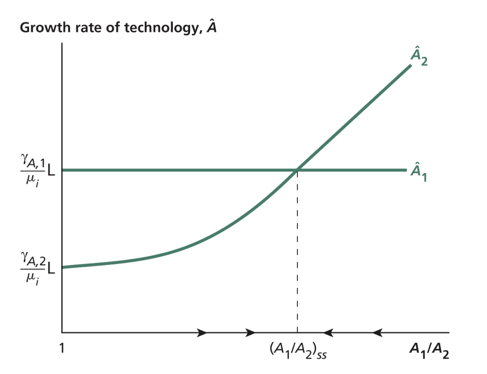
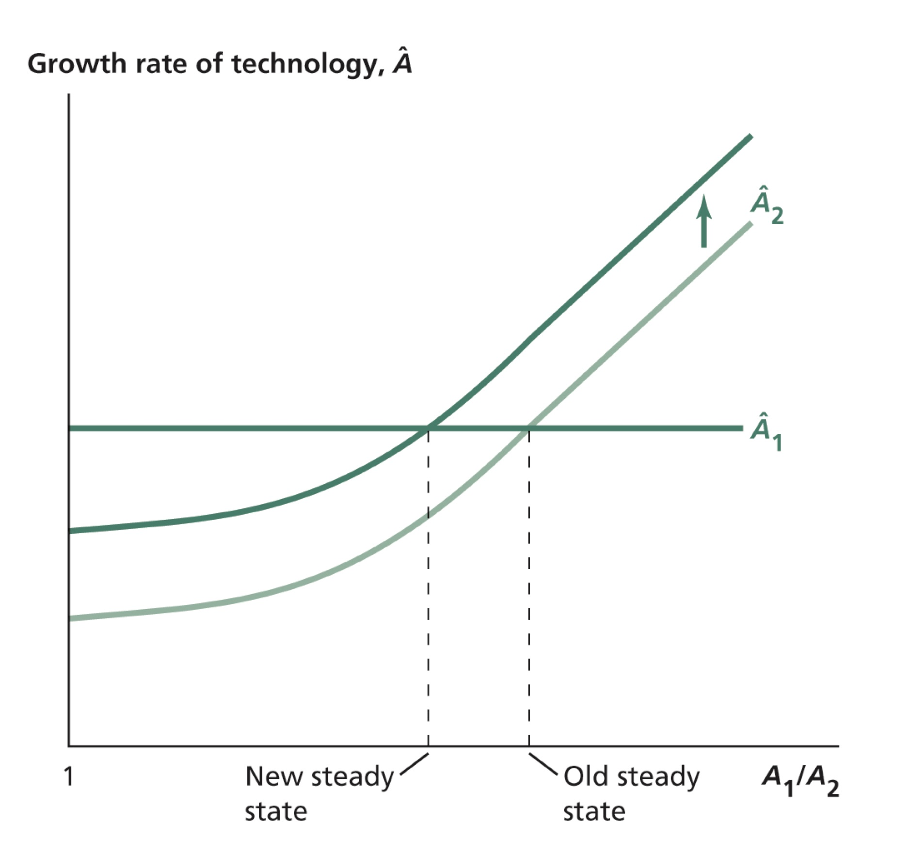
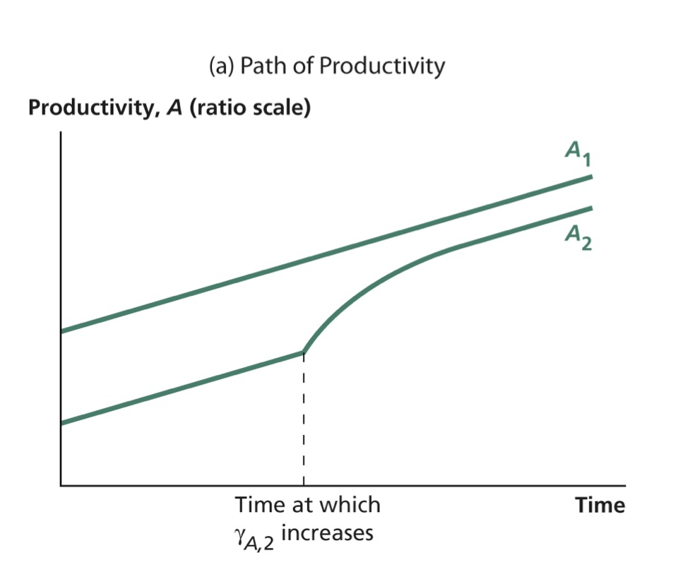
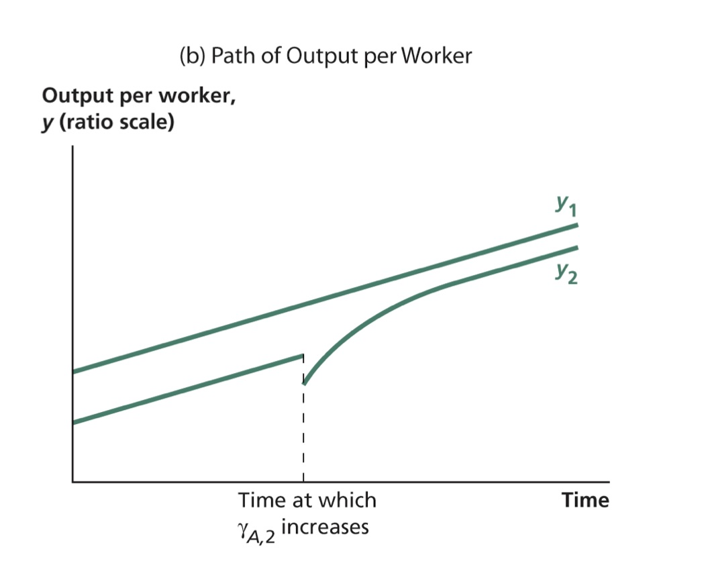
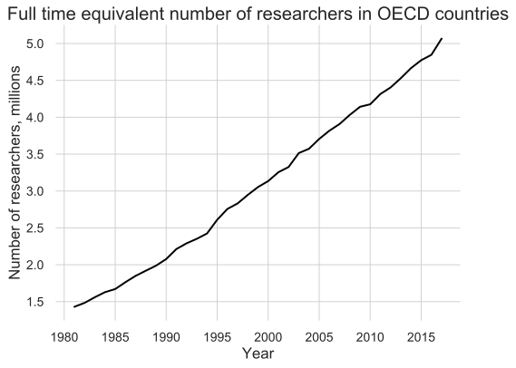

```{r setup, include=FALSE}
options(htmltools.dir.version = FALSE)
library(knitr)
opts_chunk$set(
  fig.align="center", ##fig.width=6, fig.height=4.5, 
  ## out.width="748px", ##out.length="520.75px",
  dpi=300, ##fig.path='Figs/',
  cache=T##, echo=F, warning=F, message=F
  )
```

### Overview

<br>

<br>

- Finish covering the two-country model of technology creation and growth

- Relax some unrealistic assumptions on the growth rate of technology

- Analyze the motives and consequences of R&D in a market economy

- Understand why might the level of R&D in market economy not be socially optimal 

- Last lecture and this one are about understanding the sustained economic growth in advanced economies.

---
class: inverse, center, middle
name: last-week

## Last week, we left at...

<html><div style='float:left'></div><hr color='#EB811B' size=1px width=796px></html>

---


### Two-country model of technology creation and growth

- Draws on Barro and Sala-i Martin (1997)

- Two countries: country 1 and country 2 

$$y_1 = A_1(1-\gamma_{A,1})$$
$$y_2 = A_2(1-\gamma_{A,2})$$

- Two means of acquiring a technology

 - **Innovation:** the invention of a new technology
 
 - **Imitation:** copying of a technology from elsewhere, available only to _technology follower_
 
- Suppose, country 1 is the **technology leader:** $A_1>A_2$ 

- Country 2 is the **technology follower:** $A_1 > A_2$ 
 
- Assume $\gamma_{A,1}>\gamma_{A,2}$

 - This assumption along with equal labor force sizes guarantees that country 1 is the technology leader in the model's steady state.


---

### Productivity growth rates
- Productivity growth rate in the leader country
$$\hat{A}_1 = \frac{\gamma_{A,1}}{\mu_i}L_1,$$ where $\mu_i$ is the cost of _invention_.

- Productivity growth rate in the follower
$$\hat{A}_2 = \frac{\gamma_{A,2}}{\mu_c} L_2,$$ 
where $\mu_c$ is  cost of _copying_ (or _imitation_)


---

### Cost of copying for the follower country

.pull-left[
- Cost of _copying_ is a function of technology gap between leader and follower:
$$ \mu_c = c\left(\frac{A_1}{A_2} \right) $$

- As technology gap widens, cost of copying decreases

- As $\frac{A_1}{A_2} \rightarrow \infty$,  $\mu_c = c\left(\frac{A_1}{A_2} \right) \rightarrow 0$

]

.pull-right[
<center>

</center>

Graphics from: Weil (2013)

]

---

### Steady State in the Two-Country Model

.pull-left[

- If $A_1/A_2 =1$, then cost of invention would be the same, and country 1 will grow faster since $\gamma_{A,1}>\gamma_{A,2}$

- If  $A_1/A_2 =\infty$, then cost of copying would be 0 for country 2, and it will grow much faster than country 1

- At some point $1<A_1/A_2<\infty$ the countries will grow at the same rate

-  Steady state is stable: 

 - If $A_1/A_2 > (A_1/A_2)_{ss}$, $A_2$ will grow faster and $A_1/A_2 \downarrow$

 - If $A_1/A_2 < (A_1/A_2)_{ss}$, $A_1$ will grow faster and $A_1/A_2 \uparrow$

]

.pull-right[
- Remember that $\hat{A}_2 = \frac{\gamma_{A,2}}{\mu_c} L_2,$  $\mu_c$ $\downarrow$ as $A_1/A_2$ $\uparrow$
<center>

</center>

Graphics from: Weil (2013)

]

---

### Steady state 


- In the steady state, countries grow at the same rate
$$\frac{\gamma_{A,1}}{\mu_i}L = \hat{A}_1 = \hat{A}_2 = \frac{\gamma_{A,2}}{\mu_c}L$$
- Cost of copying:
$$\mu_c = \frac{\gamma_{A,2}}{\gamma_{A,1}}\mu_i$$
- Country 2 has lower cost of technology acquisition

- Once we know $\mu_c$, we can solve for $A_1/A_2$ s.t. $c(A_1/A_2)=\mu_c= \frac{\gamma_{A,2}}{\gamma_{A,1}}\mu_i$

- Is the technology-leading country necessarily better off than the follower?


---

### Effects of an increase in R&D in the follower country <br> on the steady state

.pull-left[
- Increase $\gamma_{A,2}$ but still lower than $\gamma_{A,1}$

- Technology level of the follower country come closer to the technology level of the leader country

- Since  $\gamma_{A,2} < \gamma_{A,1}$, $A_1>A_2$ in the long run
]

.pull-right[
<center>

</center>

Graphics from: Weil (2013)

]

---

### Effect of an increase in $\gamma_{A,2}$ on productivity and output

.pull-left[
<center>

</center>

Graphics from: Weil (2013)

]

.pull-right[
<center>

</center>

]

- Increase in $\gamma_{A,2}$ causes a temporary increase in growth rates, in contrast to permanent increase in one-country model
 - Similar to increase in investment rate in the Solow model

- In contrast, an increase in $\gamma_{A,1}$ leads to permanent changes in the growth rates

---
class: inverse, center, middle
name: technology

## Technology production function

<html><div style='float:left'></div><hr color='#EB811B' size=1px width=796px></html>

---
### Technology production function

.pull-left[
- So far, we assumed technology growth rate is independent of current technology level:
$$ \hat{A} = \frac{L_A}{\mu} $$

- However, technology is cumulative: 

 - Researchers begin their investigations where those who came before them left off.

- Considering the increse in the research efforts, growth should have skyrocketed. 
]

.pull-right[
<center>

</center>

Data source: OECD
]

---
### Cumulative nature of technology development

Instead of assuming $\hat{A} = \frac{L_A}{\mu}$ assume $\hat{A}\equiv \frac{\dot{A}}{A}= \frac{L_A^\lambda}{\mu}A^{\phi - 1}$, then 

$$ \dot{A} =  \frac{L_A^\lambda}{\mu}A^{\phi} $$


- If $\phi > 0:$ **standing on shoulders**

 Isaac Newton: 
 > If I have seen farther than others, it is because I have stood on _the shoulders of giants_.

 - Larger base of knowledge

 - Larger set of tools

- If $\phi < 0:$ **fishing out**

 - Fishing out effect: easiest discoveries have already been made

 - More is known today, more effort for a researcher to learn everything required

---
### Stepping on toes effect

<br>

<br>


- If $\lambda < 1$ 

- Efforts of most of the researchers will be wasted if many are working at the same project

 - Charles Darwin came up earlier with _natural selection_ than Alfred Wallace

 - Two teams completed the sequencing of human genome simultaneously


---
### Long-run growth rate

- How do we calculate long-run economic growth if $\dot{A} = \frac{L_A^\lambda}{\mu}A^\phi$ ?

- Growth rate of $A$, $g_A \equiv \frac{\dot{A}}{A} =  \frac{(\gamma_A L)^\lambda}{\mu}A^{\phi-1} = \frac{(\gamma_A L)^\lambda}{\mu A^{1-\phi}}$

- For $g_A$ to be constant in the long run, $(\gamma_A L)^\lambda$  and $\mu A^{1-\phi}$ should grow at the same rate.

- Growth rate of $(\gamma_A L)^\lambda$  is $\lambda n$, where $n$ is the population growth rate.

- Growth rate of $\mu A^{1-\phi}$ is equal to $(1-\phi)g_A$

- $(1-\phi)g_A = \lambda n$

- Growth rate of technology:   $g_A = \frac{ \lambda n}{(1-\phi)}$ if $\phi<1$.

- $g_A$ is positively correlated with $\lambda$ and $n$, and negatively correlated with $\phi$


---

### Determinants of productivity growth in the long run

Recall that $g_A \equiv \frac{\dot{A}}{A} =  \frac{(\gamma_A L)^\lambda}{\mu}\frac{A^{\phi}}{A}$ and $\dot{A} =  \frac{(\gamma_A L)^\lambda}{\mu}A^{\phi}$ 

In the long-run: $g_A = \frac{ \lambda n}{(1-\phi)}$

To understand the intuition, suppose $\lambda=1$ and $\phi=0$

Then $g_A =\frac{(\gamma_A L)}{\mu}\frac{1}{A}$ all the time, $g_A = n$ in the long run

- If population does not grow, $g_A$ will converge to 0

 - Recall $\dot{A} =  \frac{\gamma_A L}{\mu}$ if $\lambda=1$ and $\phi=0$

- Hence the only source of growth is from population growth

- $g_A = n$ if $\lambda = 1$ and $\phi=0$ 

- Larger population generates more ideas

- Since ideas are non-rivalrous, everyone benefits

---
### Determinants of productivity growth in the long run, cont'd

<br>

<br>

- Now suppose $\lambda=1$ and $\phi=1$

- Then, $g_A =  \frac{(\gamma_A L)}{\mu}\frac{A}{A} = \frac{(\gamma_A L)}{\mu}$ all the time

- Notice that this formulation is equivalent to our assumption in the last lecture

- We see sustained growth even if research effor is contant, i.e. even if $\gamma_A L$ is constant.

- Rejected by the data

---
### Determinants of productivity growth in the long run, cont'd (2)


If $\phi>0$ but $\phi<1$:

- still positive spillovers from research

$g_A =  \frac{(\gamma_A L)^\lambda}{\mu}\frac{A^{\phi}}{A}$ all the time

$g_A$ at the steady state (or balanced growth path): $g_A = \frac{ \lambda n}{(1-\phi)}$

- Unaffected by the fraction of population engaging in R&D

 - Intuitively, higher $\gamma_A$ leads to higher $\hat{A}$ in the short run
 
 - In the long-run, because of diminishing marginal product of idea stock in idea creation, $\gamma_A$ does not affect the long-run economic growth.

However, short-run growth rate of productivity is a still function of fraction of labor force engaging in R&D.

---
### Income per capita in the long run

<br>

- Fraction of labor force engaging in R&D impacts income per capita

 - Positively: high level of productivity in the long run

 - Negatively: smaller fraction of workers in the production

- Size of labor force, $L(t)$, impacts income per capita positively (**scale effect**):

 - **demand effect:** $L \uparrow$ $\Rightarrow$ larger market for an idea $\Rightarrow$ $\uparrow$ return to research
 
 - **supply effect:** $L \uparrow$ $\Rightarrow$ more potential creators of ideas

---
class: inverse, center, middle
name: innovation

## How is the level of innovation determined in a market economy?

<html><div style='float:left'></div><hr color='#EB811B' size=1px width=796px></html>


---
### 2-models of innovation

.pull-left[
#### Romer Model

- Developed by Paul Romer

- Technological progress in Romer: 

 - increase in the number of differentiated intermediate goods

 - steam engines and electric motors are used alongside each other

- To produce a differentiated intermediate good, 

 - one needs to own the blueprints of production
 
- Monopolistic competition in the intermediate goods

 - Economic profit is the motive to innovate
]

.pull-right[
#### Schumpeterian model

- Developed by Aghion and Howitt (1992) and Grossman and Helpman (1991)

- Insights of Joseph Schumpeter, creative destruction

- Technological progress in the Schumpeterian model:

 - Technological progress: an innovation replaces an existing intermediate good
 
 - Walking $\rightarrow$ horse cart $\rightarrow$ the Model T Ford $\rightarrow$ modern cars
 
 - Hence the term **creative destruction**

]
---
### What motivates entrepreneurs to innovate?


Return to innovation: expected discounted sum of future profits

Fraction of labor force working in R&D depends

- negatively on the distcount rate

 - the lower the value of future consumption, the lower the incentive to give up current consumption to have higher future consumption

- positively on the probability of innovation
 
 - The higher the chance of a successful innovation, the higher the incentives to innovate

- Negatively on the probability of innovation

 - The higher the chance of being replaced by subsequent innovators, the lower the incentives to innovate 
 
 - Notice that this motive is missing in the Romer model.


---
### Comparison of the Romer model and the Schumpeterian model

- In both models, long-run **growth** is independent of the fraction of labor force engaging in research

- In both models, **level** of income per capita in the long run is impacted by the fraction of labor force engaging in research

- If the discount rate applied to monopoly profits is large, the Schumpeterian model imply a larger fraction of labor force engaging in innovation

 - because relative importance of being replaced by others is small

- If the discount rate is relatively small, the Schumpeterian model imply a smaller fraction of labor force engaging in research

 - because people are sensitive to the future destruction of profits

---
### Socially optimal R&D

 Because of the externalities in the innovation process, competitive equilibrium R&D level is not socially optimal.


Three distortions:

Remember that $\dot{A} = \frac{L_A}{\mu} A^\phi$


- if $\phi > 0:$ "standing on shoulders"

 - Researchers do not benefit from the positive impact on the subsequent innovators

- if $\lambda < 1:$ "stepping on toes"

 - Researchers do not take into account potential duplication of research efforts

- Consumer surplus effect

 - Private gain of an innovation = profit < Consumer surplus = Social gain 

- Ground for government interference to correct for the externalities

---
### Summary

- Analyzed the technology growth rates of different countries are interrelated.

- Analyzed how current level of technology, and number of researchers determine rate of technological progress.

- Analyzed the motives of innovation

- Analyzed the consequences of innovation

- Analyzed externalities in the innovation process, and justified the role of government intervention

### To review this lecture 

Read 

- Chapter 8.3 of Economic Growth by David Weil

- Mathematical appendix to Cahpter 9 of Economic Growth by David Weil

- Chapter 5 of Introduction to Economic Growth by Jones and Vollrath 

