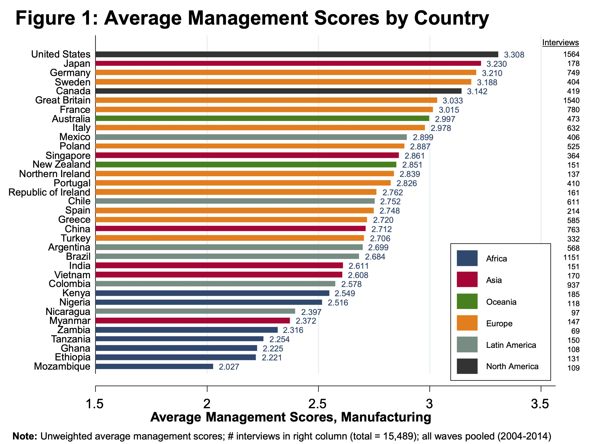
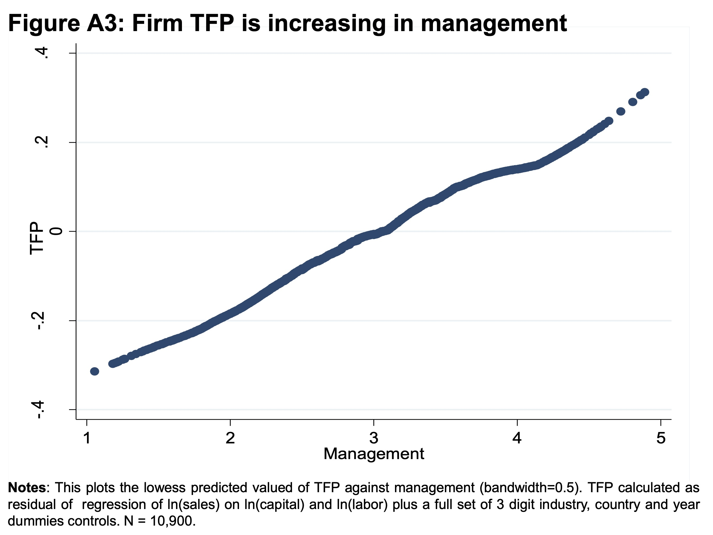
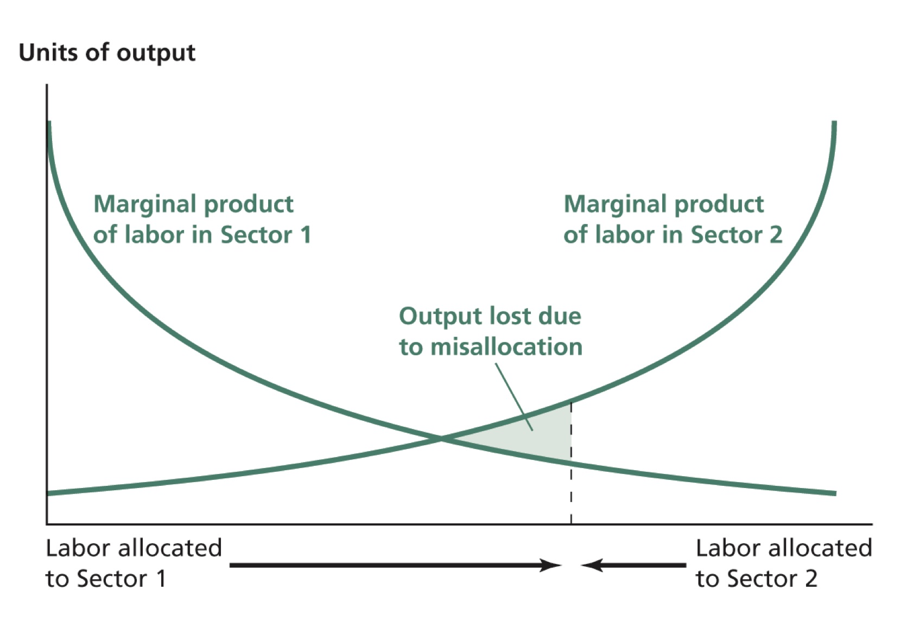

```{r setup, include=FALSE}
options(htmltools.dir.version = FALSE)
library(knitr)
opts_chunk$set(
  fig.align="center", ##fig.width=6, fig.height=4.5, 
  ## out.width="748px", ##out.length="520.75px",
  dpi=300, ##fig.path='Figs/',
  cache=T##, echo=F, warning=F, message=F
  )
```
```{r xaringan-themer, include=FALSE, warning=FALSE}
library(xaringanthemer)
style_mono_accent(
  base_color = '#000000',
  title_slide_text_color = '#000000',
  title_slide_background_color = '#FFFFFF',
  header_font_google = google_font("Josefin Sans"),
  text_font_google   = google_font("Montserrat", "300", "300i"),
  code_font_google   = google_font("Fira Mono"),

)
```


### Overview

<br>

<br>

- Models of endogenous growth

 - How is the level of innovation in a market economy determined?
 
 - Is the level of innovation in a market economy socially optimal?
 
 - Designed to analyze the economic growth in the advanced economies

- Role of efficiency in productivity

---
class: center, middle
name: innovation

## How is the level of innovation determined in a market economy?

<html><div style='float:left'></div><hr color='#EB811B' size=1px width=796px></html>


---
.pull-left[
### The Romer Model
- Developed by Paul Romer

- Expanding-variety type of innovation

 - An innovation is an introduction of a new intermediate input in the market
 
 - E.g. introduction of phone, mobile phones, smart phones, foldable smart phones,...

]

.pull-right[
### The Schumpeterian model

- Insights of Joseph Schumpeter

 - Creative destruction: existing firms/technologies are replaced by new and better firms/technologies

- Developed by Aghion and Howitt (1992) and Grossman and Helpman (1991)

- Quality-ladder type of innovation:

 - Horse cart is replaced by Ford Model T, which is replaced by modern cars
]

- In both models to produce a new intermediate input, one needs to own the blueprints of production

 - Ownership of bluebrints of productions brings in monopoly profits
 
- Blueprints are produced by researchers and sold to monopolists 

 - Reason to do R&D

---

### Determination of the fraction of labor force working in R&D 

Return to innovation: expected discounted sum of future profits

--

Fraction of labor force working in R&D depends

- positively on the growth rate of the economy

 - fast growing profits incentivizes inventions

--

- negatively on the discount rate

 - high discount rate means future consumption is valued less

 - the lower the value of future consumption, the lower the incentive to give up current consumption to have higher future consumption $\Rightarrow$ lower incentives to innovate
 

--

- positively on the probability of innovation
 
 - The higher the chance of a successful innovation, the higher the incentives to innovate

--

- negatively on the probability of innovation

 - The higher the chance of being replaced by subsequent inventors, the lower the incentives to innovate 
 - Notice that this motive is missing in the Romer model.


---
### The fraction of labor force working in R&D and economic growth?

- Assuming the idea production is of the form:  $\dot{A} = \frac{(\gamma_AL)^\lambda}{\mu}A^\phi$, where  $0<\phi<1$. $\Rightarrow g_A\equiv\frac{\dot{A}}{A} =\frac{(\gamma_AL)^\lambda}{\mu}\frac{A^\phi}{A}.$
 
- An increase in $\gamma_A$ leads higher rate of technological progress in the short-run, which leads to economic growth.

- Long-run growth rate is independent of the fraction of labor force engaging in innovation.

 - $\dot{A} = \frac{(\gamma_AL)^\lambda}{\mu}A^\phi \Rightarrow \frac{\dot{A}}{A} =\frac{(\gamma_AL)^\lambda}{\mu}\frac{A^\phi}{A}$ 
 
 - (+) Larger $\gamma_A$ makes idea creation easier, and boosts economic growth
 
 - (-) Higher level $A$ makes it harder to achieve same growth rate
 
 - Net effect: long-run growth rate of technology (and output per worker) is independent of the fraction of labor force engaging in innovation if $\phi<1$
 
- In this regard, the analysis is similar to an increase in the investment rate in the Solow model.

- More on [appendix](#appendix)

---
### Insights from the Romer model and the Schumpeterian model


- In both models, long-run **growth rate** is independent of the fraction of labor force engaging in research
 
 - Consistent with the empirical evidence.

--

- The **level** of income per capita in the long run is impacted by the fraction of labor force engaging in research

--

- A larger population size leads to higher levels of income per capita in the long-run. Due to non-rivalrous nature of ideas
 
 - Larger population, more inventors, higher levels of technology
 
 - Larger population, larger market for inventions, more inventors, higher levels of  technology
--

- Long-run economic growth rate is positively related to population growth rate

 - Higher population growth rate generates steady increase in the number of researchers
 
 - Higher rates of economic growth

---
### Insights, cont'd

- Long-run economic growth rate is positively related to knowledge spillovers, $\phi$

 - If current research benefits future researchers more, the economy can achieve higher economic growth rates

- If the discount rate applied to monopoly profits is large, the Schumpeterian model imply a larger fraction of labor force engaging in innovation

 - because relative importance of being replaced by others is small

- If the discount rate is relatively small, the Schumpeterian model imply a smaller fraction of labor force engaging in research

 - because people are sensitive to the future destruction of profits

---
### Socially optimal R&D

Because of the externalities in the innovation process, competitive equilibrium R&D level is not socially optimal. Remember that $\dot{A} = \frac{L_A^\lambda}{\mu} A^\phi$


- if $\phi > 0:$ "standing on shoulders"

 - Current researchers do not financially benefit from the positive impact of their inventions on the subsequent inventors

 - leads to under-invesment in R&D in the market economy
--

- if $\lambda < 1:$ "stepping on toes"

 - Researchers do not take into account potential duplication of research efforts
 
 - leads to over-invesment in R&D in the market economy

--

- Consumer surplus effect

 - Private gain of an innovation = profit < Consumer surplus = Social gain 
 
 - leads to under-invesment in R&D in the market economy

---

### Socially optimal R&D, cont'd


- Also, specific to the Schumpeterian model:

 - Inventors steal markets from existing producers
 
 - _Business stealing effect:_ Innovators do not internalize the cost they impose on incumbent producers
 
 - Leads to over-investment in innovation
 
 
- Overall,
 - markets under-invests in innovation
 - Lucking, Bloom, and Van Reenen (2018) estimate that, in the US <br>
 -social returns to R&D in the United States are about 60 percent <br>
 -private returns are about 15 percent


- Ground for government interference to correct for the externalities

- Anti-trust policy should take into account the contrasting effects of market power on the economu:

 - in standard markets, monopolies involve deadweight losses, hence inefficient
 - to provide incentive to innovate, markets need to be imperfect


---

### Do interactions with other inventors boost innovation?


Watch this short video by Stefanie Stantcheva: [Where does innovation come from?](https://www.youtube.com/watch?v=U5wfxjmIwtE)
<center>
<iframe width="560" height="315" src="https://www.youtube.com/embed/U5wfxjmIwtE" frameborder="0" allow="accelerometer; autoplay; clipboard-write; encrypted-media; gyroscope; picture-in-picture" allowfullscreen></iframe>
</center>

---
class: center, middle
name: efficiency

## Efficiency

<html><div style='float:left'></div><hr color='#EB811B' size=1px width=796px></html>


---

### Efficiency

<br>

 Productivity = Technology $\times$ Efficiency 

- Technology: Knowledge about how factors of production can be combined to produce output

- Efficiency: How effectively given technology and factors of production actually used

- Productivity is much lower in poor countries than in rich countries

 - Not obvious the only reason is a gap of technology

 - Many of the most advanced technologies are being used in poor countries

---

### Types of Inefficiency

<br>

- Poor management practices

- Unproductive activities

- Idle resources

- Misallocation among sectors

- Misallocation among firms

- Technology blocking

---
### Management practices

.pull-left[
- [World Management Survery](http://worldmanagementsurvey.org) (Bloom, Sadun, and Van Reenen (2017))

- Survey of thousands of managers across 40 countries

- Core management practices:
 - setting sensible targets
 - providing proper incentives
 - credibly monitoring performance 

- Read the [op-ed](https://voxdev.org/topic/firms-trade/management-and-wealth-nations) on the article

- Bloom, Lemos, Sadun, Scur, Van Reenen (2014):
> 'about a quarter of cross-country and within-country TFP gaps can be accounted for by management practices.'

]


.pull-right[
- Watch this [video](https://www.youtube.com/watch?time_continue=13&v=q9kYwVciFnI&feature=emb_logo) of John Van Reenen, a World leading expert on productivity

<br>

<center>
<iframe width="560" height="315" src="https://www.youtube.com/embed/q9kYwVciFnI" frameborder="0" allow="autoplay; encrypted-media" allowfullscreen></iframe>
</center>

]
---
### Management quality and productivity

.pull-left[
- Average management quality differs enormously across countries 
<center>

</center>
]

.pull-right[
- Firm level productivity and management quality are positively correlated
<center>

</center>

]
Source: Bloom, Sadun, and Van Reenen (2017)
---
.pull-left[
### Unproductive Activities

- Illegal activities: theft, smuggling, kidnapping for ransom, ..

- Rent seeking: involve the use of laws or government institutions to bring private benefits

 - Economic rent: payment to a factor of production in excess of what is required to elicit the supply of that factor

 - E.g.: quotas to limit the imports of some goods, lobbying, ...

 - Costs: a good deal of effort, bright people work in unproductive activities

]

--
.pull-right[
### Idle Resources


- Factors of production not used at all

- Unemployment, underemployment

- Factory that sits unused

- Factory running at less than full capacity

- Example: In 2001, 
 - Air Afrique: 500 employees per airplane, 
 - EasyJet: 66 employees per airplane
 
- Example: _Firemen_ employed in diesel engines of the United States and Canada railroads during the middle of the 20th century 


]
---

### Misallocation Among Sectors

.pull-left[
**Misallocation among sectors:** marginal product of inputs are not equal across sectors

- barriers to mobility

 - geographical isolation

 - wage policy: e.g. sectoral minimum wage

 - market segmentation: potentially productive people are unable to work
in certain sectors (due to licensing requirements for example)

 - tax rate differences across industries 
 

- wages $\neq$ marginal product of labor

]

.pull-right[
<center>

</center>
Graphic from: Weil (2013)
]


---

### Efficiency Gains from Sectoral Reallocation

<br>

<br>

Reallocation from agriculture to manufacturing

 - Taiwan: 0.7% of 5.4% annual growth over 1966-1991

 - Korea: 0.7% of 5.7% annual growth over 1960-1990

 - US: fraction of agricultural labor decreased from 50% to 3% over 1880-1980 

 - China: fraction of agricultural labor decreased from 69% to 40% over 1980-2009

---

### Misallocation Among Firms

<br>

**Misallocation among firms:** marginal product of inputs are not equal across firms

- government-owned firms over-employ: political power 

- monopolies under-employ: monopolistic profit

- financial frictions prevent efficient allocation of capital

- discrimination 

 - preventing many talented women, ethnic minorities, and others from working on jobs that better suits their talents.


---
### Technology Blocking


<br>

Agents deliberately prevent the use of technology

- Gutenberg's printing press (1453): scribes 

- automated weaving loom (19th century): Luddites 

- margarine (late 19th century): dairy farmers 

- Netscape browser: Microsoft


---
### Isn't technological progress beneficial to the economy?


- creative destruction and technology blocking

 - the success of technology blocking depends on the relative power of the opposer/supporter

<center>

</center>

Source: Kaamran Hafeez, the New Yorker
---
### Summary

- Analyzed the motives of innovation

- Analyzed externalities in the innovation process, and justified the role of government intervention

- Looked at the role of efficiency in productivity

#### To review our lectures (lectures 7 and 8) on technology and efficiency

Read 


- Chapters 4 and 5 of Introduction to Economic Growth by Jones and Vollrath 

- Mathematical appendix to Chapter 9 of Economic Growth by David Weil

- Chapter 10 of Economic Growth by David Weil

---

class: center, middle
name: appendix

## Appendix

<html><div style='float:left'></div><hr color='#EB811B' size=1px width=796px></html>


---
### Long-run growth rate

- How do we calculate long-run economic growth if $\dot{A} = \frac{L_A^\lambda}{\mu}A^\phi$ ?

- Growth rate of $A$, $g_A \equiv \frac{\dot{A}}{A} =  \frac{(\gamma_A L)^\lambda}{\mu}A^{\phi-1} = \frac{(\gamma_A L)^\lambda}{\mu A^{1-\phi}}$

- For $g_A$ to be constant in the long run, $(\gamma_A L)^\lambda$  and $\mu A^{1-\phi}$ should grow at the same rate.

- Growth rate of $(\gamma_A L)^\lambda$  is $\lambda n$, where $n$ is the population growth rate.

- Growth rate of $\mu A^{1-\phi}$ is equal to $(1-\phi)g_A$

- $(1-\phi)g_A = \lambda n$

- Growth rate of technology:   $g_A = \frac{ \lambda n}{(1-\phi)}$ if $\phi<1$.

- $g_A$ is positively correlated with $\lambda$, $n$, and $\phi$


---

### Determinants of productivity growth in the long run


In the long-run: $g_A = \frac{ \lambda n}{(1-\phi)}$

To understand the intuition, suppose $\lambda=1$ and $\phi=0$

Then $g_A =\frac{(\gamma_A L)}{\mu}\frac{1}{A}$ all the time, $g_A = n$ in the long run

- If population does not grow, $g_A$ will converge to 0

 - Recall $\dot{A} =  \frac{\gamma_A L}{\mu}$ if $\lambda=1$ and $\phi=0$

- Hence the only source of growth is from population growth

- $g_A = n$ if $\lambda = 1$ and $\phi=0$ 

- Larger population generates more ideas

- Since ideas are non-rivalrous, everyone benefits

---
### Determinants of productivity growth in the long run, cont'd

<br>

<br>

- Now suppose $\lambda=1$ and $\phi=1$

- Then, $g_A =  \frac{(\gamma_A L)}{\mu}\frac{A}{A} = \frac{(\gamma_A L)}{\mu}$ all the time

- Notice that this formulation is equivalent to our assumption in the last lecture

- We see sustained growth even if research effor is contant, i.e. even if $\gamma_A L$ is constant.

- Rejected by the data

---
### Determinants of productivity growth in the long run, cont'd (2)


If $\phi>0$ but $\phi<1$:

- still positive spillovers from research

$g_A =  \frac{(\gamma_A L)^\lambda}{\mu}\frac{A^{\phi}}{A}$ all the time

$g_A$ at the steady state (or balanced growth path): $g_A = \frac{ \lambda n}{(1-\phi)}$

- Unaffected by the fraction of population engaging in R&D

 - Intuitively, higher $\gamma_A$ leads to higher $\hat{A}$ in the short run
 
 - In the long-run, because of diminishing marginal product of idea stock in idea creation, $\gamma_A$ does not affect the long-run economic growth.

However, short-run growth rate of productivity is a still function of fraction of labor force engaging in R&D.

---
### Income per capita in the long run

<br>

- Fraction of labor force engaging in R&D impacts income per capita

 - Positively: high level of productivity in the long run

 - Negatively: smaller fraction of workers in the production

- Size of labor force, $L(t)$, impacts income per capita positively (**scale effect**):

 - **demand effect:** $L \uparrow$ $\Rightarrow$ larger market for an idea $\Rightarrow$ $\uparrow$ return to research
 
 - **supply effect:** $L \uparrow$ $\Rightarrow$ more potential creators of ideas


