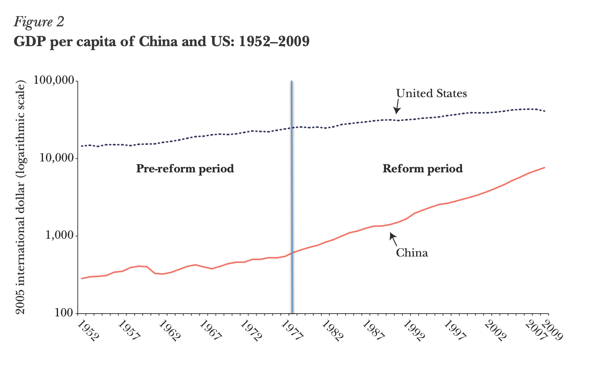
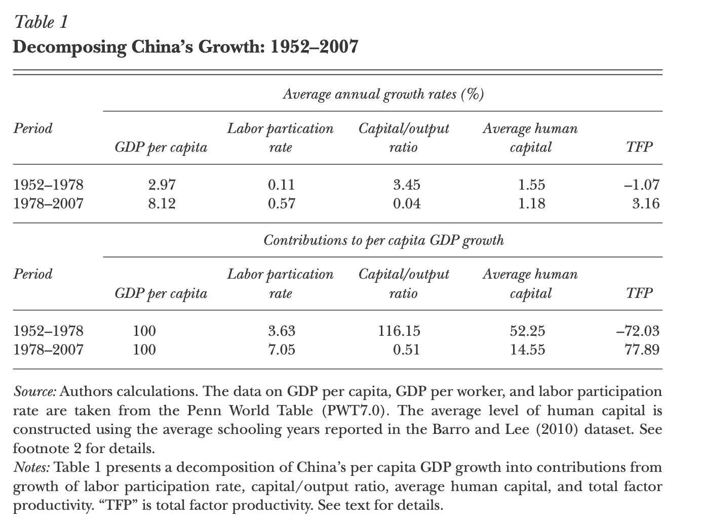

```{r setup, include=FALSE}
options(htmltools.dir.version = FALSE)
library(knitr)
opts_chunk$set(
  fig.align="center", ##fig.width=6, fig.height=4.5, 
  ## out.width="748px", ##out.length="520.75px",
  dpi=300, ##fig.path='Figs/',
  cache=T##, echo=F, warning=F, message=F
  )
```
```{r xaringan-themer, include=FALSE, warning=FALSE}
library(xaringanthemer)
style_mono_accent(
  base_color = '#000000',
  title_slide_text_color = '#000000',
  title_slide_background_color = '#FFFFFF',
  header_font_google = google_font("Josefin Sans"),
  text_font_google   = google_font("Montserrat", "300", "300i"),
  code_font_google   = google_font("Fira Mono"),

)
```


class: center, middle
name: ideas

## Understanding China’s Growth: Past, Present, and Future 

###  Xiaodong Zhu


<html><div style='float:left'></div><hr color='#EB811B' size=1px width=796px></html>

---
### Summary

.pull-left[
<br>
<center>

</center>
]
.pull-right[
#### 1952 - 1978
- Per capita GDP growth rate: 3%
- Growth due to government investment, and increase in education
- Productivity regressed 

#### 1978 - 2007
- Productivity growth

#### Data Sources
- Historical: Madison (2007)
- PPP data: Penn World Table (7.0)
- Growth accounting exercise data: Brandt and Zhu (2010)
]

---
### Growth accounting, alternative
.pull-left[
Start with Cobb-Douglas $Y = A K^\alpha (hL)^{1-\alpha}$

Divide both sides with $Y^\alpha$

$$ \frac{Y}{Y^\alpha} = Y^{1-\alpha} = A \left(\frac{K}{Y}\right)^\alpha (hL)^{1-\alpha}$$

Raise both sides to the power $1/(1-\alpha)$

$$ Y = A^{1/(1-\alpha)}\left(\frac{K}{Y}\right)^{\alpha/(1-\alpha)} hL$$

Divide both sides with population, $N$


$$\frac{Y}{N} = A^{1/(1-\alpha)} \left(\frac{K}{Y}\right)^{\alpha/(1-\alpha)} h \frac{L}{N} $$ 

Why this way: $K/Y$ is independent of productivity
]

.pull-right[
$$ \text{Growth in GDP per capita} = $$
$$ \frac{1}{1-\alpha} \text{growth rate of total factor productivity}$$
$$ + \frac{\alpha}{1-\alpha}\text{growth rate of capital/output ratio} $$
$$ + \text{growth rate of average human capital} $$
$$ + \text{growth rate of employment to population ratio}$$

Assume $\alpha=1/2$

]


---

<center>

</center>
