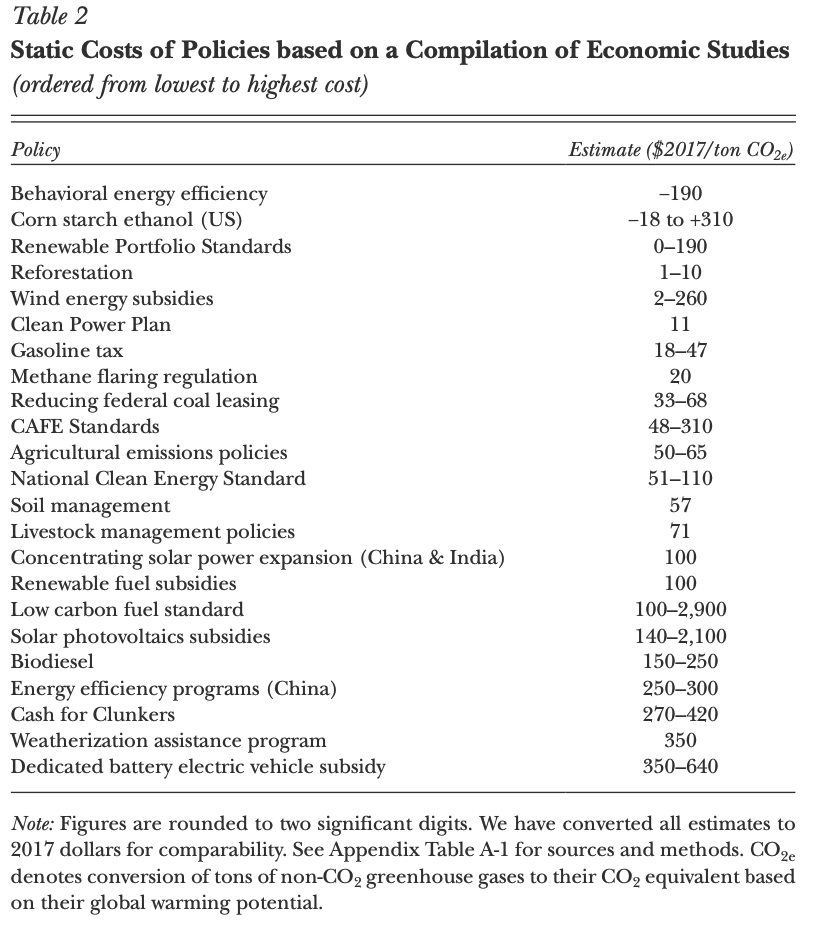
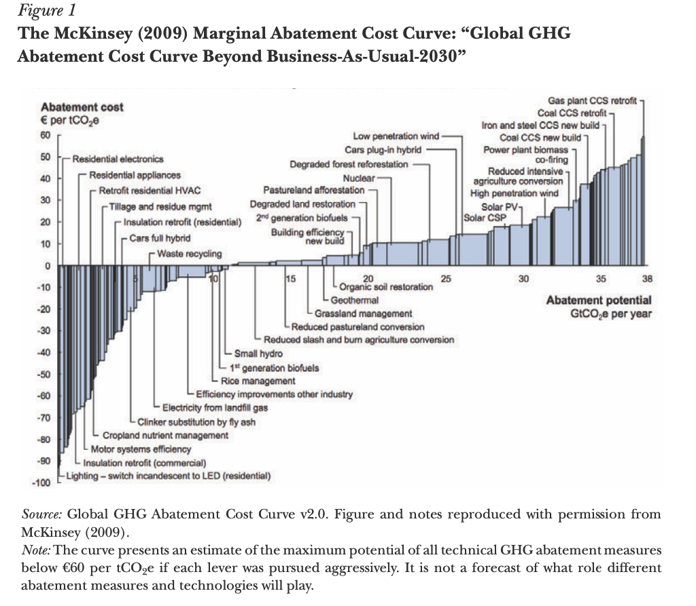
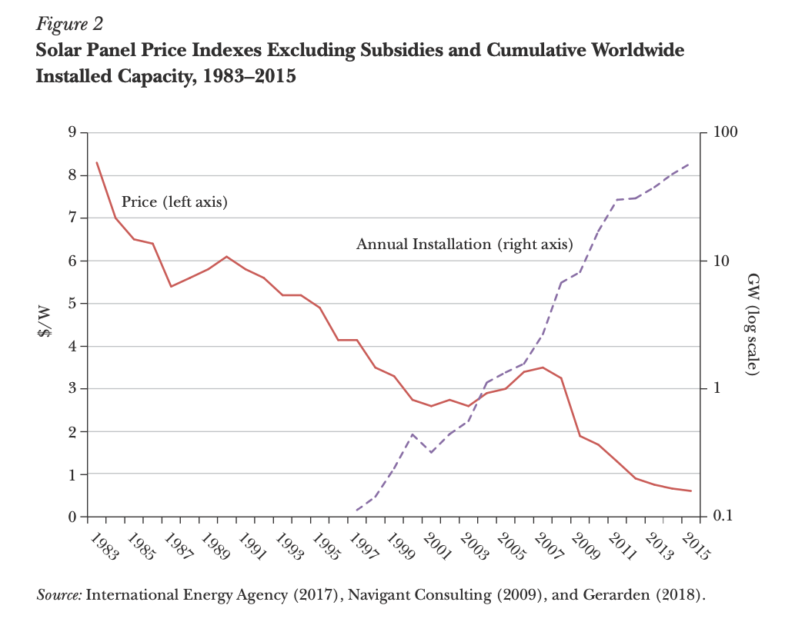
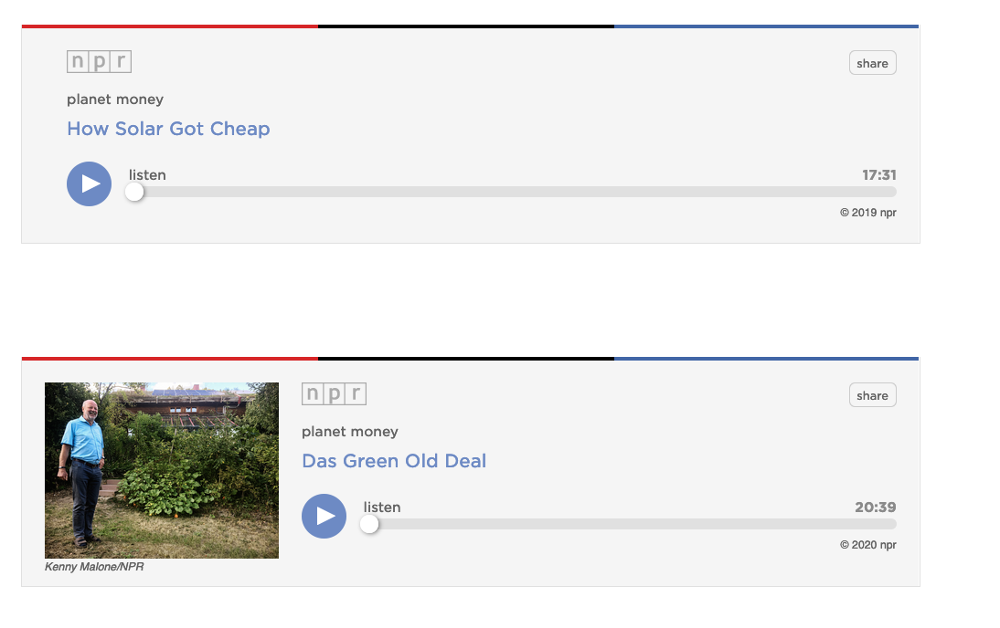
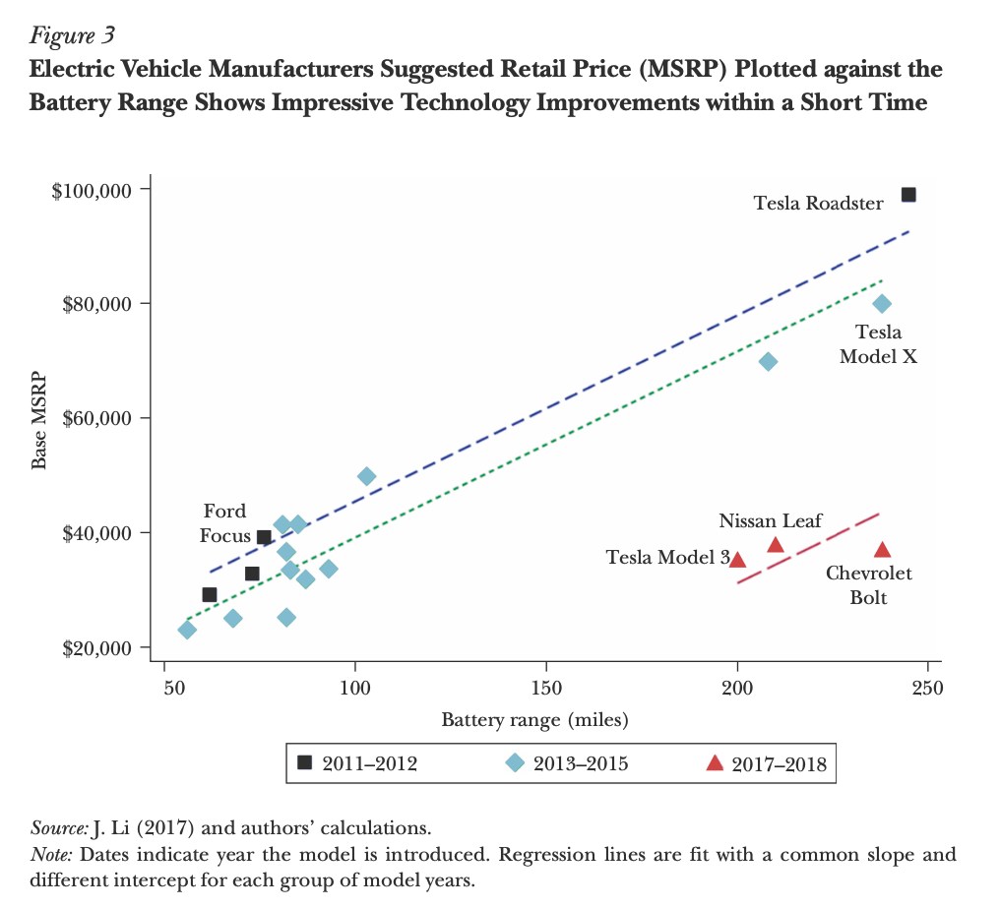

```{r setup, include=FALSE}
options(htmltools.dir.version = FALSE)
library(knitr)
opts_chunk$set(
  fig.align="center", ##fig.width=6, fig.height=4.5, 
  ## out.width="748px", ##out.length="520.75px",
  dpi=300, ##fig.path='Figs/',
  cache=T##, echo=F, warning=F, message=F
  )
```
```{r xaringan-themer, include=FALSE, warning=FALSE}
library(xaringanthemer)
style_mono_accent(
  base_color = '#000000',
  title_slide_text_color = '#000000',
  title_slide_background_color = '#FFFFFF',
  header_font_google = google_font("Josefin Sans"),
  text_font_google   = google_font("Montserrat", "300", "300i"),
  code_font_google   = google_font("Fira Mono"),

)
```

### Questions

<br>

1. Briefly define carbon taxes. What is the appeal of carbon taxes?

2. Define static abatement costs and give examples of static abatement costs from
Gillingham and Stock (2018). Be sure to provide cost of estimates of your examples.

3. According to the authors, is there a ‘free lunch’ in reducing carbon emissions?
Briefly explain.

4. Define dynamic abatement costs and provide examples of dynamics abatements
costs from Gillingham and Stock (2018). Be sure to provide cost estimates of your
examples.

5. Give examples of actions of taken today that with high static costs but low dynamic
costs.
---

class: center, middle
name: climate

### Gillingham, K., & Stock, J. H. (2018). The cost of reducing greenhouse gas emissions. Journal of Economic Perspectives, 32(4), 53-72

<html><div style='float:left'></div><hr color='#EB811B' size=1px width=796px></html>


---
class: middle

## Research question


### What is the most economically efficient way to reduce greenhouse gas emissions?


---
class: middle

### 1. Briefly define carbon taxes. Why is taxing carbon emissions appealing to economists?

--

- Core The Economy:
> Pigouvian tax: "A tax levied on activities that generate negative external effects so as to correct an inefficient market outcome.""

--

- A carbon tax is a Pigouvian tax levied on carbon emissions. 

- Gillingham and Stock (2018):

> "[Reductions in carbon emissions] can be implemented by a Pigouvian tax, for example a carbon tax where the tax rate is the marginal benefit of the emissions reduction or, equivalently, the monetized damages from emitting an additional ton of carbon dioxide ( $CO_2$ )"

--

- With Pigouvian taxes, markets find the most efficient way of reducing greenhouse gas emissions.
---
class: middle
### 2. Define static abatement costs and give examples of static abatement costs from Gillingham and Stock (2018). Be sure to provide cost estimates of your examples.
---
.pull-left[
### 2. Define static abatement costs and give examples of static abatement costs from Gillingham and Stock (2018). Be sure to provide cost estimates of your examples.

Static abatement costs: cost of a project compared to a benchmark technology over the life of the project, ignoring spillovers.

- blending corn ethanol into gasoline up to a 10 percent ratio

- replacing coal-fired electricity generation with natural gas

- wide range of cost estimates

- wide range of cost estimates within a policy

]

.pull-left[
<center>

</center>
]

---
### 3. According to the authors, is there a ‘free lunch’ in reducing carbon emissions? Briefly explain.

--

.pull-left[
- Yes, but the examples from the McKinsey is not necessarily accurate.

 - Ignores behavioral responses, engineering estimates might also be wrong

- Behavioral changes (negative cost)

 - but limited impact on the total greenhouse gas emissions
 
- blending corn ethanol into gasoline up to a 10 percent ratio
]

.pull-right[
<center>

</center>
]
---
### 4. Define dynamic abatement costs and provide examples of dynamics abatements costs from Gillingham and Stock (2018). Be sure to provide cost estimates of your examples.

--

- Dynamic abatement costs include not only a project's static costs but also the project's effects on future emissions. 

 - Gains in production efficiency as a result of production (learning by doing)
 
 - Research and development spillovers. Current demand for the project $\Rightarrow$ R&D $\Rightarrow$ Reduces costs and more emission reductions in the future
 
 - Network externalitiy: an expenditure today influences available options in the future
 
 - Irreversible components of energy investments

---
### Solar power

.pull-left[
Static costs: $140 - $2,100 
- Feed-in tariff in Germany and other subsidies around the world

- Subsidies induced innovation effects (Gerarden, 2018)

- Learning by doing and economies of scale

 - Not a justification for subsidies in itself, but without subsidies (or carbon tax) companies wouldn't reach the cost efficient point of production.
]

.pull-right[
<center>

</center>
]


---
### Podcasts!

<!-- <center> -->
<!--  -->
<!-- </center> -->

<center>
<iframe src="https://www.npr.org/player/embed/751234092/751295860" width="100%" height="290" frameborder="0" scrolling="no" title="NPR embedded audio player"></iframe>

<iframe src="https://www.npr.org/player/embed/797322305/809310384" width="100%" height="290" frameborder="0" scrolling="no" title="NPR embedded audio player"></iframe>
</center>
---
### Electric vehicles

.pull-left[
Static cost: $350 - $450

- Tax credits, regulation led to an increase in demand

- Induced innovation, learning-by-doing, economies of scale, network effects
]

.pull-right[
<center>

</center>
]


---
### 5. Give examples of actions taken today that with high static costs but low dynamic costs.

- Solar power, electric vehicles

- Natural gas (on the other hand) low static cost, high dynamic cost. Why?


